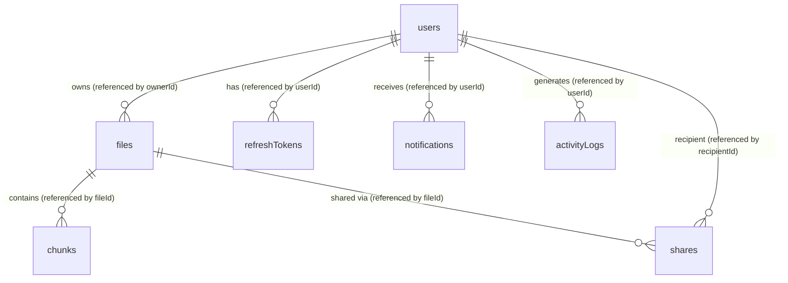

# Database Design Document (DDD)

# Cloud-Based File Distribution System (CBFDS)

**Version:** 1.0  
**Date:** August 5, 2026  
**Standard:** Enterprise Database Design Standard  
**Classification:** Academic / Portfolio Project  
**Reference Documents:** SRS v1.0, SAD v1.0, Graph Memory v1.0  

---

## 1. Database Overview

The Cloud-Based File Distribution System (CBFDS) uses **MongoDB** as its primary metadata store. MongoDB is selected for its high write throughput, schema flexibility, and native support for JSON-like documents, which maps directly to the JavaScript/Node.js application layer.

### 1.1 Connection Strategy
- **Driver:** Mongoose ODM (Object-Document Mapper) for Node.js.
- **Connection String Protocol:** `mongodb://` (Development) and `mongodb+srv://` (Production with replica sets).
- **Pooling Settings:**
  - `maxPoolSize`: 100 (allows up to 100 concurrent socket connections in production).
  - `minPoolSize`: 10 (keeps 10 connections warm to minimize handshake latency).
  - `socketTimeoutMS`: 45000 (aborts queries taking longer than 45 seconds).
  - `connectTimeoutMS`: 30000 (aborts connection attempts taking longer than 30 seconds).
  - `keepAlive`: true (enables TCP keep-alive to maintain persistent sockets).
- **Write Concern:** `w: "majority"` (guarantees data persistence across replica set nodes before returning success).
- **Read Preference:** `primaryPreferred` (reads from primary but falls back to secondary if primary is overloaded).

### 1.2 Database Naming Conventions
- **Database Name:** `cbfds` (all lowercase, no special characters).
- **Collection Names:** camelCase plural (e.g., `users`, `files`, `refreshTokens`).
- **Field Names:** camelCase singular (e.g., `userId`, `originalName`, `storageQuota`).
- **Index Names:** `idx_{collectionName}_{fields}_{direction}` (e.g., `idx_files_ownerId_status`).

---

## 2. Document Relationships & Design Decisions



### 2.1 Embedding vs. Referencing Rationale
1. **User Storage Quota (Embedded):** Quota fields (`storageQuota`, `storageUsed`) are embedded directly in the `users` collection. 
   - *Rationale:* These values are read on almost every user action (dashboard loading, file upload checks) and updated directly upon file creation or deletion. Embedding eliminates high-frequency joins.
2. **File and Chunks (Referenced):** A `file` document references its `chunks` rather than embedding them.
   - *Rationale:* Under the 5 GB maximum file size limit, a file will contain up to 1,024 chunks. Embedding 1,024 chunk objects within a file document risks hitting MongoDB's 16 MB document size limit. Storing chunks in a separate `chunks` collection allows independent scaling and query optimization.
3. **External and Internal Shares (Referenced):** Shares are stored in a dedicated `shares` collection referencing `fileId` and `ownerId`.
   - *Rationale:* Supports flexible lifecycle operations, custom expiration index hooks, and prevents the `files` document from growing indefinitely when a file is shared with hundreds of users.

---

## 3. Detailed Collection Specifications

### 3.1 Collection: `users`
Represents system accounts and authorization scopes.

```javascript
const userSchema = new mongoose.Schema({
  userId: {
    type: String,
    required: true,
    unique: true,
    default: () => uuidv4()
  },
  fullName: {
    type: String,
    required: true,
    trim: true,
    minlength: 2,
    maxlength: 100
  },
  email: {
    type: String,
    required: true,
    unique: true,
    trim: true,
    lowercase: true,
    match: [/^\w+([\.-]?\w+)*@\w+([\.-]?\w+)*(\.\w{2,3})+$/, 'Please fill a valid email address']
  },
  passwordHash: {
    type: String,
    required: true
  },
  passwordHistory: {
    type: [String],
    default: []
  },
  role: {
    type: String,
    enum: ['user', 'admin', 'superadmin'],
    default: 'user'
  },
  storageQuota: {
    type: Number,
    required: true,
    default: 10737418240 // 10 GB in bytes
  },
  storageUsed: {
    type: Number,
    required: true,
    default: 0
  },
  isActive: {
    type: Boolean,
    default: true
  },
  failedLoginAttempts: {
    type: Number,
    default: 0
  },
  lockUntil: {
    type: Date,
    default: null
  },
  knownDevices: [{
    userAgent: String,
    ipAddress: String,
    lastLoginAt: Date
  }],
  notificationPrefs: {
    emailOnShare: { type: Boolean, default: true },
    emailOnQuotaWarning: { type: Boolean, default: true },
    emailOnNewDevice: { type: Boolean, default: true }
  }
}, {
  timestamps: true,
  collection: 'users'
});
```

---

### 3.2 Collection: `files`
Tracks file metadata, verification hashes, status transitions, and version pointers.

```javascript
const fileSchema = new mongoose.Schema({
  fileId: {
    type: String,
    required: true,
    unique: true,
    default: () => uuidv4()
  },
  ownerId: {
    type: String,
    required: true,
    ref: 'User'
  },
  originalName: {
    type: String,
    required: true,
    trim: true,
    maxlength: 255
  },
  sanitizedName: {
    type: String,
    required: true,
    trim: true
  },
  mimeType: {
    type: String,
    required: true
  },
  extension: {
    type: String,
    required: true
  },
  fileSize: {
    type: Number,
    required: true
  },
  fileHash: {
    type: String,
    default: null
  },
  totalChunks: {
    type: Number,
    default: null
  },
  chunkSize: {
    type: Number,
    required: true,
    default: 5242880 // 5 MB in bytes
  },
  status: {
    type: String,
    enum: ['UPLOADING', 'PROCESSING', 'ACTIVE', 'DELETED', 'PENDING_DELETION', 'ERROR'],
    default: 'UPLOADING'
  },
  statusMessage: {
    type: String,
    default: null
  },
  versionNumber: {
    type: Number,
    default: 1
  },
  previousVersionId: {
    type: String,
    ref: 'File',
    default: null
  },
  isLatestVersion: {
    type: Boolean,
    default: true
  },
  activeOperations: {
    type: Number,
    default: 0
  },
  storageProvider: {
    type: String,
    required: true
  },
  deletedAt: {
    type: Date,
    default: null
  }
}, {
  timestamps: true,
  collection: 'files'
});
```

---

### 3.3 Collection: `chunks`
Represents individual binary blocks stored in target object stores. Standardizes chunk numbering zero-padding using 4 digits (`0000` to `9999`) to support files up to ~48 GB at 5 MB chunk size (Resolves `AMB-001`).

```javascript
const chunkSchema = new mongoose.Schema({
  chunkId: {
    type: String,
    required: true,
    unique: true,
    default: () => uuidv4()
  },
  fileId: {
    type: String,
    required: true,
    ref: 'File'
  },
  chunkNumber: {
    type: Number,
    required: true,
    min: 0
  },
  chunkSize: {
    type: Number,
    required: true
  },
  checksum: {
    type: String,
    required: true // SHA-256 hash of this specific chunk
  },
  storageKey: {
    type: String,
    required: true // Format: {userId}/{fileId}/chunks/{chunkNumber_zero_padded}
  },
  storageBucket: {
    type: String,
    required: true
  },
  status: {
    type: String,
    enum: ['STORED', 'VERIFIED', 'CORRUPTED', 'DELETED'],
    default: 'STORED'
  }
}, {
  timestamps: true,
  collection: 'chunks'
});
```

---

### 3.4 Collection: `shares`
Represents internal user sharing configurations or public access link parameters.

```javascript
const shareSchema = new mongoose.Schema({
  shareId: {
    type: String,
    required: true,
    unique: true,
    default: () => uuidv4()
  },
  fileId: {
    type: String,
    required: true,
    ref: 'File'
  },
  ownerId: {
    type: String,
    required: true,
    ref: 'User'
  },
  shareType: {
    type: String,
    enum: ['INTERNAL', 'EXTERNAL'],
    required: true
  },
  recipientId: {
    type: String,
    ref: 'User',
    default: null // Only used if shareType is INTERNAL
  },
  token: {
    type: String,
    unique: true,
    sparse: true,
    default: null // Generated cryptographically for EXTERNAL shares
  },
  passwordHash: {
    type: String,
    default: null // Optional password protection for external links
  },
  permission: {
    type: String,
    enum: ['VIEWER', 'EDITOR'],
    default: 'VIEWER'
  },
  expiresAt: {
    type: Date,
    default: null // Null indicates no expiry
  },
  downloadLimit: {
    type: Number,
    default: null // Null indicates unlimited
  },
  downloadCount: {
    type: Number,
    default: 0
  },
  isActive: {
    type: Boolean,
    default: true
  },
  failedAccessAttempts: {
    type: Number,
    default: 0
  },
  blockedUntil: {
    type: Date,
    default: null
  }
}, {
  timestamps: true,
  collection: 'shares'
});
```

---

### 3.5 Collection: `refreshTokens`
Tracks active sessions to support token rotation and session revocation.

```javascript
const refreshTokenSchema = new mongoose.Schema({
  tokenHash: {
    type: String,
    required: true,
    unique: true // SHA-256 hash of rotation token
  },
  userId: {
    type: String,
    required: true,
    ref: 'User'
  },
  deviceInfo: {
    userAgent: { type: String },
    os: { type: String },
    browser: { type: String }
  },
  ipAddress: {
    type: String
  },
  isRevoked: {
    type: Boolean,
    default: false
  },
  expiresAt: {
    type: Date,
    required: true // TTL of 7 days
  }
}, {
  timestamps: true,
  collection: 'refreshTokens'
});
```

---

### 3.6 Collection: `notifications`
Supports user alert notifications.

```javascript
const notificationSchema = new mongoose.Schema({
  notificationId: {
    type: String,
    required: true,
    unique: true,
    default: () => uuidv4()
  },
  userId: {
    type: String,
    required: true,
    ref: 'User'
  },
  type: {
    type: String,
    enum: [
      'FILE_SHARED',
      'UPLOAD_COMPLETE',
      'DOWNLOAD_COMPLETE',
      'STORAGE_WARNING',
      'PASSWORD_CHANGED',
      'NEW_DEVICE',
      'ADMIN_ANNOUNCEMENT'
    ],
    required: true
  },
  title: {
    type: String,
    required: true
  },
  message: {
    type: String,
    required: true
  },
  data: {
    type: mongoose.Schema.Types.Mixed,
    default: {}
  },
  isRead: {
    type: Boolean,
    default: false
  }
}, {
  timestamps: true,
  collection: 'notifications'
});
```

---

### 3.7 Collection: `activityLogs`
Structured log metrics for system operation auditing.

```javascript
const activityLogSchema = new mongoose.Schema({
  logId: {
    type: String,
    required: true,
    unique: true,
    default: () => uuidv4()
  },
  userId: {
    type: String,
    required: true,
    ref: 'User'
  },
  action: {
    type: String,
    enum: [
      'LOGIN',
      'LOGOUT',
      'UPLOAD',
      'DOWNLOAD',
      'DELETE',
      'SHARE_CREATE',
      'SHARE_REVOKE',
      'PERMISSION_CHANGE',
      'QUOTA_CHANGE',
      'PASSWORD_RESET',
      'ADMIN_FILE_DELETE'
    ],
    required: true
  },
  targetType: {
    type: String,
    enum: ['file', 'user', 'share', 'system'],
    default: 'system'
  },
  targetId: {
    type: String,
    default: null
  },
  details: {
    type: mongoose.Schema.Types.Mixed,
    default: {}
  },
  ipAddress: {
    type: String
  },
  userAgent: {
    type: String
  }
}, {
  timestamps: true,
  collection: 'activityLogs'
});
```

---

### 3.8 Collection: `otps`
Password-reset one-time passcodes.

```javascript
const otpSchema = new mongoose.Schema({
  email: {
    type: String,
    required: true,
    unique: true,
    trim: true,
    lowercase: true
  },
  otpHash: {
    type: String,
    required: true // SHA-256 hash of the 6-digit OTP code
  },
  attempts: {
    type: Number,
    default: 0
  },
  expiresAt: {
    type: Date,
    required: true // TTL of 10 minutes
  }
}, {
  timestamps: true,
  collection: 'otps'
});
```

---

### 3.9 Collection: `systemConfig`
Stores dynamically configurable server configuration values.

```javascript
const systemConfigSchema = new mongoose.Schema({
  key: {
    type: String,
    required: true,
    unique: true
  },
  value: {
    type: mongoose.Schema.Types.Mixed,
    required: true
  },
  description: {
    type: String,
    required: true
  },
  updatedBy: {
    type: String,
    ref: 'User',
    default: null
  }
}, {
  timestamps: true,
  collection: 'systemConfig'
});
```

---

## 4. Mongoose Schema Middleware & Hooks

To enforce data integrity and clean dependencies, the database implements the following server-side Mongoose hooks.

### 4.1 `User` Middleware
1. **Pre-Save (Password Hashing):** If the password field is modified, hash it automatically with bcrypt.
```javascript
userSchema.pre('save', async function (next) {
  if (!this.isModified('passwordHash')) return next();
  try {
    const salt = await bcrypt.genSalt(12);
    this.passwordHash = await bcrypt.hash(this.passwordHash, salt);
    next();
  } catch (err) {
    next(err);
  }
});
```
2. **Pre-Save (Password History Rotation):** Maintains the last 3 password hashes.
```javascript
userSchema.pre('save', function (next) {
  if (this.isModified('passwordHash')) {
    if (this.passwordHistory.length >= 3) {
      this.passwordHistory.shift();
    }
    this.passwordHistory.push(this.passwordHash);
  }
  next();
});
```

### 4.2 `File` Middleware
1. **Cascade Delete (Background job coordination):** When a file status moves to `DELETED`, the system triggers an asynchronous cleanup job. Rather than doing the cleanup inline in Mongoose middleware, the service layer queues a BullMQ clean job to delete physical chunks from MinIO/S3, then calls the chunk repository to purge database records.

---

## 5. Virtual Fields, Instance Methods, and Statics

### 5.1 `User` Virtuals, Instances, & Statics
- **Virtual Field: `storagePercentage`**  
  Calculates the percentage of storage quota used.
  ```javascript
  userSchema.virtual('storagePercentage').get(function() {
    return parseFloat(((this.storageUsed / this.storageQuota) * 100).toFixed(2));
  });
  ```
- **Instance Method: `comparePassword(candidatePassword)`**  
  Compares cleartext password with stored hash.
  ```javascript
  userSchema.methods.comparePassword = async function (candidatePassword) {
    return bcrypt.compare(candidatePassword, this.passwordHash);
  };
  ```
- **Static Method: `findActiveByEmail(email)`**  
  ```javascript
  userSchema.statics.findActiveByEmail = function (email) {
    return this.findOne({ email: email.toLowerCase(), isActive: true });
  };
  ```

### 5.2 `File` Virtuals & Statics
- **Virtual Field: `isTrash`**  
  Checks if a file is in the trash folder.
  ```javascript
  fileSchema.virtual('isTrash').get(function() {
    return this.status === 'DELETED';
  });
  ```
- **Static Method: `findActiveUserFiles(userId)`**  
  Returns active, non-deleted files for a user.
  ```javascript
  fileSchema.statics.findActiveUserFiles = function (userId) {
    return this.find({ ownerId: userId, status: 'ACTIVE' });
  };
  ```

### 5.3 `Share` Instance Methods
- **Instance Method: `isExpired()`**  
  Checks if the share link has expired based on current time or download limits.
  ```javascript
  shareSchema.methods.isExpired = function () {
    const timeExpired = this.expiresAt && this.expiresAt < new Date();
    const limitReached = this.downloadLimit && this.downloadCount >= this.downloadLimit;
    return !this.isActive || timeExpired || limitReached;
  };
  ```

---

## 6. Indexing Strategy Details

To support millions of records at low latency, the following database indexes are established at the connection phase.

| Collection | Index Name | Compound Key Fields | Direction | Type / Options | Rationale |
|---|---|---|---|---|---|
| `users` | `idx_users_email` | `email` | 1 | Unique | Primary user credential lookup |
| `users` | `idx_users_userId` | `userId` | 1 | Unique | Profile retrieval |
| `files` | `idx_files_fileId` | `fileId` | 1 | Unique | File retrieval and download verification |
| `files` | `idx_files_ownerId_status` | `ownerId`, `status` | 1, 1 | Regular | Dashboard and file browse operations |
| `files` | `idx_files_ownerId_uploadedAt` | `ownerId`, `uploadedAt` | 1, -1 | Regular | Recent uploads listing |
| `files` | `idx_files_searchName` | `originalName` | "text" | Text Index | Fast substring keyword filename search |
| `files` | `idx_files_status_deletedAt` | `status`, `deletedAt` | 1, 1 | Regular | Scheduled trash auto-purge job scanner |
| `chunks` | `idx_chunks_fileId_chunkNumber` | `fileId`, `chunkNumber` | 1, 1 | Unique | Sequential order mapping for file merging |
| `shares` | `idx_shares_token` | `token` | 1 | Unique, Sparse | Secure external download routing |
| `shares` | `idx_shares_expiresAt` | `expiresAt` | 1 | TTL Index | Automate memory cleanup of expired shares |
| `refreshTokens` | `idx_refreshTokens_tokenHash` | `tokenHash` | 1 | Unique | Active session rotation lookup |
| `refreshTokens` | `idx_refreshTokens_expiresAt` | `expiresAt` | 1 | TTL Index | Auto-expire invalid refresh token scopes |
| `notifications` | `idx_notifications_userId_isRead` | `userId`, `isRead` | 1, 1 | Regular | Filter active notification feeds |
| `notifications` | `idx_notifications_createdAt` | `createdAt` | 1 | TTL Index (90 days) | Auto-cleanup stale alerts |
| `activityLogs` | `idx_logs_userId_createdAt` | `userId`, `createdAt` | 1, -1 | Regular | Fetch audit metrics for dashboard |
| `otps` | `idx_otps_email` | `email` | 1 | Unique | Verification route lookup |
| `otps` | `idx_otps_expiresAt` | `expiresAt` | 1 | TTL Index (10 mins) | Enforce quick expiration of reset tokens |

---

## 7. Database Migration Strategy

Since MongoDB is schema-less at the database engine level, migrations will be managed at the application level.

### 7.1 Database Schema Versioning
- Every collection schema includes a `schemaVersion` parameter if required. Version 1.0 documents do not include version tags (default baseline).
- Future additions that introduce breaking changes (e.g. nested property structures) will add a `schemaVersion: 2` property to documents.

### 7.2 Migration Execution
- **Dynamic Migrations:** The schema loader / repository tier updates older models on-the-fly when read from MongoDB by applying defaults for missing properties and calling `save()`.
- **Batch Migrations:** A standard utility script using the `db-migrate` package runs migration scripts asynchronously when deployment requires schema updates on millions of records.

---

## 8. Seed Data & System Configurations

Upon deployment, the system initializes the following baseline records in the database.

### 8.1 Default System Settings (`systemConfig` collection)
- `maxFileSize`: `5368709120` (5 GB in bytes)
- `defaultChunkSize`: `5242880` (5 MB in bytes)
- `defaultQuota`: `10737418240` (10 GB in bytes)
- `maxConcurrentUploads`: `5`
- `trashRetentionDays`: `30`

### 8.2 Baseline Administration Setup
The system initialization routine scans the `users` collection. If no `superadmin` role exists, it:
1. Provisions a default `superadmin` user using environment variables:
   - `SUPERADMIN_EMAIL`
   - `SUPERADMIN_PASSWORD` (automatically hashed via the schema middleware hook).

---

## 9. Backup & Disaster Recovery Plan

### 9.1 Development
- Docker-based MongoDB runs on a mapped persistent volume. Backup involves copying the host folder.

### 9.2 Production
- **Automated Backup (MongoDB Atlas):** Periodic snapshots are configured in Atlas (hourly query logs, daily backups with a 30-day retention policy).
- **Manual Backups (Self-Hosted Fallback):**
  - **Backup Command:**  
    `mongodump --uri="mongodb://<host>:<port>" --db=cbfds --archive=/backups/cbfds_$(date +%F).archive --gzip`
  - **Restore Command:**  
    `mongorestore --uri="mongodb://<host>:<port>" --archive=/backups/cbfds_target.archive --gzip --drop`
- **Disaster Scenarios:**
  - Database primary down: Automatic replica set election handles primary transition within 5 seconds.
  - Complete cluster failure: Restore the latest daily backup snapshot to a fresh cluster.

---

*End of Database Design Document — CBFDS v1.0*
