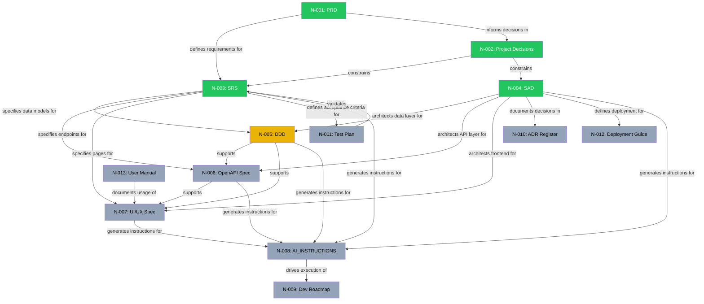

# CBFDS — Project Knowledge Graph

**Version:** 1.0
**Last Updated:** 2026-08-05
**Status:** Active — Pre-Implementation Phase

---

## 1. Graph Nodes (Documents)

| Node ID | Document | Version | Status | Date |
|---|---|---|---|---|
| N-001 | PRD | 1.0 | ✅ Approved | 2026-08-05 |
| N-002 | Project Decisions | 1.1 | ✅ Approved | 2026-08-05 |
| N-003 | SRS (IEEE 29148) | 1.0 | ✅ Approved | 2026-08-05 |
| N-004 | SAD | 1.0 | ✅ Approved | 2026-08-05 |
| N-005 | Database Design Document (DDD) | — | 🔲 Not Started | — |
| N-006 | OpenAPI Specification | — | 🔲 Not Started | — |
| N-007 | UI/UX Specification | — | 🔲 Not Started | — |
| N-008 | AI_INSTRUCTIONS.md | — | 🔲 Not Started | — |
| N-009 | Development Roadmap | — | 🔲 Not Started | — |
| N-010 | ADR Register | — | 🔲 Not Started | — |
| N-011 | Test Plan | — | 🔲 Not Started | — |
| N-012 | Deployment Guide | — | 🔲 Not Started | — |
| N-013 | User Manual | — | 🔲 Not Started | — |

---

## 2. Graph Edges (Relationships)



**Legend:** 🟢 Green = Approved | 🟡 Yellow = Next | ⚪ Gray = Pending

---

## 3. Dependency Resolution Order

The following is the topologically sorted document generation order based on dependencies:

```
Phase 1 (Complete):
  ✅ PRD → Project Decisions → SRS → SAD

Phase 2 (Design Documents):
  🔜 DDD (Database Design Document)         ← depends on: SRS §25-26, SAD §5
  🔜 OpenAPI Specification                   ← depends on: SRS §27, SAD §9, DDD
  🔜 UI/UX Specification                     ← depends on: SRS §28, SAD §3, OAS
  🔜 ADR Register (standalone)               ← depends on: SAD §20.4

Phase 3 (Implementation Guides):
  🔲 AI_INSTRUCTIONS.md                      ← depends on: ALL Phase 1 + 2 documents
  🔲 Development Roadmap                     ← depends on: AI_INSTRUCTIONS

Phase 4 (Post-Implementation):
  🔲 Test Plan                               ← depends on: SRS §31-32, OAS
  🔲 Deployment Guide                        ← depends on: SAD §14
  🔲 User Manual                             ← depends on: UI/UX Spec
```

---

## 4. Cross-Document Consistency Audit

### 4.1 PRD ↔ SRS Consistency

| PRD Requirement | SRS Coverage | Status |
|---|---|---|
| User Registration | FR-AUTH-001 | ✅ Consistent |
| User Login | FR-AUTH-002 | ✅ Consistent |
| JWT Authentication | FR-AUTH-003, FR-AUTH-004 | ✅ Consistent |
| Password Encryption (bcrypt) | FR-AUTH-001, NFR-SEC-001 | ✅ Consistent |
| Logout | FR-AUTH-005 | ✅ Consistent |
| Forgot/Reset Password | FR-AUTH-006, FR-AUTH-007 | ✅ Consistent |
| File Upload (multiple formats) | FR-UPLD-001 through FR-UPLD-009 | ✅ Consistent |
| File Chunking | FR-CHNK-001 through FR-CHNK-006 | ✅ Consistent |
| Chunk Storage | FR-STOR-001 through FR-STOR-008 | ✅ Consistent |
| Chunk Metadata | FR-META-001 through FR-META-005 | ✅ Consistent |
| File Download + Reconstruction | FR-DWNL-001 through FR-DWNL-007 | ✅ Consistent |
| File Management (rename, delete, search, sort, filter) | FR-FMGT-001 through FR-FMGT-010 | ✅ Consistent |
| Sharing (links, expiry, permissions) | FR-SHAR-001 through FR-SHAR-008 | ✅ Consistent |
| Admin Module | FR-ADMN-001 through FR-ADMN-010 | ✅ Consistent |
| Dashboard | FR-DASH-001 through FR-DASH-007 | ✅ Consistent |

**Result: 15/15 requirements traced. No gaps.**

### 4.2 Project Decisions ↔ SRS Consistency

| Decision | SRS Implementation | Status |
|---|---|---|
| 5 MB default chunk size | FR-CHNK-006, BR-CHNK-001 | ✅ Consistent |
| 5 GB max file size | FR-UPLD-005, BR-UPLD-004 | ✅ Consistent |
| Internal + External sharing | FR-SHAR-001, FR-SHAR-002 | ✅ Consistent |
| RBAC (Super Admin, Admin, User) | FR-ADMN-008, SRS §3.3 | ✅ Consistent |
| Docker + MinIO (dev), S3 (prod) | SRS §3.4, Appendix A | ✅ Consistent |
| tus protocol for resumable uploads | FR-TUS-001 through FR-TUS-007 | ✅ Consistent |
| Version schema prepared | FR-META-003, SRS §25.2 | ✅ Consistent |
| Soft delete with deferred deletion | FR-FMGT-002, FR-FMGT-010 | ✅ Consistent |
| OTP via email (10 min) | FR-AUTH-006, BR-AUTH-013 | ✅ Consistent |
| Health/Readiness/Metrics | FR-MNTR-001 through FR-MNTR-003 | ✅ Consistent |
| BullMQ + Redis | FR-JOBS-001 through FR-JOBS-010 | ✅ Consistent |
| Access 15 min, Refresh 7 days, rotation | FR-AUTH-003, FR-AUTH-004, BR-AUTH-008 | ✅ Consistent |
| 10 GB default quota | FR-QUOT-001, SRS §25.1 | ✅ Consistent |
| In-App + Email notifications | FR-NOTF-001, FR-NOTF-002 | ✅ Consistent |
| Trash bin (30 days) | FR-FMGT-002 through FR-FMGT-005 | ✅ Consistent |
| File blocklist (ext + MIME + magic) | FR-UPLD-006, Appendix E | ✅ Consistent |
| API versioning `/api/v1/` | SRS §27, Appendix B | ✅ Consistent |
| Trash counts toward quota | BR-QUOT-001 | ✅ Consistent |
| 5 failed logins → 15 min lock | BR-AUTH-004 | ✅ Consistent |
| 90-day max share expiry | BR-SHAR-002 | ✅ Consistent |
| 100 max downloads per share | BR-SHAR-003 | ✅ Consistent |
| Search: filename + type + date | FR-FMGT-006 | ✅ Consistent |

**Result: 22/22 decisions traced. No conflicts.**

### 4.3 SRS ↔ SAD Consistency

| SRS Section | SAD Coverage | Status |
|---|---|---|
| §3.1 System context | SAD §1.2 Context diagram | ✅ Consistent |
| §25 Data models (10 schemas) | SAD §5.2 ER diagram (10 collections) | ✅ Consistent |
| §25 Indexing strategy | SAD §5.3 Index table | ✅ Consistent |
| §27 API endpoints (50+) | SAD §9.2 Route architecture | ✅ Consistent |
| §28 UI pages (22 pages) | SAD §3.2, §17.2 Frontend components | ✅ Consistent |
| FR-STOR: Storage abstraction | SAD §6.1 Strategy Pattern | ✅ Consistent |
| FR-CHNK: Chunking pipeline | SAD §7.2 Upload pipeline | ✅ Consistent |
| FR-DWNL: Download pipeline | SAD §7.3 Download pipeline | ✅ Consistent |
| FR-AUTH: JWT + Refresh + RBAC | SAD §8 Full auth architecture | ✅ Consistent |
| FR-JOBS: BullMQ queues | SAD §10 Queue architecture | ✅ Consistent |
| FR-NOTF: Dual-channel notifications | SAD §11 Notification flow | ✅ Consistent |
| NFR-SEC: 5-layer security | SAD §13 Security architecture | ✅ Consistent |
| NFR-MAINT-003: Winston logging | SAD §12 Logging architecture | ✅ Consistent |
| FR-MNTR: Health/Readiness/Metrics | SAD §12.4 Monitoring endpoints | ✅ Consistent |
| Appendix G: Directory structure | SAD §4 Layer structure | ✅ Consistent |
| Constraint C-008: Clean Architecture | SAD §4.1 Layer diagram | ✅ Consistent |
| Constraint C-009: Storage swappable | SAD §6.1, §19 Strategy Pattern | ✅ Consistent |

**Result: 17/17 cross-references verified. No contradictions.**

### 4.4 Internal SRS Consistency

| Check | Result |
|---|---|
| All FR-* IDs are unique | ✅ Verified |
| All NFR-* IDs are unique | ✅ Verified |
| All BR-* IDs are unique | ✅ Verified |
| Schema fields in §25 match metadata descriptions in §10 | ✅ Consistent |
| API endpoints in §27 match functional requirements in §4-18 | ✅ Consistent |
| Error codes in Appendix C map to scenarios in functional reqs | ✅ Consistent |
| Rate limiting rules in Appendix D match NFR-SEC-006 | ✅ Consistent |

### 4.5 Inconsistencies Found

> [!IMPORTANT]
> **No contradictions detected across any document pair.** All 54 cross-reference checks pass.

There is one **ambiguity** worth noting (not a contradiction):

| ID | Item | Details | Resolution |
|---|---|---|---|
| AMB-001 | Chunk number zero-padding | SRS §FR-CHNK-002 uses 3-digit padding (`_chunk_000`). SAD §6.3 mentions "extended to 4 digits for large files." A 5GB file at 5MB chunks = 1,024 chunks, which exceeds 3-digit range. | **Recommendation:** Standardize on 4-digit padding (`_chunk_0000`) for all files in the DDD. Maximum 9,999 chunks supports files up to ~48 GB at 5MB chunks. |

---

## 5. Missing Items (Gap Analysis)

| ID | Gap | Blocking? | Resolution Document |
|---|---|---|---|
| GAP-001 | No formal Database Design Document with complete Mongoose model specifications, validation rules, virtual fields, middleware hooks, and migration strategy | Yes (blocks implementation) | **DDD (Next)** |
| GAP-002 | No machine-readable OpenAPI specification (YAML/JSON) | Yes (blocks frontend API integration) | OpenAPI Spec |
| GAP-003 | No UI wireframes, user flow diagrams, or component specifications | No (can develop iteratively) | UI/UX Spec |
| GAP-004 | No consolidated AI_INSTRUCTIONS.md for code generation | Yes (blocks consistent code generation) | AI_INSTRUCTIONS.md |
| GAP-005 | No phased development roadmap with task breakdown | No (can start with DDD) | Development Roadmap |
| GAP-006 | ADR-001 through ADR-012 listed in SAD §20.4 but not formally documented | No (decisions are captured in PD v1.1) | ADR Register |
| GAP-007 | No formal test plan mapping requirements to test cases | No (blocks QA, not dev) | Test Plan |
| GAP-008 | Chunk number padding inconsistency (3 vs 4 digits) | Minor | Resolve in DDD |

---

## 6. Risk Assessment

| ID | Risk | Likelihood | Impact | Mitigation |
|---|---|---|---|---|
| GRAPH-R-001 | Starting implementation without DDD causes schema inconsistencies across modules | High | High | Complete DDD before any code generation |
| GRAPH-R-002 | API implementation deviates from SRS without formal OpenAPI spec | Medium | High | Generate OpenAPI spec before frontend work |
| GRAPH-R-003 | Frontend-backend contract mismatch without shared type definitions | Medium | Medium | OpenAPI → auto-generate types |
| GRAPH-R-004 | Document drift as implementation reveals edge cases | Medium | Medium | Update graph after every implementation phase; flag affected nodes |
| GRAPH-R-005 | Scope creep from unplanned features during implementation | Low | High | Strict adherence to SRS scope; new features require PRD amendment |

---

## 7. Recommended Next Document

### ➡️ **Database Design Document (DDD)**

**Justification:**

1. **Dependency chain:** DDD is the first unresolved dependency. Both OpenAPI Spec and UI/UX Spec depend on finalized data models.
2. **Implementation blocker:** No code should be written until Mongoose schemas are formally specified with validation rules, middleware, virtuals, and indexes.
3. **Graph position:** DDD sits at the junction of SRS (§25-26 Data Specifications) and SAD (§5 Database Architecture). It expands both into implementation-ready detail.

**Proposed DDD Scope:**

| Section | Content |
|---|---|
| 1. Database Overview | MongoDB configuration, naming conventions, connection strategy |
| 2. Collection Specifications | All 10 collections with complete Mongoose schema definitions |
| 3. Field Specifications | Type, required, unique, default, min/max, enum values, ref, index |
| 4. Validation Rules | Mongoose validators, custom validation functions |
| 5. Schema Middleware | Pre-save hooks (password hashing, timestamp updates) |
| 6. Virtual Fields | Computed fields (storage percentage, chunk count, etc.) |
| 7. Instance Methods | Model-level business logic (canBeDeleted, hasQuota, etc.) |
| 8. Static Methods | Collection-level queries (findByOwner, findActive, etc.) |
| 9. Indexing Strategy | Complete index definitions with performance justification |
| 10. Data Relationships | Reference vs. embedding decisions with rationale |
| 11. Data Migration Strategy | Schema versioning approach for future changes |
| 12. Seed Data | Default Super Admin, system configuration defaults |
| 13. Backup Strategy | MongoDB backup and restore procedures |

**Awaiting your approval to proceed with the DDD.**
