# Software Architecture Document (SAD)

# Cloud-Based File Distribution System (CBFDS)

**Version:** 1.0
**Date:** August 5, 2026
**Standard:** IEEE 42010 / Enterprise Architecture Style
**Classification:** Academic / Portfolio Project
**Reference Document:** SRS CBFDS v1.0 (IEEE 29148-2018)

---

# Document Control

| Field | Value |
|---|---|
| Document Title | Software Architecture Document |
| Project Name | Cloud-Based File Distribution System (CBFDS) |
| Version | 1.0 |
| Author | Project Team |
| Status | Draft |
| Last Updated | 2026-08-05 |

### Revision History

| Version | Date | Description |
|---|---|---|
| 1.0 | 2026-08-05 | Initial SAD based on SRS v1.0 |

### Reference Documents

| Document | Version | Identifier |
|---|---|---|
| Product Requirements Document | 1.0 | PRD-CBFDS-1.0 |
| Project Decisions | 1.1 | PD-CBFDS-1.1 |
| Software Requirements Specification | 1.0 | SRS-CBFDS-1.0 |

---

# Table of Contents

1. [High-Level Architecture](#1-high-level-architecture)
2. [System Components](#2-system-components)
3. [Frontend Architecture](#3-frontend-architecture)
4. [Backend Architecture (Clean Architecture)](#4-backend-architecture)
5. [Database Architecture](#5-database-architecture)
6. [Storage Architecture](#6-storage-architecture)
7. [File Chunking & Reconstruction Flow](#7-file-chunking--reconstruction-flow)
8. [Authentication & Authorization](#8-authentication--authorization)
9. [API Architecture](#9-api-architecture)
10. [Background Jobs](#10-background-jobs)
11. [Notification Architecture](#11-notification-architecture)
12. [Logging & Monitoring](#12-logging--monitoring)
13. [Security Architecture](#13-security-architecture)
14. [Deployment Architecture](#14-deployment-architecture)
15. [Scalability & High Availability](#15-scalability--high-availability)
16. [Sequence Diagrams](#16-sequence-diagrams)
17. [Component Diagrams](#17-component-diagrams)
18. [Technology Stack](#18-technology-stack)
19. [Design Patterns Used](#19-design-patterns-used)
20. [Risks, Trade-offs, and Future Scalability](#20-risks-trade-offs-and-future-scalability)

---

# 1. High-Level Architecture

## 1.1 Architectural Style

CBFDS follows a **three-tier layered architecture** with an **event-driven processing backbone**:

| Tier | Responsibility | Technologies |
|---|---|---|
| **Presentation** | User interface, client-side routing, state management | React, Tailwind CSS, Axios |
| **Application** | Business logic, API routing, job orchestration | Node.js, Express.js, BullMQ |
| **Data** | Persistent storage, caching, object storage | MongoDB, Redis, MinIO/S3 |

The architecture is supplemented by:

- **Reverse Proxy Layer** — Nginx handles TLS termination, static asset serving, and request routing.
- **Asynchronous Processing Layer** — BullMQ workers process heavy operations (chunking, deletion, notifications) outside the request-response cycle.
- **External Services Layer** — Email delivery (SMTP/SendGrid) for transactional notifications.

**Rationale (SRS Reference: Section 3.1, C-008):** Clean Architecture was mandated to ensure separation of concerns, testability, and the ability to swap infrastructure components (storage providers, email services) without modifying business logic.

## 1.2 System Context Diagram

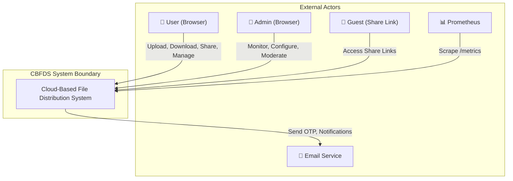

## 1.3 High-Level Architecture Diagram

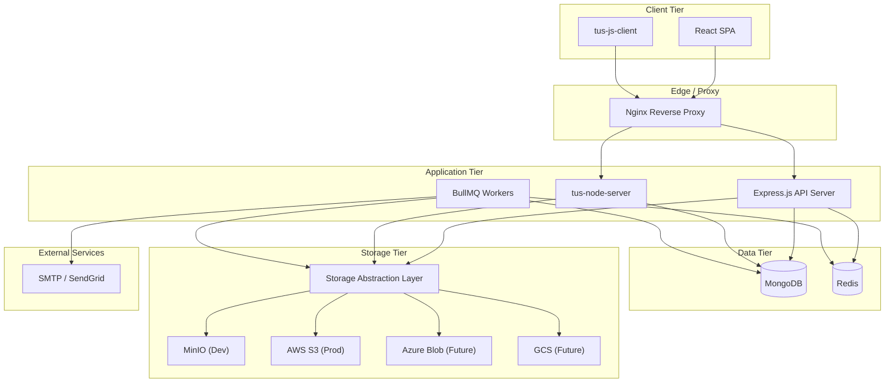

## 1.4 Key Architectural Principles

| Principle | Application in CBFDS |
|---|---|
| **Separation of Concerns** | Controllers handle HTTP, services contain logic, repositories abstract data |
| **Dependency Inversion** | Business logic depends on interfaces, not concrete implementations |
| **Single Responsibility** | Each module owns one domain (auth, files, shares, notifications) |
| **Open/Closed** | Storage providers extend the system without modifying existing code |
| **Stateless API** | API servers hold no session state; all state is in MongoDB/Redis |
| **Asynchronous by Default** | Heavy operations (chunking, deletion) run in background workers |
| **Fail Fast** | Environment validation on startup; missing config aborts boot |

---

# 2. System Components

## 2.1 Component Overview

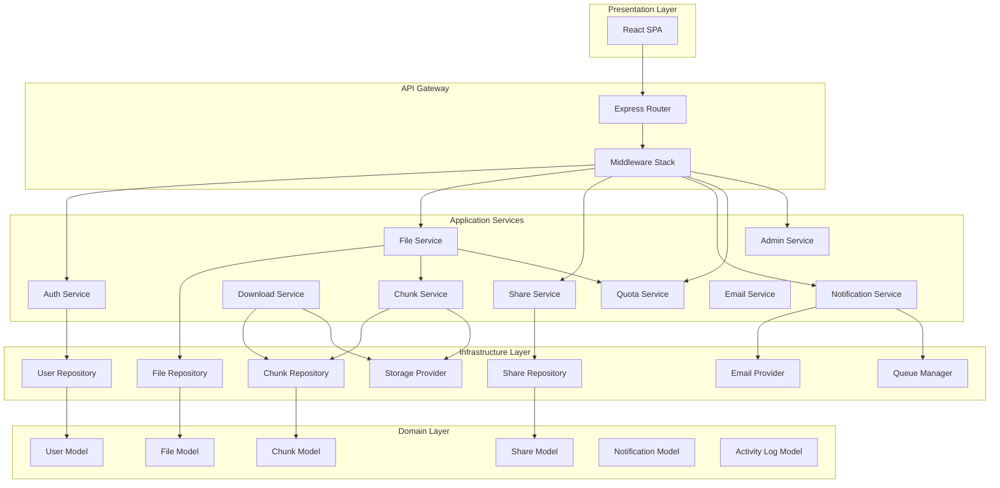

## 2.2 Component Responsibility Matrix

| Component | Responsibilities | SRS Reference |
|---|---|---|
| **Auth Service** | Registration, login, JWT/refresh management, OTP, session tracking, device detection | FR-AUTH-001 through FR-AUTH-009 |
| **File Service** | Upload orchestration, metadata CRUD, file status transitions, soft/hard delete | FR-UPLD-001 through FR-UPLD-009, FR-FMGT-001 through FR-FMGT-010 |
| **Chunk Service** | File splitting, SHA-256 computation, chunk storage, chunk metadata management | FR-CHNK-001 through FR-CHNK-006 |
| **Download Service** | Chunk retrieval, checksum verification, streaming reconstruction | FR-DWNL-001 through FR-DWNL-007 |
| **Share Service** | Internal/external sharing, link generation, password protection, expiry, limits | FR-SHAR-001 through FR-SHAR-008 |
| **Notification Service** | In-app creation, email dispatch, preferences, history | FR-NOTF-001 through FR-NOTF-005 |
| **Quota Service** | Usage tracking, threshold warnings, upload blocking, admin overrides | FR-QUOT-001 through FR-QUOT-006 |
| **Admin Service** | User management, statistics, moderation, RBAC, configuration, activity logs | FR-ADMN-001 through FR-ADMN-010 |
| **Email Service** | Template rendering, SMTP/provider dispatch, retry handling | FR-NOTF-002, FR-AUTH-006 |
| **Storage Provider** | Object CRUD via abstraction layer, health checks | FR-STOR-001 through FR-STOR-008 |
| **Queue Manager** | Job enqueueing, worker registration, retry/DLQ management | FR-JOBS-001 through FR-JOBS-010 |
| **Monitor Service** | Health, readiness, Prometheus metrics | FR-MNTR-001 through FR-MNTR-003 |

## 2.3 Component Communication Patterns

| Pattern | Used Between | Mechanism |
|---|---|---|
| **Synchronous Request/Response** | Client ↔ API Server | HTTP/REST |
| **Asynchronous Job Queue** | API Server → Workers | BullMQ (Redis) |
| **Event Callback** | tus Server → API Server | HTTP callback on upload complete |
| **Database Polling** | Workers → MongoDB | Query for pending jobs/cleanup |
| **Streaming** | Storage → API → Client | Node.js readable/writable streams |

---

# 3. Frontend Architecture

## 3.1 Technology Decisions

| Decision | Choice | Rationale |
|---|---|---|
| Framework | React 18+ | SRS Constraint C-002, component-based architecture, large ecosystem |
| Styling | Tailwind CSS 3.3+ | SRS Constraint C-002, utility-first, rapid prototyping, responsive |
| HTTP Client | Axios | Request/response interceptors for token management |
| Routing | React Router 6+ | Declarative, nested routes, protected route patterns |
| Upload Client | tus-js-client | SRS FR-TUS-001, open protocol, built-in resume/retry |
| State Management | React Context + useReducer | Sufficient for this scope; avoids external dependency |

## 3.2 Frontend Layer Diagram

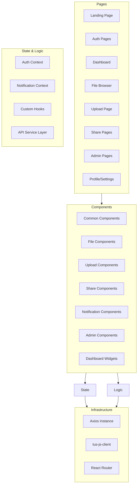

## 3.3 State Management Architecture

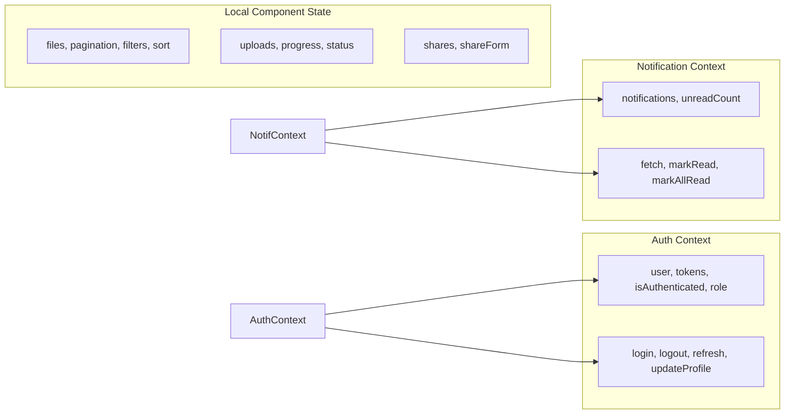

**Design Decision:** Global state is limited to authentication and notifications (cross-cutting concerns). File listings, upload progress, and share management use local component state with custom hooks, avoiding unnecessary re-renders.

## 3.4 API Service Layer

The frontend communicates with the backend exclusively through a centralized service layer. This layer:

1. **Centralizes Axios configuration** — Base URL, timeout, default headers.
2. **Manages token lifecycle** — Attaches access token to every request via interceptor.
3. **Handles token refresh** — On 401 with `TOKEN_EXPIRED`, silently refreshes and retries.
4. **Normalizes errors** — Converts API error responses into consistent error objects.
5. **Provides typed methods** — `authService.login()`, `fileService.upload()`, etc.

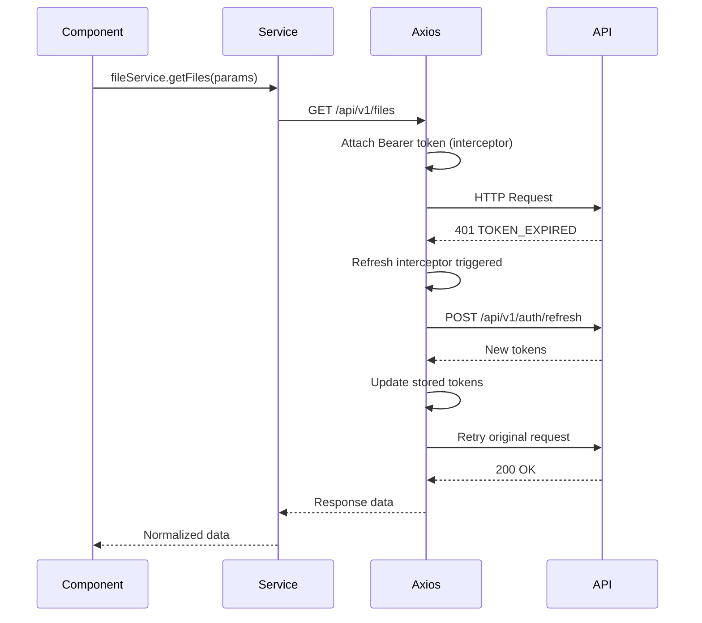

## 3.5 Protected Route Architecture

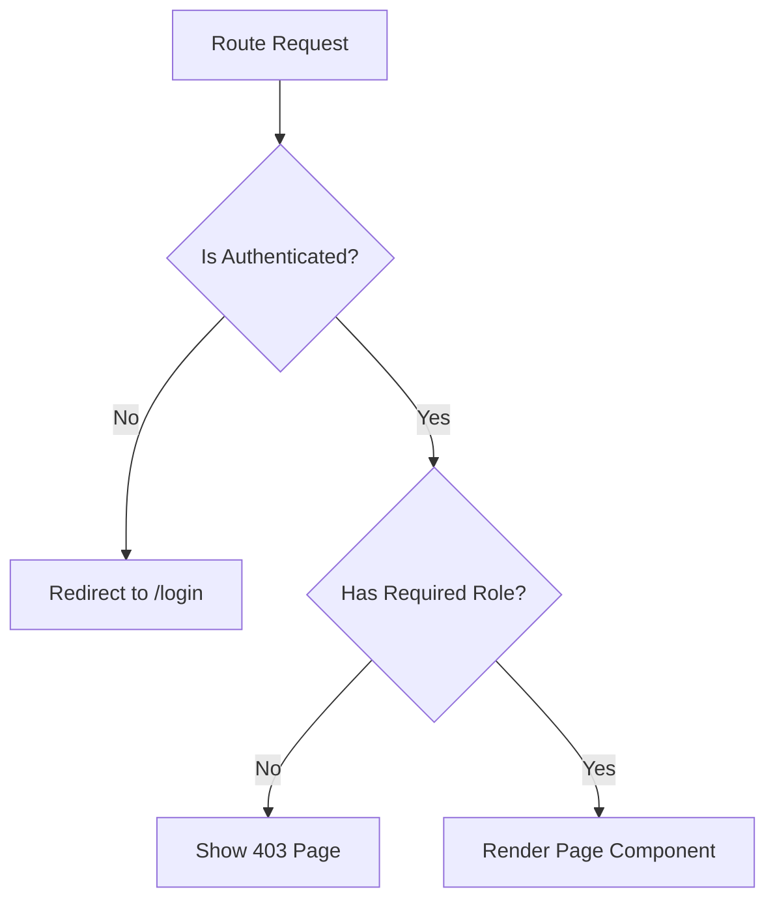

Routes are wrapped in a `ProtectedRoute` component that checks:
1. Authentication status (valid access token exists).
2. Role authorization (user role meets the minimum required role).
3. Token freshness (triggers refresh if access token is near expiry).

## 3.6 Responsive Layout Strategy

| Viewport | Layout | Sidebar | Navigation |
|---|---|---|---|
| Mobile (< 768px) | Single column, stacked | Hidden behind hamburger menu | Bottom tab bar |
| Tablet (768–1023px) | Two columns | Collapsible overlay | Left sidebar (collapsible) |
| Desktop (≥ 1024px) | Three+ columns with sidebar | Persistent left sidebar | Left sidebar (fixed) |

**SRS Reference:** NFR-USE-001

---

# 4. Backend Architecture (Clean Architecture)

## 4.1 Layer Structure

The backend follows **Clean Architecture** (Robert C. Martin) adapted for Node.js/Express.js. Dependencies point inward — outer layers depend on inner layers, never the reverse.

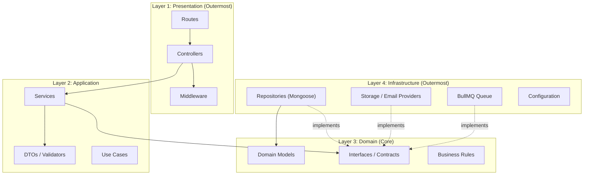

## 4.2 Layer Responsibilities

### Layer 1: Presentation

| Component | Responsibility | Example |
|---|---|---|
| **Routes** | Define HTTP endpoints, attach middleware, delegate to controllers | `fileRoutes.js` — `router.get('/:fileId', auth, fileController.getFile)` |
| **Controllers** | Parse HTTP requests, call services, format HTTP responses | `fileController.getFile(req, res)` |
| **Middleware** | Cross-cutting concerns executed before controllers | `auth.js`, `rbac.js`, `rateLimiter.js`, `validator.js`, `errorHandler.js` |

### Layer 2: Application

| Component | Responsibility | Example |
|---|---|---|
| **Services** | Orchestrate business workflows, coordinate repositories and providers | `fileService.uploadFile()` — validates, creates metadata, enqueues chunking |
| **DTOs** | Define input/output shapes with validation rules | `CreateFileDTO { originalName, mimeType, fileSize }` |
| **Validators** | Input validation using a schema library (Joi/Zod) | `registerSchema.validate(req.body)` |

### Layer 3: Domain (Core)

| Component | Responsibility | Example |
|---|---|---|
| **Models** | Define entity structure and relationships (Mongoose schemas) | `File { fileId, ownerId, status, totalChunks, ... }` |
| **Interfaces** | Define contracts for infrastructure (never import concrete classes) | `IStorageProvider { putObject(), getObject(), ... }` |
| **Business Rules** | Encode domain logic as pure functions or model methods | `File.canBeDeleted()`, `Quota.hasSpace(fileSize)` |

### Layer 4: Infrastructure

| Component | Responsibility | Example |
|---|---|---|
| **Repositories** | Implement data access using Mongoose | `fileRepository.findByOwnerId(userId)` |
| **Providers** | Implement external service integrations | `MinIOProvider.putObject(bucket, key, data)` |
| **Queue** | Implement job management using BullMQ | `queueManager.addJob('file-processing', payload)` |
| **Config** | Load and validate environment variables | `env.js` — validates all required vars at startup |

## 4.3 Dependency Injection Strategy

CBFDS uses **manual dependency injection** via factory functions (appropriate for the project scale). Each service receives its dependencies at construction time:

```
// Composition Root (app.js)

const storageProvider = storageFactory(config.STORAGE_PROVIDER)
const emailProvider = emailFactory(config.EMAIL_PROVIDER)

const fileRepository = new FileRepository(FileModel)
const chunkRepository = new ChunkRepository(ChunkModel)

const chunkService = new ChunkService(chunkRepository, storageProvider)
const quotaService = new QuotaService(userRepository)
const fileService = new FileService(fileRepository, chunkService, quotaService, queueManager)

const fileController = new FileController(fileService)
```

**Rationale:** Full DI containers (InversifyJS, tsyringe) add complexity without proportional benefit at this project scale. Manual injection preserves testability — services can be instantiated with mock dependencies in tests.

## 4.4 Middleware Pipeline

Every HTTP request passes through a middleware pipeline in this order:

```mermaid
graph LR
    Request["HTTP Request"] --> Helmet["Helmet (Security Headers)"]
    Helmet --> CORS["CORS"]
    CORS --> RateLimit["Rate Limiter"]
    RateLimit --> BodyParser["Body Parser"]
    BodyParser --> RequestID["Request ID Generator"]
    RequestID --> Logger["Request Logger"]
    Logger --> Auth["JWT Auth (if protected)"]
    Auth --> RBAC["Role Check (if restricted)"]
    RBAC --> Validator["Input Validator"]
    Validator --> Controller["Controller"]
    Controller --> ErrorHandler["Error Handler"]
    ErrorHandler --> Response["HTTP Response"]
```

## 4.5 Error Handling Architecture

All errors flow through a centralized error handler middleware at the end of the Express pipeline.

**Error Hierarchy:**

```
AppError (base)
├── ValidationError (400)
├── AuthenticationError (401)
├── AuthorizationError (403)
├── NotFoundError (404)
├── ConflictError (409)
├── RateLimitError (429)
├── QuotaExceededError (413)
├── IntegrityError (500)
└── ServiceUnavailableError (503)
```

Each custom error class carries:
- **HTTP status code** — Determines the response status.
- **Error code** — Machine-readable identifier (e.g., `AUTH_TOKEN_EXPIRED`).
- **Message** — Human-readable description.
- **Details** — Optional structured context (field errors, limits, etc.).

The error handler:
1. Catches all thrown/rejected errors.
2. Determines if the error is an `AppError` (operational) or unexpected (programmer error).
3. Operational errors → structured JSON response with appropriate status code.
4. Unexpected errors → generic 500 response; full details logged to Winston.
5. Never exposes stack traces, database queries, or internal paths to the client.

**SRS Reference:** NFR-SEC-007, NFR-USE-004, NFR-REL-003

---

# 5. Database Architecture

## 5.1 Database Selection Rationale

| Criterion | MongoDB | Rationale |
|---|---|---|
| Data Model | Document-oriented | File/chunk metadata maps naturally to nested documents |
| Schema Flexibility | Schema-less (with Mongoose validation) | Supports evolving requirements without migrations |
| Scalability | Horizontal sharding | Supports millions of files (SRS NFR-SCAL-003) |
| Developer Productivity | Native JSON | Aligns with Node.js/JavaScript stack |
| Ecosystem | Mongoose ODM | Mature, well-documented, with validation and middleware |
| Constraint | SRS C-003 | MongoDB is mandated |

## 5.2 Collection Architecture

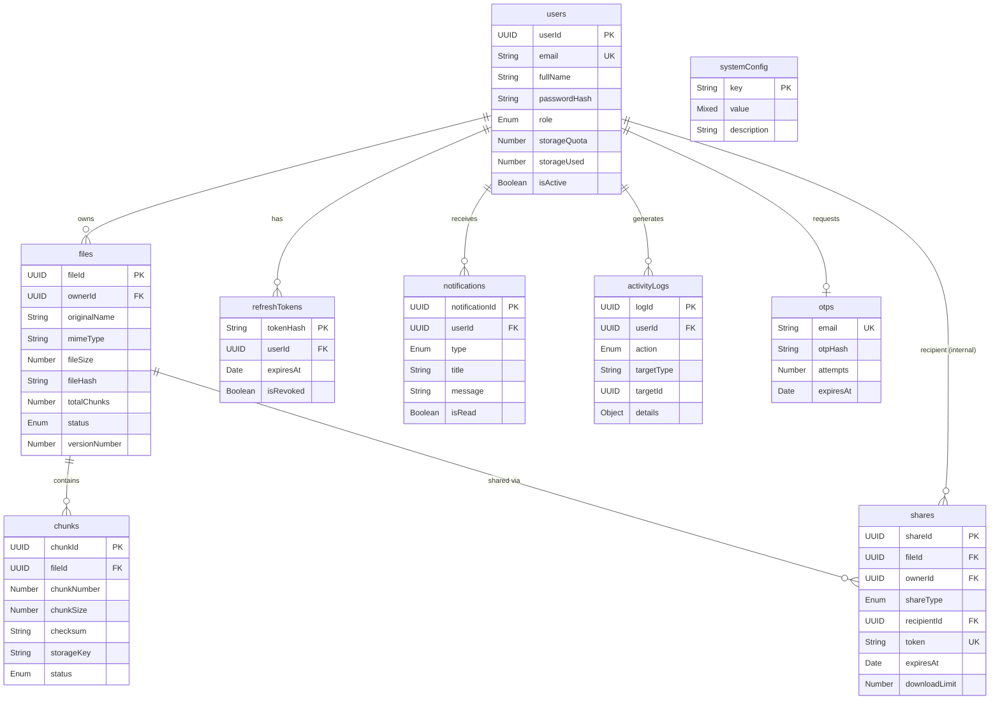

## 5.3 Indexing Strategy

Performance-critical queries are backed by targeted indexes:

| Collection | Index Definition | Type | Purpose |
|---|---|---|---|
| `users` | `{ email: 1 }` | Unique | Login lookup |
| `files` | `{ fileId: 1 }` | Unique | Direct file access |
| `files` | `{ ownerId: 1, status: 1 }` | Compound | File listing (active/deleted) |
| `files` | `{ ownerId: 1, uploadedAt: -1 }` | Compound | Recent uploads sort |
| `files` | `{ ownerId: 1, originalName: "text" }` | Text | Filename search |
| `files` | `{ status: 1, deletedAt: 1 }` | Compound | Trash auto-purge query |
| `chunks` | `{ fileId: 1, chunkNumber: 1 }` | Compound Unique | Ordered chunk retrieval |
| `shares` | `{ token: 1 }` | Unique | Public link access |
| `shares` | `{ expiresAt: 1 }` | TTL | Auto-expire documents |
| `shares` | `{ fileId: 1 }` | Regular | Find shares for a file |
| `refreshTokens` | `{ tokenHash: 1 }` | Unique | Token lookup |
| `refreshTokens` | `{ userId: 1 }` | Regular | Revoke all sessions |
| `refreshTokens` | `{ expiresAt: 1 }` | TTL | Auto-expire tokens |
| `notifications` | `{ userId: 1, isRead: 1, createdAt: -1 }` | Compound | Notification feed |
| `notifications` | `{ createdAt: 1 }` | TTL (90d) | Auto-expire notifications |
| `activityLogs` | `{ userId: 1, createdAt: -1 }` | Compound | User activity query |
| `activityLogs` | `{ action: 1, createdAt: -1 }` | Compound | Admin log filtering |
| `otps` | `{ email: 1 }` | Unique | OTP lookup |
| `otps` | `{ expiresAt: 1 }` | TTL | Auto-expire OTPs |

**SRS Reference:** FR-META-005

## 5.4 Data Lifecycle Management

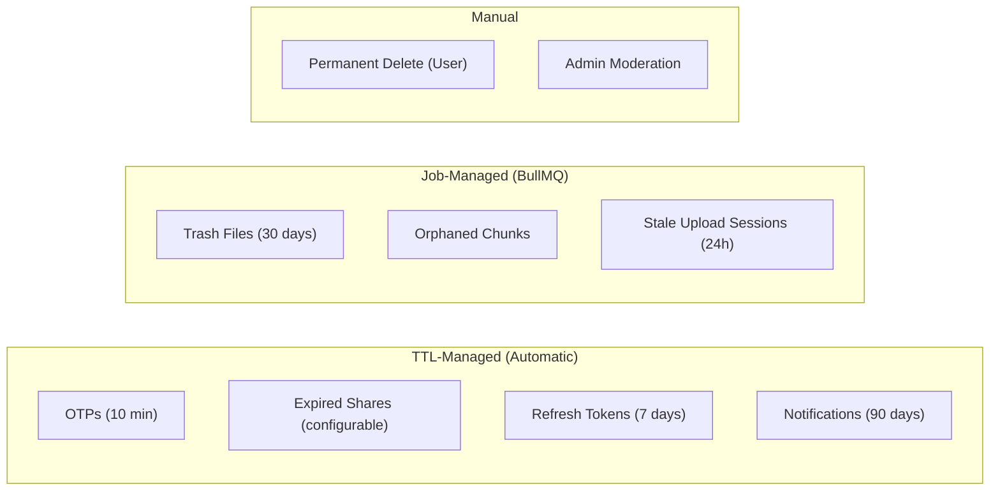

MongoDB TTL indexes handle time-based automatic expiration. Background jobs handle more complex lifecycle rules (trash purge requires deleting chunks from storage, not just MongoDB documents).

## 5.5 Read/Write Patterns

| Pattern | Collection | Frequency | Optimization |
|---|---|---|---|
| **Read-heavy** | files, notifications | Very high | Compound indexes, projection |
| **Write-heavy** | activityLogs | High | Append-only, no updates |
| **Read-then-write** | files (status transitions) | Medium | Atomic updates (`findOneAndUpdate`) |
| **Burst writes** | chunks (during chunking) | High (burst) | Bulk insert operations |
| **Counter updates** | files (activeOperations), shares (downloadCount) | Medium | Atomic `$inc` operator |

---

# 6. Storage Architecture

## 6.1 Abstraction Layer Design

The storage layer implements the **Strategy Pattern** (SRS Constraint C-009) to enable provider-agnostic object operations. The business logic interacts exclusively with the `IStorageProvider` interface.

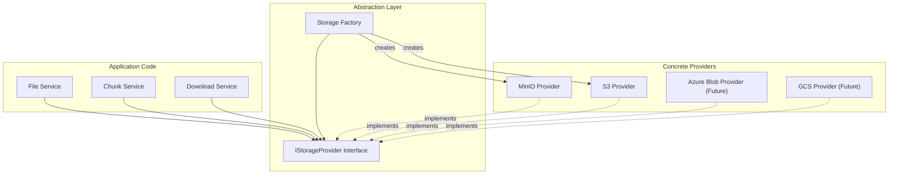

## 6.2 Interface Contract

```
IStorageProvider
├── putObject(bucket, key, data, metadata?)    → Promise<void>
├── getObject(bucket, key)                      → Promise<ReadableStream>
├── deleteObject(bucket, key)                   → Promise<void>
├── objectExists(bucket, key)                   → Promise<boolean>
├── getObjectMetadata(bucket, key)              → Promise<ObjectMetadata>
├── listObjects(bucket, prefix, options?)        → Promise<ObjectInfo[]>
├── bucketExists(bucket)                        → Promise<boolean>
├── createBucket(bucket)                        → Promise<void>
└── healthCheck()                               → Promise<HealthStatus>
```

## 6.3 Object Key Hierarchy

Objects in storage follow a deterministic, hierarchical key structure:

```
{bucket}/
└── {userId}/
    └── {fileId}/
        └── chunks/
            ├── 000
            ├── 001
            ├── 002
            └── ...
```

**Example:** `cbfds-chunks/a1b2c3d4-user-uuid/e5f6g7h8-file-uuid/chunks/007`

**Design Rationale:**

- **User isolation** — Each user's files are namespaced, enabling per-user policies.
- **File grouping** — All chunks for a file share a common prefix, enabling batch deletion via `listObjects(prefix)`.
- **Zero-padded numbering** — Ensures lexicographic ordering matches chunk order (supports up to 1,000 chunks for 3 digits; extended to 4 digits for large files).

## 6.4 Provider Selection

Provider selection is driven by the `STORAGE_PROVIDER` environment variable and resolved at application startup via the Storage Factory:

| Environment Variable | Provider Instantiated | Required Config |
|---|---|---|
| `minio` | MinIOProvider | MINIO_ENDPOINT, MINIO_PORT, MINIO_ACCESS_KEY, MINIO_SECRET_KEY |
| `s3` | S3Provider | AWS_REGION, AWS_ACCESS_KEY_ID, AWS_SECRET_ACCESS_KEY, S3_BUCKET |
| `azure` (future) | AzureBlobProvider | AZURE_CONNECTION_STRING, AZURE_CONTAINER |
| `gcs` (future) | GCSProvider | GCS_PROJECT_ID, GCS_KEY_FILE, GCS_BUCKET |

## 6.5 Storage Resilience

| Concern | Strategy |
|---|---|
| **Upload failure** | Retry 3 times with exponential backoff (1s, 2s, 4s) |
| **Download failure** | Retry 3 times; if all fail, report integrity error |
| **Connection pool** | MinIO/S3 SDKs manage HTTP connection pools internally |
| **Health monitoring** | `healthCheck()` called by `/readiness` endpoint every 30 seconds |
| **Orphaned objects** | Weekly maintenance job scans for objects without metadata records |

**SRS Reference:** FR-STOR-001 through FR-STOR-008

---

# 7. File Chunking & Reconstruction Flow

## 7.1 Chunking Architecture

Chunking transforms a single uploaded file into independently addressable, integrity-verified segments.

**Parameters (SRS Reference: FR-CHNK-006, BR-CHNK-001 through BR-CHNK-004):**

| Parameter | Default | Min | Max | Configurable By |
|---|---|---|---|---|
| Chunk Size | 5 MB (5,242,880 bytes) | 1 MB | 100 MB | Super Admin |

**Chunk Count Formula:** `totalChunks = Math.ceil(fileSize / chunkSize)`

**Example Calculations:**

| File Size | Chunk Size | Total Chunks | Last Chunk Size |
|---|---|---|---|
| 500 KB | 5 MB | 1 | 500 KB |
| 12 MB | 5 MB | 3 | 2 MB |
| 1 GB | 5 MB | 205 | ~4.8 MB |
| 5 GB | 5 MB | 1,024 | 5 MB |

## 7.2 Upload & Chunking Pipeline

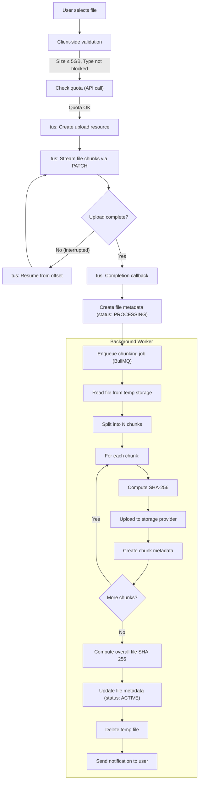

## 7.3 Download & Reconstruction Pipeline

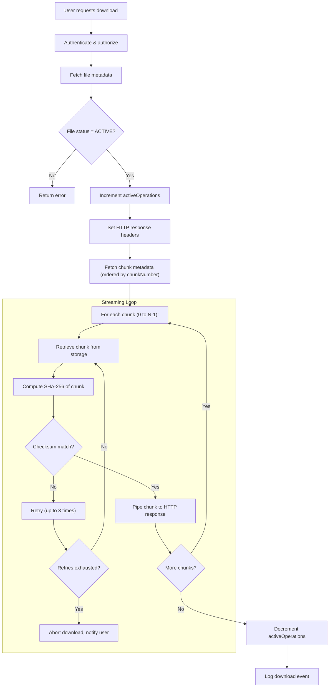

## 7.4 Integrity Verification Strategy

Integrity is verified at two levels:

| Level | Hash | When Computed | When Verified |
|---|---|---|---|
| **Chunk Level** | SHA-256 per chunk | During chunking (worker) | During download (before streaming each chunk) |
| **File Level** | SHA-256 of entire file | During chunking (after all chunks stored) | After download reconstruction (optional client-side) |

**Failure Handling (SRS Reference: FR-DWNL-003, FR-DWNL-007):**

1. Chunk checksum mismatch → retry retrieval up to 3 times.
2. All retries fail → mark chunk as `CORRUPTED`, abort download.
3. Notify user with integrity failure details (which chunk, expected vs. actual hash).
4. Log corruption event in activity logs with full diagnostic data.

## 7.5 Memory Management During Reconstruction

**Critical Constraint (SRS Reference: BR-DWNL-001):** Maximum memory usage per download ≤ 2 × chunk size (10 MB at default settings).

**Implementation Strategy:**

- Chunks are retrieved and streamed **one at a time** (sequential pipeline).
- Each chunk is piped directly from the storage provider's readable stream to the HTTP response writable stream.
- The chunk is never fully buffered in memory — Node.js stream backpressure manages flow control.
- Only the SHA-256 hash state (fixed 256-bit accumulator) is held in memory per chunk.

---

# 8. Authentication & Authorization

## 8.1 Authentication Architecture

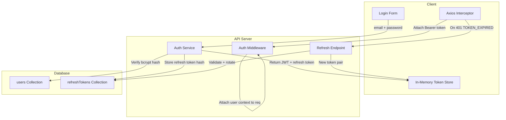

## 8.2 Token Architecture

| Token | Type | Storage (Client) | Storage (Server) | TTL | Purpose |
|---|---|---|---|---|---|
| **Access Token** | JWT (HS256) | JavaScript variable (memory) | Not stored | 15 minutes | API request authentication |
| **Refresh Token** | Opaque (32-byte hex) | httpOnly cookie or memory | SHA-256 hash in MongoDB | 7 days | Obtain new access tokens |

**JWT Access Token Payload:**

```json
{
  "sub": "user-uuid",
  "role": "user|admin|superadmin",
  "iat": 1691234567,
  "exp": 1691235467
}
```

**SRS Reference:** FR-AUTH-003, FR-AUTH-004, NFR-SEC-002, NFR-SEC-013

## 8.3 Refresh Token Rotation

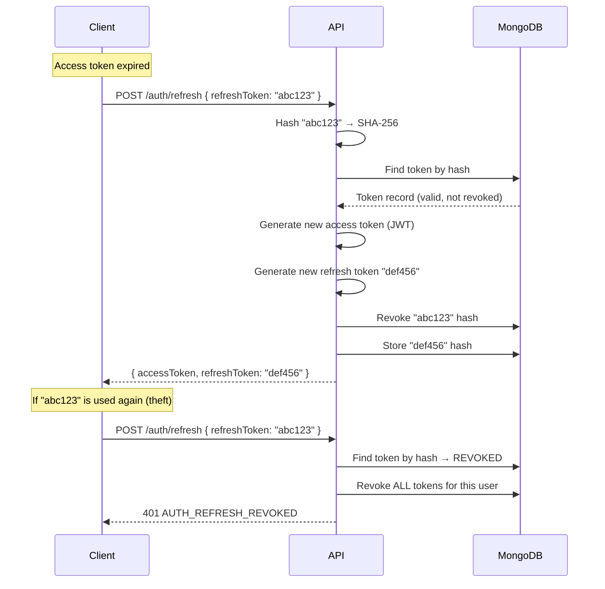

**Theft Detection (SRS Reference: BR-AUTH-010):** If a revoked refresh token is presented, it indicates the token was stolen and used by the legitimate user (revoking it) while the attacker still holds a copy. The system responds by revoking ALL tokens for that user, forcing re-authentication on all devices.

## 8.4 Role-Based Access Control (RBAC)

### Role Hierarchy

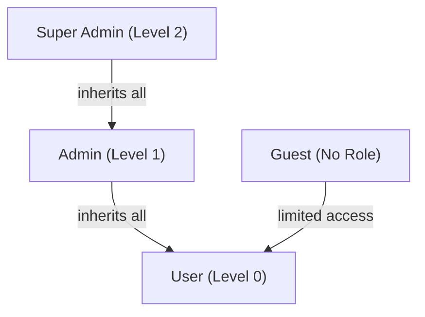

### Permission Matrix

| Resource / Action | Guest | User | Admin | Super Admin |
|---|---|---|---|---|
| View public share links | ✅ | ✅ | ✅ | ✅ |
| Register / Login | ✅ | — | — | — |
| Upload files | ❌ | ✅ | ✅ | ✅ |
| Download own files | ❌ | ✅ | ✅ | ✅ |
| Download shared files | via link | ✅ | ✅ | ✅ |
| Manage own files | ❌ | ✅ | ✅ | ✅ |
| Share files | ❌ | ✅ | ✅ | ✅ |
| View own dashboard | ❌ | ✅ | ✅ | ✅ |
| View admin dashboard | ❌ | ❌ | ✅ | ✅ |
| Manage users | ❌ | ❌ | ✅ | ✅ |
| Delete any file | ❌ | ❌ | ✅ | ✅ |
| View activity logs | ❌ | ❌ | ✅ | ✅ |
| Change user roles | ❌ | ❌ | ❌ | ✅ |
| Manage admins | ❌ | ❌ | ❌ | ✅ |
| System configuration | ❌ | ❌ | ❌ | ✅ |
| Override quotas | ❌ | ❌ | ✅ | ✅ |

### RBAC Middleware Implementation

The RBAC middleware is a higher-order function that accepts the minimum required role:

```
rbac(requiredRole)
→ Extracts role from req.user (set by auth middleware)
→ Compares role level against required level
→ If insufficient → 403 AUTH_UNAUTHORIZED
→ If sufficient → next()
```

**SRS Reference:** FR-ADMN-008, NFR-SEC-012, BR-ADMN-004 through BR-ADMN-006

## 8.5 Account Security Mechanisms

| Mechanism | Configuration | SRS Reference |
|---|---|---|
| **Password Policy** | Min 8 chars, uppercase + lowercase + number + special char | FR-AUTH-001 |
| **Password History** | Cannot reuse last 3 passwords | BR-AUTH-017 |
| **Account Lockout** | 5 failed attempts → 15-minute lock | BR-AUTH-004 |
| **OTP Expiry** | 10 minutes | BR-AUTH-013 |
| **OTP Rate Limit** | 3 requests per hour per email | BR-AUTH-014 |
| **Email Enumeration Prevention** | Identical response for existing/non-existing emails | BR-AUTH-015 |
| **Session Revocation** | On password reset, all sessions terminated | BR-AUTH-018 |
| **New Device Detection** | Email notification on unrecognized device | FR-AUTH-009 |

---

# 9. API Architecture

## 9.1 API Design Principles

| Principle | Implementation |
|---|---|
| **Versioning** | All routes under `/api/v1/` (SRS C-007) |
| **RESTful** | Resource-oriented URLs, proper HTTP methods and status codes |
| **Consistent Response Format** | All responses follow `{ success, message, data/error, pagination? }` |
| **Idempotency** | GET, PUT, DELETE are idempotent; POST is not |
| **Pagination** | Cursor-based or offset pagination for all list endpoints |
| **Content Negotiation** | `application/json` for all endpoints except file downloads |
| **Error Standardization** | Machine-readable error codes with human-readable messages |

## 9.2 Route Architecture

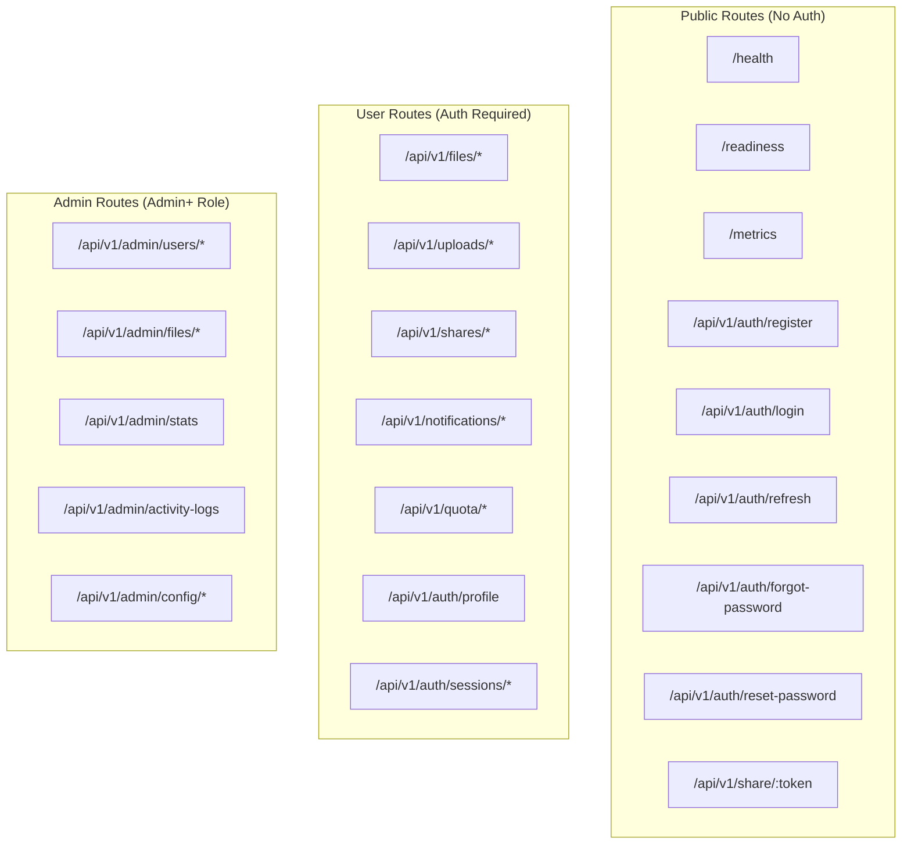

## 9.3 Request/Response Pipeline

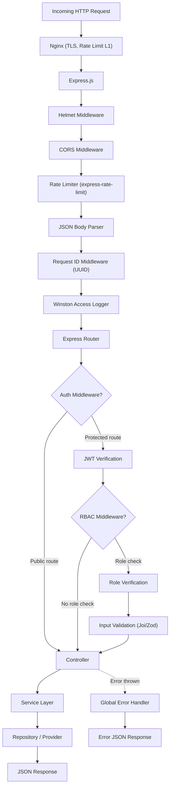

## 9.4 API Documentation

API documentation is auto-generated using **OpenAPI 3.0 / Swagger** and served at `/api-docs`.

| Feature | Implementation |
|---|---|
| Spec Format | OpenAPI 3.0 (YAML/JSON) |
| UI | Swagger UI served at `/api-docs` |
| Generation | swagger-jsdoc reads JSDoc annotations from route files |
| Authentication | "Try it out" supports Bearer token input |
| Environments | Dev and Prod base URLs configured |

**SRS Reference:** NFR-MAINT-002

---

# 10. Background Jobs (BullMQ + Redis)

## 10.1 Queue Architecture

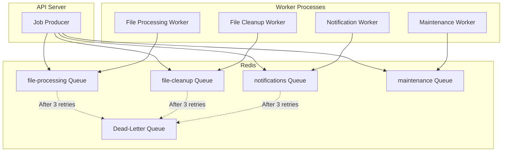

## 10.2 Queue Configuration

| Queue Name | Jobs | Priority | Concurrency | Retry Policy | SRS Reference |
|---|---|---|---|---|---|
| `file-processing` | Chunking, merge | High | 3 workers | 3 retries (1m, 5m, 15m) | FR-JOBS-002, FR-JOBS-003 |
| `file-cleanup` | Deletion, purge, orphan cleanup | Medium | 2 workers | 3 retries (1m, 5m, 15m) | FR-JOBS-004, FR-JOBS-009 |
| `notifications` | Email, in-app notifications | Medium | 5 workers | 3 retries (30s, 2m, 10m) | FR-JOBS-006, FR-JOBS-007 |
| `maintenance` | Expired links, analytics, integrity checks | Low | 1 worker | 3 retries (5m, 15m, 1h) | FR-JOBS-005, FR-JOBS-008, FR-JOBS-010 |

## 10.3 Job Lifecycle

```mermaid
stateDiagram-v2
    [*] --> Waiting: Job enqueued
    Waiting --> Active: Worker picks up
    Active --> Completed: Success
    Active --> Failed: Error thrown
    Failed --> Waiting: Retry (backoff)
    Failed --> DeadLetter: Max retries exhausted
    Completed --> [*]
    DeadLetter --> [*]: Manual intervention
```

## 10.4 Scheduled Jobs

| Job | Schedule | Queue | SRS Reference |
|---|---|---|---|
| Trash auto-purge | Daily 02:00 UTC | file-cleanup | FR-JOBS-009 |
| Share link expiry cleanup | Every hour | maintenance | FR-JOBS-005 |
| Storage analytics aggregation | Every 6 hours | maintenance | FR-JOBS-010 |
| Integrity verification (10% sample) | Weekly | maintenance | FR-JOBS-008 |
| Orphaned upload cleanup | Daily 03:00 UTC | file-cleanup | BR-TUS-001 |

## 10.5 Job Payload Design Principles

1. **No binary data** — Payloads contain references (fileId, userId, filePath), never file content.
2. **Idempotent** — Jobs can be safely retried without side effects (check before write).
3. **Self-contained** — Each job payload contains all information needed to execute without additional API calls.
4. **Minimal** — Only necessary fields to reduce Redis memory usage.

**SRS Reference:** FR-JOBS-001, BR-JOBS-001 through BR-JOBS-004

---

# 11. Notification Architecture

## 11.1 Notification Flow

```mermaid
graph TB
    subgraph "Trigger Events"
        Upload["Upload Complete"]
        Share["File Shared"]
        Quota["Quota Warning"]
        Auth["Password Changed / New Device"]
        Admin["Admin Announcement"]
    end

    subgraph "Notification Service"
        Determine["Determine notification type"]
        CheckPrefs["Check user preferences"]
        CreateInApp["Create in-app notification"]
        EnqueueEmail["Enqueue email job"]
    end

    subgraph "Delivery"
        InAppDB["MongoDB (notifications)"]
        EmailQueue["BullMQ (notifications queue)"]
        EmailWorker["Email Worker"]
        EmailProvider["SMTP / SendGrid"]
    end

    Upload --> Determine
    Share --> Determine
    Quota --> Determine
    Auth --> Determine
    Admin --> Determine

    Determine --> CheckPrefs
    CheckPrefs --> CreateInApp
    CheckPrefs -->|"If email enabled"| EnqueueEmail

    CreateInApp --> InAppDB
    EnqueueEmail --> EmailQueue
    EmailQueue --> EmailWorker
    EmailWorker --> EmailProvider
```

## 11.2 Notification Categories and Channels

| Event | In-App | Email | Priority | SRS Reference |
|---|---|---|---|---|
| File shared with you | ✅ | ✅ | Normal | FR-SHAR-008 |
| Upload completed | ✅ | ❌ | Low | FR-NOTF-001 |
| Download completed | ✅ | ❌ | Low | FR-NOTF-001 |
| Storage at 80% | ✅ | ❌ | High | FR-QUOT-003 |
| Storage at 90% | ✅ | ✅ (1x/24h) | Critical | FR-QUOT-004 |
| Password changed | ✅ | ✅ | High | FR-NOTF-002 |
| New device login | ✅ | ✅ | Critical | FR-AUTH-009 |
| OTP request | ❌ | ✅ | Critical | FR-AUTH-006 |
| Admin announcement | ✅ | ❌ | Normal | FR-NOTF-001 |

## 11.3 Email Provider Abstraction

```mermaid
graph LR
    NotifService["Notification Service"] --> IEmailProvider["IEmailProvider Interface"]
    IEmailProvider --> SMTP["SmtpProvider (Dev)"]
    IEmailProvider --> SendGrid["SendGridProvider (Prod)"]
    IEmailProvider --> SES["SesProvider (Prod)"]
```

The email provider follows the same Strategy Pattern as the storage provider. Selection is based on the `EMAIL_PROVIDER` environment variable.

---

# 12. Logging & Monitoring

## 12.1 Logging Architecture

```mermaid
graph LR
    subgraph "Log Sources"
        API["API Requests"]
        Auth["Auth Events"]
        File["File Operations"]
        Worker["Background Jobs"]
        Errors["Errors/Exceptions"]
    end

    subgraph "Winston Logger"
        Formatter["JSON Formatter"]
        Console["Console Transport (Dev)"]
        FileTransport["File Transport (Prod)"]
    end

    subgraph "Log Destinations"
        StdOut["stdout/stderr"]
        LogFiles["Log Files (Rotated)"]
        MonitorDash["Monitoring Dashboard"]
    end

    API --> Formatter
    Auth --> Formatter
    File --> Formatter
    Worker --> Formatter
    Errors --> Formatter

    Formatter --> Console
    Formatter --> FileTransport

    Console --> StdOut
    FileTransport --> LogFiles
    StdOut --> MonitorDash
```

## 12.2 Log Levels and Usage

| Level | Usage | Example |
|---|---|---|
| `error` | Unrecoverable failures, unhandled exceptions | Database connection failure, storage write error |
| `warn` | Recoverable issues, deprecation notices | Rate limit hit, retry attempt, near-quota |
| `info` | Business events, request summaries | Login success, file uploaded, share created |
| `debug` | Detailed processing (development only) | Chunk #5 stored, checksum computed |

## 12.3 Structured Log Format

Every log entry is a JSON object with consistent fields:

```json
{
  "timestamp": "2026-08-05T10:30:00.000Z",
  "level": "info",
  "requestId": "req-uuid-123",
  "userId": "user-uuid-456",
  "service": "FileService",
  "method": "uploadFile",
  "message": "File chunking completed",
  "metadata": {
    "fileId": "file-uuid-789",
    "totalChunks": 20,
    "durationMs": 3450
  }
}
```

**SRS Reference:** NFR-REL-003, NFR-MAINT-003

## 12.4 Monitoring Endpoints

| Endpoint | Purpose | Auth | SRS Reference |
|---|---|---|---|
| `GET /health` | System health status | None | FR-MNTR-001 |
| `GET /readiness` | Dependency connectivity | None | FR-MNTR-002 |
| `GET /metrics` | Prometheus-compatible metrics | None | FR-MNTR-003 |

### Health Check Architecture

```mermaid
graph TB
    HealthEndpoint["/health"] --> APICheck["API Status"]
    HealthEndpoint --> DBCheck["MongoDB Ping"]
    HealthEndpoint --> RedisCheck["Redis Ping"]
    HealthEndpoint --> StorageCheck["Storage Health"]
    HealthEndpoint --> MemCheck["Memory Usage"]

    DBCheck -->|"OK"| Healthy["status: healthy"]
    DBCheck -->|"Fail"| Degraded["status: degraded"]
    StorageCheck -->|"Fail"| Degraded
    RedisCheck -->|"Fail"| Unhealthy["status: unhealthy"]
```

**Determination Logic:**

- All checks pass → `healthy`
- Non-critical check fails (storage, memory warning) → `degraded`
- Critical check fails (MongoDB, Redis) → `unhealthy`

## 12.5 Prometheus Metrics

| Metric Name | Type | Description |
|---|---|---|
| `cbfds_http_requests_total` | Counter | Total HTTP requests by method, path, status |
| `cbfds_http_request_duration_seconds` | Histogram | Request latency distribution |
| `cbfds_uploads_total` | Counter | Total uploads by status (success/fail) |
| `cbfds_downloads_total` | Counter | Total downloads by status |
| `cbfds_chunks_stored_total` | Counter | Total chunks stored |
| `cbfds_storage_bytes_used` | Gauge | Aggregate storage consumption |
| `cbfds_active_users` | Gauge | Currently active users (24h window) |
| `cbfds_queue_depth` | Gauge | Pending jobs per queue |
| `cbfds_queue_completed_total` | Counter | Completed jobs per queue |
| `cbfds_queue_failed_total` | Counter | Failed jobs per queue |

---

# 13. Security Architecture

## 13.1 Security Layers

```mermaid
graph TB
    subgraph "Layer 1: Network"
        HTTPS["HTTPS/TLS 1.2+"]
        HSTS["HSTS Headers"]
        Nginx["Nginx (L1 Rate Limiting)"]
    end

    subgraph "Layer 2: Transport"
        Helmet["Helmet Security Headers"]
        CORS["CORS Whitelist"]
        CSP["Content Security Policy"]
    end

    subgraph "Layer 3: Application"
        RateLimit["Rate Limiting (per endpoint)"]
        Auth["JWT Authentication"]
        RBAC["RBAC Authorization"]
        InputVal["Input Validation + Sanitization"]
        FileVal["File Validation (3-layer)"]
    end

    subgraph "Layer 4: Data"
        Bcrypt["bcrypt Password Hashing"]
        SHA256["SHA-256 Token Hashing"]
        NoSQLGuard["NoSQL Injection Prevention"]
        XSSGuard["XSS Prevention (React default)"]
    end

    subgraph "Layer 5: Audit"
        ActivityLog["Immutable Activity Logs"]
        ErrorLog["Structured Error Logging"]
    end

    HTTPS --> Helmet
    Helmet --> RateLimit
    RateLimit --> Auth
    Auth --> RBAC
    RBAC --> InputVal
    InputVal --> Bcrypt
    Bcrypt --> ActivityLog
```

## 13.2 Threat Model

| Threat | Mitigation | SRS Reference |
|---|---|---|
| **Brute Force (Login)** | Rate limit: 5 attempts / 15 min / IP; account lockout after 5 failures | NFR-SEC-006, BR-AUTH-004 |
| **Credential Stuffing** | Rate limiting, account lockout, new device email alerts | NFR-SEC-006, FR-AUTH-009 |
| **Token Theft** | Short-lived access tokens (15 min), refresh rotation with theft detection | FR-AUTH-004, BR-AUTH-010 |
| **Session Hijacking** | JWT in memory (not cookies/localStorage), HTTPS only | NFR-SEC-013, NFR-SEC-003 |
| **NoSQL Injection** | Input sanitization, parameterized queries, mongo-sanitize | NFR-SEC-008 |
| **XSS** | React JSX auto-escaping, CSP headers, no `dangerouslySetInnerHTML` | NFR-SEC-009 |
| **CSRF** | Bearer token auth (not cookie-based), SameSite cookies where used | NFR-SEC-010 |
| **File Upload Attacks** | 3-layer validation (extension, MIME, magic bytes), type blocklist | NFR-SEC-011 |
| **Path Traversal** | Sanitized filenames, UUID-based storage keys (no user-supplied paths) | FR-UPLD-007 |
| **Email Enumeration** | Identical responses for existing/non-existing emails on forgot-password | BR-AUTH-015 |
| **Denial of Service** | Rate limiting, max file size (5 GB), max concurrent uploads (5) | NFR-SEC-006, BR-TUS-002 |
| **Data Leakage** | Structured error responses never expose internals, stack traces only in logs | NFR-USE-004 |

## 13.3 File Validation Architecture

```mermaid
graph TD
    Upload["File Upload"] --> L1["Layer 1: Extension Check"]
    L1 -->|"Extension in blocklist"| Reject["REJECT (FILE_TYPE_BLOCKED)"]
    L1 -->|"Extension allowed"| L2["Layer 2: MIME Type Check"]
    L2 -->|"MIME mismatch"| Reject
    L2 -->|"MIME valid"| L3["Layer 3: Magic Bytes Check"]
    L3 -->|"Signature mismatch"| Reject
    L3 -->|"Signature valid"| Accept["ACCEPT → Proceed to chunking"]
```

**SRS Reference:** FR-UPLD-006, NFR-SEC-011, BR-UPLD-007 through BR-UPLD-009

---

# 14. Deployment Architecture

## 14.1 Development Environment (Docker Compose)

```mermaid
graph TB
    subgraph "Docker Compose Network"
        subgraph "App Services"
            API["cbfds-api (Node.js)"]
            Worker["cbfds-worker (BullMQ Workers)"]
        end

        subgraph "Data Services"
            Mongo["cbfds-mongo (MongoDB 6.0)"]
            Redis["cbfds-redis (Redis 7.0)"]
        end

        subgraph "Storage Services"
            MinIO["cbfds-minio (MinIO)"]
            MinIOConsole["MinIO Console (:9001)"]
        end
    end

    subgraph "Host Machine"
        ReactDev["React Dev Server (Vite :5173)"]
    end

    ReactDev -->|"API proxy"| API
    API --> Mongo
    API --> Redis
    API --> MinIO
    Worker --> Mongo
    Worker --> Redis
    Worker --> MinIO
    MinIOConsole --> MinIO
```

### Docker Compose Services

| Service | Image | Ports | Volumes |
|---|---|---|---|
| `cbfds-api` | Custom (Dockerfile) | 3000 | `./server:/app` (bind mount) |
| `cbfds-worker` | Custom (Dockerfile) | — | `./server:/app` (bind mount) |
| `cbfds-mongo` | mongo:6.0 | 27017 | `mongo-data:/data/db` |
| `cbfds-redis` | redis:7.0-alpine | 6379 | `redis-data:/data` |
| `cbfds-minio` | minio/minio | 9000, 9001 | `minio-data:/data` |

## 14.2 Production Environment

```mermaid
graph TB
    subgraph "CDN / Edge"
        CDN["CloudFront / Cloudflare"]
    end

    subgraph "Load Balancer"
        ALB["Nginx / Application Load Balancer"]
    end

    subgraph "Compute (Docker / ECS / K8s)"
        API1["API Instance 1"]
        API2["API Instance 2"]
        TUSN["tus Server"]
        W1["Worker Instance 1"]
        W2["Worker Instance 2"]
    end

    subgraph "Managed Data Services"
        Atlas["MongoDB Atlas (3-node replica set)"]
        ElastiCache["Redis (ElastiCache / Upstash)"]
    end

    subgraph "Object Storage"
        S3["AWS S3 (Standard)"]
    end

    subgraph "Email"
        SES["Amazon SES / SendGrid"]
    end

    subgraph "Monitoring"
        Prom["Prometheus"]
        Grafana["Grafana"]
    end

    CDN --> ALB
    ALB --> API1
    ALB --> API2
    ALB --> TUSN

    API1 --> Atlas
    API1 --> ElastiCache
    API1 --> S3
    API2 --> Atlas
    API2 --> ElastiCache
    API2 --> S3
    TUSN --> S3

    W1 --> Atlas
    W1 --> ElastiCache
    W1 --> S3
    W1 --> SES
    W2 --> Atlas
    W2 --> ElastiCache
    W2 --> S3

    Prom --> API1
    Prom --> API2
    Grafana --> Prom
```

## 14.3 Container Design

**API Server Dockerfile (Multi-stage):**

| Stage | Base Image | Purpose |
|---|---|---|
| Builder | `node:18-alpine` | Install dependencies, run build |
| Production | `node:18-alpine` | Copy built artifacts, run with minimal footprint |

**Container Best Practices:**

| Practice | Implementation |
|---|---|
| Non-root user | Run as `node` user (UID 1000) |
| Health check | `HEALTHCHECK CMD curl -f http://localhost:3000/health` |
| Signal handling | Graceful shutdown on SIGTERM (drain connections, finish jobs) |
| .dockerignore | Exclude node_modules, tests, docs, .git |
| Layer caching | Copy package*.json first, then npm install, then source code |
| Minimal image | Alpine-based, no dev dependencies in production |

---

# 15. Scalability & High Availability

## 15.1 Scalability Strategy

```mermaid
graph TB
    subgraph "Horizontal Scaling"
        APIScale["API Servers (N instances)"]
        WorkerScale["Workers (N instances)"]
        StorageScale["Storage Nodes"]
    end

    subgraph "Vertical Scaling"
        MongoScale["MongoDB (Replica Set → Sharding)"]
        RedisScale["Redis (Single → Cluster)"]
    end

    subgraph "Enables"
        Stateless["Stateless API Design"]
        QueueDecoupling["Queue-based Decoupling"]
        StorageAbstraction["Provider Abstraction"]
    end

    Stateless --> APIScale
    QueueDecoupling --> WorkerScale
    StorageAbstraction --> StorageScale
```

## 15.2 Scalability Decisions

| Component | Current (v1.0) | Scale Path | Trigger |
|---|---|---|---|
| **API Server** | 1 instance | N instances behind Nginx/ALB | > 100 concurrent users |
| **BullMQ Workers** | Co-located with API | Separate container(s), N instances | Job processing latency > 10s |
| **MongoDB** | Standalone | Replica Set → Sharded Cluster | > 1M documents, read latency > 100ms |
| **Redis** | Standalone | Redis Cluster | > 10K concurrent queue ops |
| **Object Storage** | MinIO (single node) | AWS S3 (infinite scale) | Production deployment |
| **Nginx** | Single instance | Multiple instances with DNS round-robin | > 10K req/s |

## 15.3 Stateless API Design

The API server holds **no in-process state**:

| State Type | Storage Location | Not In |
|---|---|---|
| User sessions | MongoDB (refresh tokens) | API memory |
| Upload progress | tus server + MongoDB | API memory |
| Job state | Redis (BullMQ) | API memory |
| File metadata | MongoDB | API memory |
| Cached data | Redis | API memory |

This means any API instance can serve any request, enabling horizontal scaling with a load balancer.

## 15.4 High Availability Patterns

| Pattern | Implementation |
|---|---|
| **Health Checks** | ALB routes traffic only to healthy instances (`/health`) |
| **Graceful Shutdown** | SIGTERM handler drains HTTP connections and finishes in-flight jobs |
| **Circuit Breaker** | Storage/email providers wrap calls with retry + circuit break logic |
| **Graceful Degradation** | If email service is down, in-app notifications still work (SRS NFR-REL-005) |
| **Data Redundancy** | MongoDB replica set (3 nodes), S3 cross-region replication |
| **Job Retries** | BullMQ retries with exponential backoff before dead-lettering |

## 15.5 Bottleneck Analysis

| Bottleneck | Impact | Mitigation |
|---|---|---|
| **Large file chunking** | CPU/memory spike during 5 GB chunking | Background workers, streaming I/O, separate process |
| **Download reconstruction** | Memory pressure with many concurrent downloads | Streaming (never buffer full file), backpressure |
| **MongoDB queries** | Slow file listing with millions of documents | Compound indexes, pagination, projection |
| **Redis memory** | Job payloads accumulate | No binary data in payloads, TTL on completed jobs |
| **Storage I/O** | Concurrent chunk reads during downloads | Connection pooling, parallel chunk retrieval (future) |

**SRS Reference:** NFR-SCAL-001 through NFR-SCAL-005

---

# 16. Sequence Diagrams

## 16.1 User Registration

```mermaid
sequenceDiagram
    participant User
    participant React
    participant API
    participant AuthService
    participant UserRepo
    participant MongoDB
    participant Queue

    User->>React: Fill registration form
    React->>React: Client-side validation
    React->>API: POST /api/v1/auth/register
    API->>API: Rate limit check
    API->>API: Input validation (Joi)
    API->>AuthService: register(dto)
    AuthService->>UserRepo: findByEmail(email)
    UserRepo->>MongoDB: db.users.findOne({ email })
    MongoDB-->>UserRepo: null (no duplicate)
    AuthService->>AuthService: bcrypt.hash(password, 12)
    AuthService->>AuthService: Generate UUID v4
    AuthService->>UserRepo: create(userData)
    UserRepo->>MongoDB: db.users.insertOne(userData)
    MongoDB-->>UserRepo: User document
    AuthService->>Queue: Enqueue welcome email
    AuthService-->>API: User created
    API-->>React: 201 { success: true, data: { userId, email } }
    React-->>User: "Registration successful. Please log in."
```

## 16.2 File Upload (Complete Flow)

```mermaid
sequenceDiagram
    participant User
    participant React
    participant API
    participant TUS
    participant Queue
    participant Worker
    participant Storage
    participant MongoDB

    User->>React: Select file (drag-drop or picker)
    React->>React: Validate size (≤5GB) + type (not blocked)
    React->>API: GET /api/v1/quota
    API->>MongoDB: Get user quota
    MongoDB-->>API: { storageUsed, storageQuota }
    API-->>React: Quota check result

    alt Quota exceeded
        React-->>User: "Insufficient storage space"
    end

    React->>TUS: POST /api/v1/uploads (Upload-Length, Upload-Metadata)
    TUS->>MongoDB: Create upload record
    TUS-->>React: 201 Location: /uploads/{uploadId}

    loop Streaming PATCH requests
        React->>TUS: PATCH /uploads/{id} (binary data + offset)
        TUS-->>React: Updated offset
        React-->>User: Progress bar update
    end

    Note over TUS: Upload-Offset == Upload-Length

    TUS->>API: Upload complete callback
    API->>API: Server-side file validation (MIME + magic bytes)
    API->>MongoDB: Insert file record (status: PROCESSING)
    API->>Queue: Enqueue chunking job

    Queue-->>Worker: Dequeue chunking job
    Worker->>Worker: Read file, split into chunks
    loop For each chunk
        Worker->>Worker: Compute SHA-256
        Worker->>Storage: putObject(bucket, key, chunkData)
        Worker->>MongoDB: Insert chunk record
    end
    Worker->>Worker: Compute file SHA-256
    Worker->>MongoDB: Update file (status: ACTIVE, fileHash, totalChunks)
    Worker->>Worker: Delete temporary file
    Worker->>Queue: Enqueue notification job
    Queue-->>Worker: Send in-app notification
    Worker->>MongoDB: Insert notification
```

## 16.3 File Download (Complete Flow)

```mermaid
sequenceDiagram
    participant User
    participant React
    participant API
    participant MongoDB
    participant Storage

    User->>React: Click "Download"
    React->>API: GET /api/v1/files/{fileId}/download
    API->>API: Authenticate (JWT)
    API->>MongoDB: Get file metadata
    MongoDB-->>API: File record (status, ownerId, totalChunks)

    alt Not owner and not shared
        API-->>React: 403 FILE_ACCESS_DENIED
    end

    alt Status != ACTIVE
        API-->>React: 404 FILE_NOT_FOUND
    end

    API->>MongoDB: $inc { activeOperations: 1 }
    API->>API: Set response headers (Content-Disposition, Content-Type, Content-Length)
    API->>MongoDB: Get all chunk records (sorted by chunkNumber)

    loop For each chunk (0 to N-1)
        API->>Storage: getObject(bucket, storageKey)
        Storage-->>API: Readable stream
        API->>API: Compute SHA-256 while streaming
        alt Checksum mismatch
            API->>Storage: Retry (up to 3x)
            alt All retries fail
                API->>MongoDB: Mark chunk CORRUPTED
                API-->>React: 500 INTEGRITY_FAILURE
            end
        end
        API->>User: Stream chunk data
    end

    API->>MongoDB: $inc { activeOperations: -1 }
    API->>MongoDB: Insert activity log (DOWNLOAD)
```

## 16.4 Forgot Password (OTP Flow)

```mermaid
sequenceDiagram
    participant User
    participant React
    participant API
    participant AuthService
    participant MongoDB
    participant Queue
    participant EmailWorker
    participant SMTP

    User->>React: Enter email, click "Send OTP"
    React->>API: POST /api/v1/auth/forgot-password { email }
    API->>API: Rate limit check (3/hour/email)
    API->>AuthService: forgotPassword(email)
    AuthService->>MongoDB: Find user by email

    alt User not found
        AuthService-->>API: Return generic success (no enumeration)
    end

    AuthService->>AuthService: Generate 6-digit OTP
    AuthService->>AuthService: Hash OTP (SHA-256)
    AuthService->>MongoDB: Upsert OTP record (10-min TTL)
    AuthService->>Queue: Enqueue OTP email job
    AuthService-->>API: Success

    API-->>React: "If this email exists, an OTP has been sent."

    Queue-->>EmailWorker: Process OTP email
    EmailWorker->>SMTP: Send OTP email
    SMTP-->>User: Email with 6-digit OTP

    User->>React: Enter OTP + new password
    React->>API: POST /api/v1/auth/reset-password
    API->>AuthService: resetPassword(email, otp, newPassword)
    AuthService->>MongoDB: Find OTP record
    AuthService->>AuthService: Compare SHA-256 hashes
    AuthService->>AuthService: bcrypt.hash(newPassword, 12)
    AuthService->>MongoDB: Update user password
    AuthService->>MongoDB: Revoke all refresh tokens
    AuthService->>MongoDB: Delete OTP record
    AuthService->>Queue: Enqueue confirmation email
    AuthService-->>API: Password reset successful
    API-->>React: "Password reset successful. Please log in."
```

## 16.5 File Share (External Link)

```mermaid
sequenceDiagram
    participant Owner
    participant React
    participant API
    participant MongoDB
    participant Guest

    Owner->>React: Click "Share" → Configure link
    React->>API: POST /api/v1/shares { fileId, password?, expiresAt?, downloadLimit? }
    API->>API: Authenticate owner
    API->>MongoDB: Verify file exists and is owned by user
    API->>API: Generate 32-byte random token (hex)
    API->>API: Hash password with bcrypt (if provided)
    API->>MongoDB: Insert share record
    API-->>React: { shareUrl: "/share/abc123..." }
    React-->>Owner: Copy share link

    Owner->>Guest: Send link via email/chat

    Guest->>API: GET /api/v1/share/{token}
    API->>MongoDB: Find share by token
    alt Share expired
        API-->>Guest: 410 SHARE_EXPIRED
    end
    alt Download limit reached
        API-->>Guest: 410 SHARE_LIMIT_REACHED
    end
    alt Password required
        API-->>Guest: 401 SHARE_PASSWORD_REQUIRED
        Guest->>API: POST /api/v1/share/{token}/verify { password }
        API->>API: Compare bcrypt hash
        API-->>Guest: Password verified (session token)
    end

    Guest->>API: GET /api/v1/share/{token}/download
    API->>MongoDB: $inc { downloadCount: 1 }
    API->>API: Stream file (same as download flow)
    API-->>Guest: File stream
```

---

# 17. Component Diagrams

## 17.1 Backend Component Diagram

```mermaid
graph TB
    subgraph "Express Application"
        subgraph "Middleware"
            Helmet["helmet"]
            CORS["cors"]
            RateLimiter["express-rate-limit"]
            AuthMW["JWT Auth"]
            RBACMW["RBAC"]
            ValidatorMW["Input Validator"]
            ErrorMW["Error Handler"]
        end

        subgraph "Route Modules"
            AuthRoutes["Auth Routes"]
            FileRoutes["File Routes"]
            ShareRoutes["Share Routes"]
            NotifRoutes["Notification Routes"]
            QuotaRoutes["Quota Routes"]
            AdminRoutes["Admin Routes"]
            MonitorRoutes["Monitor Routes"]
        end

        subgraph "Controllers"
            AuthCtrl["AuthController"]
            FileCtrl["FileController"]
            ShareCtrl["ShareController"]
            NotifCtrl["NotificationController"]
            QuotaCtrl["QuotaController"]
            AdminCtrl["AdminController"]
            MonitorCtrl["MonitorController"]
        end

        subgraph "Services"
            AuthSvc2["AuthService"]
            FileSvc2["FileService"]
            ChunkSvc2["ChunkService"]
            DwnldSvc["DownloadService"]
            ShareSvc2["ShareService"]
            NotifSvc2["NotificationService"]
            QuotaSvc2["QuotaService"]
            AdminSvc2["AdminService"]
            EmailSvc2["EmailService"]
        end

        subgraph "Repositories"
            UserRepo2["UserRepository"]
            FileRepo2["FileRepository"]
            ChunkRepo2["ChunkRepository"]
            ShareRepo2["ShareRepository"]
            NotifRepo["NotificationRepository"]
            LogRepo["ActivityLogRepository"]
            TokenRepo["RefreshTokenRepository"]
        end

        subgraph "Providers"
            StorageProv2["IStorageProvider"]
            EmailProv2["IEmailProvider"]
            QueueMgr2["QueueManager"]
        end
    end

    AuthRoutes --> AuthCtrl
    FileRoutes --> FileCtrl
    ShareRoutes --> ShareCtrl
    NotifRoutes --> NotifCtrl
    QuotaRoutes --> QuotaCtrl
    AdminRoutes --> AdminCtrl
    MonitorRoutes --> MonitorCtrl

    AuthCtrl --> AuthSvc2
    FileCtrl --> FileSvc2
    FileCtrl --> DwnldSvc
    ShareCtrl --> ShareSvc2
    NotifCtrl --> NotifSvc2
    QuotaCtrl --> QuotaSvc2
    AdminCtrl --> AdminSvc2

    AuthSvc2 --> UserRepo2
    AuthSvc2 --> TokenRepo
    FileSvc2 --> FileRepo2
    FileSvc2 --> ChunkSvc2
    FileSvc2 --> QuotaSvc2
    ChunkSvc2 --> ChunkRepo2
    ChunkSvc2 --> StorageProv2
    DwnldSvc --> ChunkRepo2
    DwnldSvc --> StorageProv2
    ShareSvc2 --> ShareRepo2
    NotifSvc2 --> NotifRepo
    NotifSvc2 --> EmailSvc2
    NotifSvc2 --> QueueMgr2
    AdminSvc2 --> UserRepo2
    AdminSvc2 --> FileRepo2
    AdminSvc2 --> LogRepo
    EmailSvc2 --> EmailProv2
```

## 17.2 Frontend Component Diagram

```mermaid
graph TB
    subgraph "App Shell"
        App["App.jsx"]
        Router["React Router"]
        AuthProvider["AuthContext.Provider"]
        NotifProvider["NotificationContext.Provider"]
    end

    subgraph "Pages"
        LandingP["LandingPage"]
        LoginP["LoginPage"]
        RegisterP["RegisterPage"]
        ForgotPWP["ForgotPasswordPage"]
        DashboardP["DashboardPage"]
        FilesP["FilesPage"]
        TrashP["TrashPage"]
        UploadP["UploadPage"]
        FileDetailP["FileDetailPage"]
        SharesP["SharesPage"]
        SharedWithMeP["SharedWithMePage"]
        NotificationsP["NotificationsPage"]
        ProfileP["ProfilePage"]
        AdminDashP["AdminDashboardPage"]
        AdminUsersP["AdminUsersPage"]
        ShareAccessP["ShareAccessPage"]
    end

    subgraph "Shared Components"
        Layout["Layout (Sidebar + Header)"]
        FileTable["FileTable"]
        FileCard["FileCard"]
        UploadZone["UploadDropZone"]
        ProgressBar["UploadProgressBar"]
        ShareModal["ShareModal"]
        NotifBell["NotificationBell"]
        StorageBar["StorageUsageBar"]
        Pagination["Pagination"]
        SearchBar["SearchBar"]
        Modal["Modal"]
        Toast["Toast"]
    end

    subgraph "Service Layer"
        AuthAPI["authService"]
        FileAPI["fileService"]
        ShareAPI["shareService"]
        NotifAPI["notificationService"]
        QuotaAPI["quotaService"]
        AdminAPI["adminService"]
        TUSUploader["tusUploadService"]
    end

    App --> Router
    App --> AuthProvider
    App --> NotifProvider
    Router --> Pages
    Pages --> Shared Components
    Shared Components --> Service Layer
```

---

# 18. Technology Stack

## 18.1 Complete Stack Overview

```mermaid
graph TB
    subgraph "Frontend"
        React["React 18+"]
        Tailwind["Tailwind CSS 3.3+"]
        Axios["Axios 1.4+"]
        ReactRouter["React Router 6+"]
        TUSClient["tus-js-client 3+"]
    end

    subgraph "Backend"
        Node["Node.js 18 LTS"]
        Express["Express.js 4.18+"]
        Mongoose["Mongoose 7+"]
        BullMQ["BullMQ 4+"]
        TUSServer["tus-node-server 1+"]
        JWT["jsonwebtoken 9+"]
        Bcrypt["bcryptjs 2.4+"]
        Winston["Winston 3.8+"]
        HelmetLib["Helmet 7+"]
        CorsLib["cors 2.8+"]
        RateLimitLib["express-rate-limit 6+"]
        Nodemailer["Nodemailer 6.9+"]
        MinIOSDK["MinIO SDK 7+"]
        Swagger["swagger-jsdoc + swagger-ui-express"]
    end

    subgraph "Data Stores"
        MongoDB["MongoDB 6.0+"]
        Redis["Redis 7.0+"]
    end

    subgraph "Object Storage"
        MinIOStore["MinIO (Development)"]
        S3Store["AWS S3 (Production)"]
    end

    subgraph "Infrastructure"
        Docker["Docker 24+"]
        DockerCompose["Docker Compose v2"]
        NginxInfra["Nginx 1.24+"]
    end

    subgraph "Email"
        SMTPGmail["SMTP / Gmail (Dev)"]
        SendGridProd["SendGrid / SES (Prod)"]
    end
```

## 18.2 Technology Decision Register

| Decision | Chosen | Alternatives Considered | Rationale |
|---|---|---|---|
| Backend Runtime | Node.js 18 | Python/Django, Go, Java/Spring | SRS mandate (C-001), JavaScript full-stack, async I/O for streaming |
| Web Framework | Express.js | Fastify, Koa, NestJS | SRS mandate (C-001), minimal abstraction, largest middleware ecosystem |
| Database | MongoDB | PostgreSQL, DynamoDB | SRS mandate (C-003), document model fits file metadata, flexible schema |
| Queue | BullMQ + Redis | RabbitMQ, Kafka, AWS SQS | Decided in PD v1.1, native Node.js integration, Redis is already required |
| Upload Protocol | tus | Custom chunked upload, S3 multipart | Decided in PD v1.1, open standard, battle-tested, library support |
| Password Hashing | bcrypt (factor 12) | Argon2, scrypt | SRS mandate, widely adopted, sufficient for this use case |
| Token Auth | JWT (HS256) | Paseto, session cookies | SRS mandate, stateless, standard |
| Frontend | React + Tailwind | Vue, Angular, Svelte | SRS mandate (C-002), component model, utility-first CSS |
| Storage | MinIO (dev) / S3 (prod) | Local filesystem, Azure, GCS | SRS constraint (C-004, C-009), S3-compatible API, Strategy Pattern |
| Logging | Winston | Pino, Bunyan | JSON structured output, transport flexibility, mature |
| API Docs | OpenAPI / Swagger | Postman, Redoc | Industry standard, auto-generation from code |
| Containerization | Docker + Compose | Podman, bare metal | SRS constraint (C-010), reproducible environments |

---

# 19. Design Patterns Used

## 19.1 Pattern Catalog

| Pattern | Category | Where Applied | Purpose |
|---|---|---|---|
| **Strategy** | Behavioral | Storage providers, Email providers | Swap implementations without changing consumers |
| **Factory** | Creational | `storageFactory()`, `emailFactory()` | Create provider instances based on configuration |
| **Repository** | Structural | All data access (`UserRepository`, `FileRepository`, etc.) | Abstract database operations from business logic |
| **Middleware** | Structural | Express middleware pipeline | Cross-cutting concerns (auth, logging, validation) |
| **Observer** | Behavioral | Event-driven notifications (file uploaded → notify user) | Decouple event producers from consumers |
| **Template Method** | Behavioral | Base error classes, base repository | Define skeleton operations with customizable steps |
| **Singleton** | Creational | Database connection, Redis client, logger | Ensure single instance of shared resources |
| **Adapter** | Structural | MinIO SDK wrapped in IStorageProvider | Adapt third-party APIs to internal interface |
| **Chain of Responsibility** | Behavioral | Middleware pipeline, file validation layers | Sequential processing with short-circuit capability |
| **Builder** | Creational | Query builders for MongoDB (filters, sorts, pagination) | Construct complex queries step-by-step |
| **Dependency Injection** | Structural | Manual DI in composition root | Invert control, enable testing with mocks |
| **Circuit Breaker** | Resilience | External service calls (storage, email) | Prevent cascading failures |
| **Dead Letter** | Messaging | BullMQ failed jobs | Handle persistently failing jobs |

## 19.2 Pattern Application Details

### Strategy Pattern (Storage)

```mermaid
classDiagram
    class IStorageProvider {
        <<interface>>
        +putObject(bucket, key, data)
        +getObject(bucket, key)
        +deleteObject(bucket, key)
        +objectExists(bucket, key)
        +healthCheck()
    }

    class MinIOProvider {
        -client: MinIO.Client
        +putObject(bucket, key, data)
        +getObject(bucket, key)
        +deleteObject(bucket, key)
        +objectExists(bucket, key)
        +healthCheck()
    }

    class S3Provider {
        -client: S3Client
        +putObject(bucket, key, data)
        +getObject(bucket, key)
        +deleteObject(bucket, key)
        +objectExists(bucket, key)
        +healthCheck()
    }

    class StorageFactory {
        +create(providerName): IStorageProvider
    }

    IStorageProvider <|.. MinIOProvider
    IStorageProvider <|.. S3Provider
    StorageFactory --> IStorageProvider
```

### Repository Pattern (Data Access)

```mermaid
classDiagram
    class IFileRepository {
        <<interface>>
        +create(fileData)
        +findById(fileId)
        +findByOwner(ownerId, filters)
        +update(fileId, data)
        +softDelete(fileId)
        +hardDelete(fileId)
    }

    class FileRepository {
        -model: Mongoose.Model
        +create(fileData)
        +findById(fileId)
        +findByOwner(ownerId, filters)
        +update(fileId, data)
        +softDelete(fileId)
        +hardDelete(fileId)
    }

    class FileService {
        -fileRepo: IFileRepository
        -chunkService: ChunkService
        -quotaService: QuotaService
        +uploadFile(userId, fileData)
        +deleteFile(userId, fileId)
        +getFiles(userId, filters)
    }

    IFileRepository <|.. FileRepository
    FileService --> IFileRepository
```

---

# 20. Risks, Trade-offs, and Future Scalability

## 20.1 Identified Risks

| ID | Risk | Likelihood | Impact | Mitigation |
|---|---|---|---|---|
| R-001 | 5 GB file chunking exceeds worker memory | Medium | High | Streaming I/O (never buffer entire file), worker memory limits |
| R-002 | MongoDB performance degrades at millions of chunks | Medium | Medium | Compound indexes, sharding plan, pagination |
| R-003 | MinIO single-node failure causes data loss | High (dev) | Critical | Prod uses S3 (99.999999999% durability); dev data is ephemeral |
| R-004 | Redis failure halts all background jobs | Low | High | Redis persistence (RDB/AOF), sentinel for HA, graceful degradation |
| R-005 | Concurrent downloads of large files exhaust bandwidth | Medium | Medium | Rate limiting downloads, streaming (no buffering), CDN in production |
| R-006 | Token theft enables unauthorized access | Low | Critical | 15-min access token TTL, refresh rotation with theft detection |
| R-007 | Orphaned chunks consume storage without metadata | Low | Medium | Weekly maintenance job scans for orphaned objects |
| R-008 | Email delivery failure blocks password reset | Low | High | Queue with retries, multiple provider fallback |
| R-009 | Incomplete tus uploads accumulate temp storage | Medium | Low | 24-hour cleanup job for stale uploads |
| R-010 | Docker volume corruption loses all development data | Low | Medium | Regular volume backups, data is reproducible (test data) |

## 20.2 Architectural Trade-offs

### Trade-off 1: Fixed-Size vs. Content-Defined Chunking

| Approach | Pros | Cons |
|---|---|---|
| **Fixed-Size (Chosen)** | Simple, predictable, easy to implement and verify | No deduplication across similar files |
| Content-Defined (Rabin) | Enables deduplication, efficient for versioned files | Complex implementation, variable chunk sizes |

**Decision Rationale:** Fixed-size chunking is chosen for v1.0 to reduce implementation complexity. The architecture supports migrating to content-defined chunking in the future without changing the storage or metadata layer.

### Trade-off 2: Sequential vs. Parallel Chunk Retrieval

| Approach | Pros | Cons |
|---|---|---|
| **Sequential (Chosen)** | Simple, predictable memory usage, ordered streaming | Slower for large files |
| Parallel | Faster reconstruction, better bandwidth utilization | Higher memory usage, complex ordering |

**Decision Rationale:** Sequential retrieval ensures memory stays within 2× chunk size (10 MB). Parallel retrieval is a future optimization with careful backpressure management.

### Trade-off 3: Manual DI vs. DI Container

| Approach | Pros | Cons |
|---|---|---|
| **Manual DI (Chosen)** | No additional dependencies, explicit, easy to understand | Verbose composition root |
| DI Container (InversifyJS) | Automatic resolution, decorator-based | Additional dependency, learning curve |

**Decision Rationale:** Manual DI is sufficient for the project scale. The composition root in `app.js` remains manageable with ~15 services.

### Trade-off 4: Monolith vs. Microservices

| Approach | Pros | Cons |
|---|---|---|
| **Modular Monolith (Chosen)** | Simple deployment, low operational overhead, sufficient for scope | Scaling is per-instance |
| Microservices | Independent scaling, isolated failures | Complex deployment, inter-service communication overhead |

**Decision Rationale:** A modular monolith with clean internal boundaries is the right choice for a BCA final-year project. The Clean Architecture ensures that modules can be extracted into microservices in the future if needed.

### Trade-off 5: In-Memory Token vs. Cookie-Based

| Approach | Pros | Cons |
|---|---|---|
| **In-Memory (Chosen)** | Immune to CSRF, XSS-resistant (no storage API exposure) | Lost on page refresh (requires refresh token call) |
| httpOnly Cookie | Persists across tabs/refreshes | Requires CSRF protection, more complex |

**Decision Rationale:** In-memory storage is more secure for SPAs. The trade-off (re-authentication on page refresh via refresh token) is acceptable given the 15-minute access token TTL.

## 20.3 Future Scalability Roadmap

```mermaid
graph LR
    subgraph "v1.0 (Current)"
        Monolith["Modular Monolith"]
        SingleNode["Single-Node Deployment"]
        MinIODev["MinIO (Dev)"]
        Sequential["Sequential Chunking"]
    end

    subgraph "v1.x (Near Term)"
        MultiInstance["Multi-Instance API"]
        ReplicaSet["MongoDB Replica Set"]
        S3Prod["AWS S3 (Prod)"]
        CDN["CDN for Frontend"]
        RedisCluster["Redis Sentinel"]
    end

    subgraph "v2.x (Medium Term)"
        Parallel["Parallel Chunk Retrieval"]
        Compression["Chunk Compression (gzip)"]
        Encryption["At-Rest Encryption"]
        MultiCloud["Multi-Cloud Storage"]
        VirusScan["ClamAV Integration"]
    end

    subgraph "v3.x (Long Term)"
        ContentDefined["Content-Defined Chunking"]
        Dedup["Cross-File Deduplication"]
        K8s["Kubernetes Orchestration"]
        AIOptimize["AI Storage Optimization"]
        Mobile["Mobile + Desktop Clients"]
    end

    Monolith --> MultiInstance
    SingleNode --> ReplicaSet
    MinIODev --> S3Prod
    Sequential --> Parallel
    MultiInstance --> K8s
    S3Prod --> MultiCloud
    Parallel --> ContentDefined
```

## 20.4 Architecture Decision Records (ADR) Summary

| ADR | Decision | Date | Status |
|---|---|---|---|
| ADR-001 | Use Clean Architecture with Repository Pattern | 2026-08-05 | Accepted |
| ADR-002 | Use Strategy Pattern for storage provider abstraction | 2026-08-05 | Accepted |
| ADR-003 | Use tus protocol for resumable uploads | 2026-08-05 | Accepted |
| ADR-004 | Use BullMQ + Redis for background job processing | 2026-08-05 | Accepted |
| ADR-005 | Use JWT with refresh token rotation for authentication | 2026-08-05 | Accepted |
| ADR-006 | Default 5 MB fixed-size chunking | 2026-08-05 | Accepted |
| ADR-007 | Sequential chunk retrieval for downloads | 2026-08-05 | Accepted |
| ADR-008 | Manual dependency injection (no DI container) | 2026-08-05 | Accepted |
| ADR-009 | Modular monolith (not microservices) | 2026-08-05 | Accepted |
| ADR-010 | In-memory access token storage on client | 2026-08-05 | Accepted |
| ADR-011 | MongoDB TTL indexes for automatic data expiration | 2026-08-05 | Accepted |
| ADR-012 | Streaming file reconstruction (no full-file buffering) | 2026-08-05 | Accepted |

---

*End of Software Architecture Document — CBFDS v1.0*
