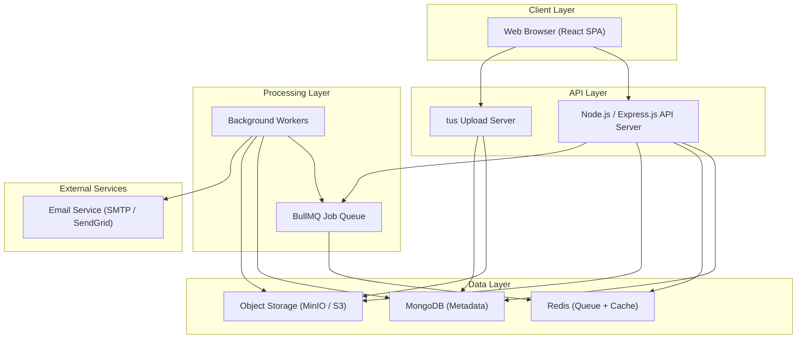
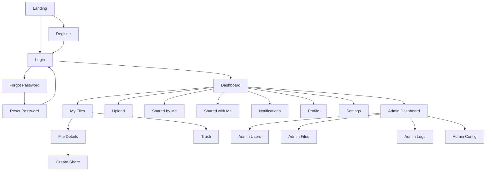
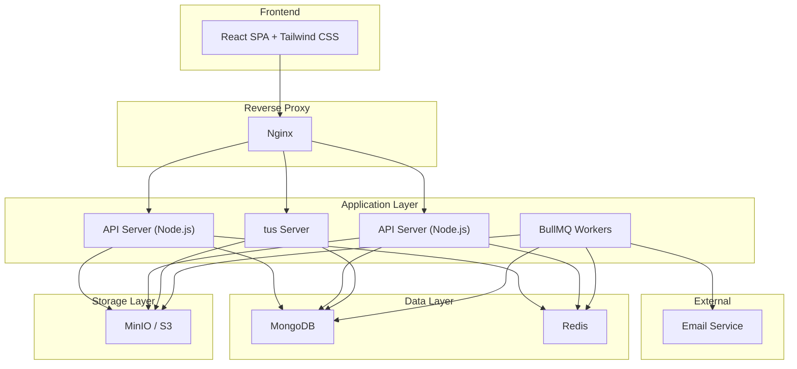
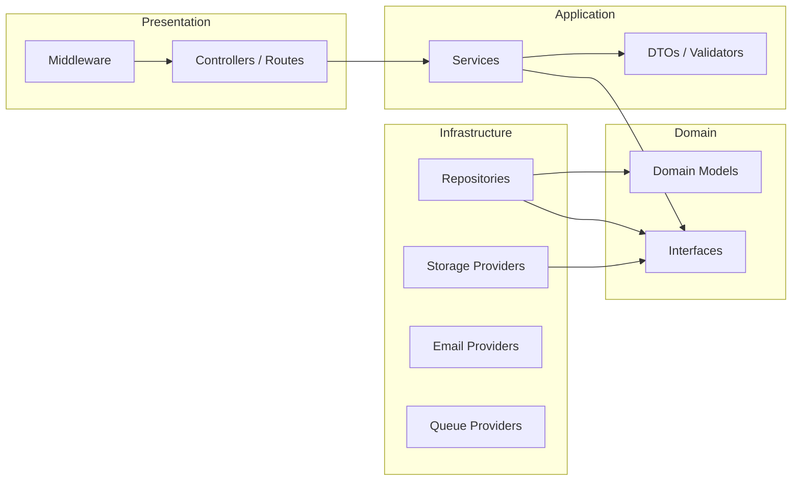
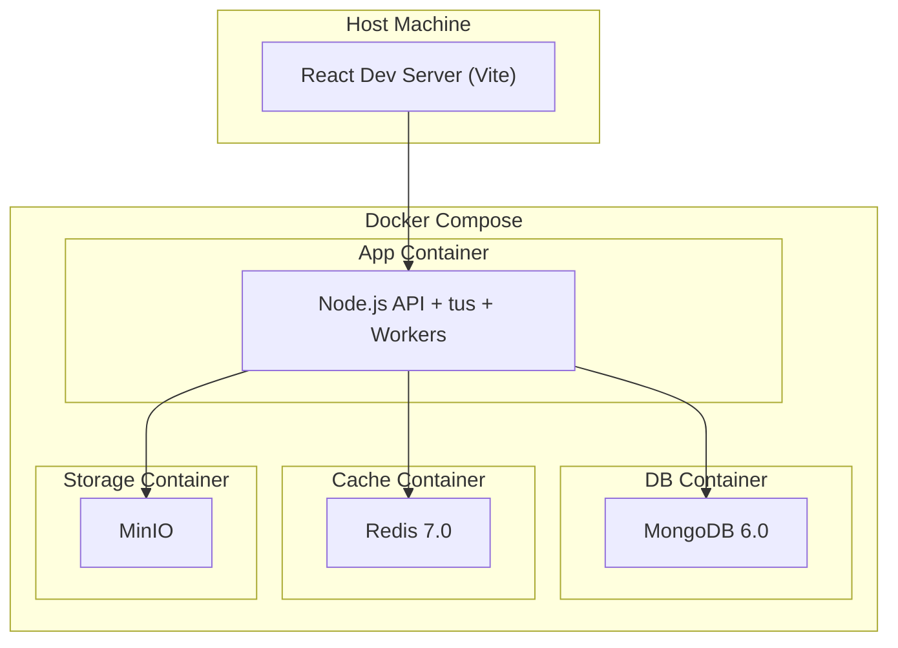
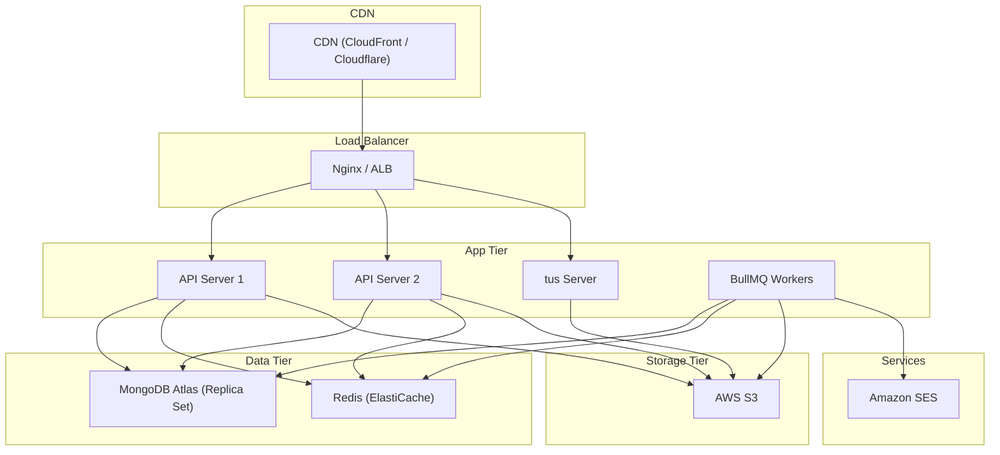
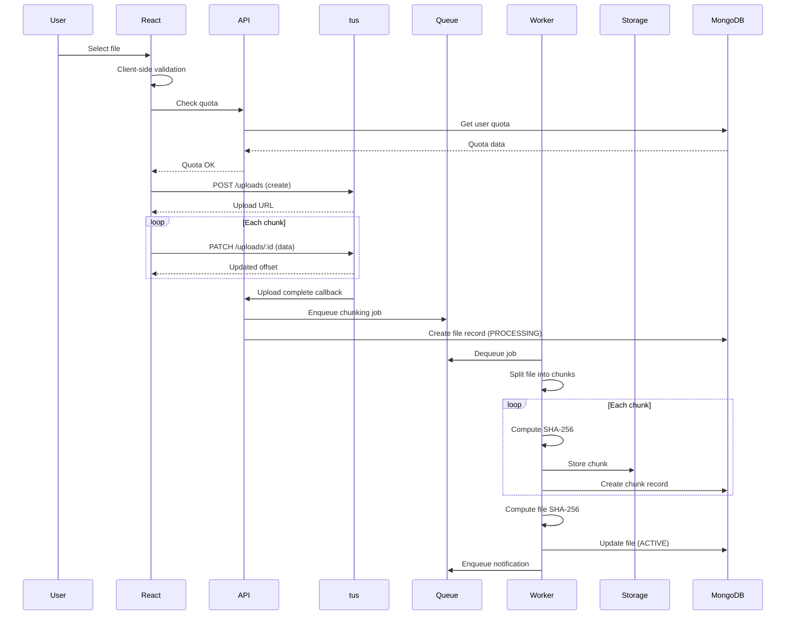
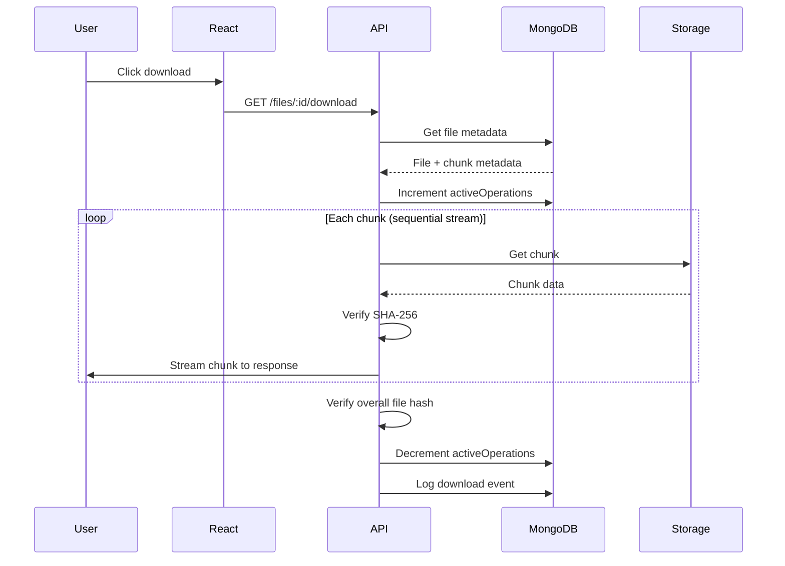
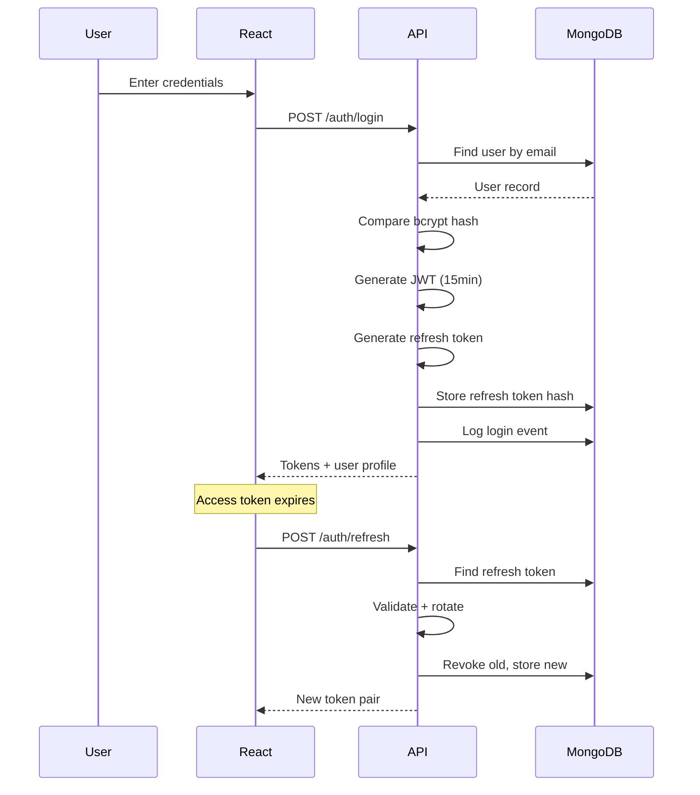

# Software Requirements Specification

# Cloud-Based File Distribution System (CBFDS)

**Version:** 1.0
**Date:** August 5, 2026
**Standard:** IEEE 29148-2018
**Classification:** Academic / Portfolio Project

---

# Document Control

| Field | Value |
|---|---|
| Document Title | Software Requirements Specification |
| Project Name | Cloud-Based File Distribution System (CBFDS) |
| Version | 1.0 |
| Author | Project Team |
| Status | Draft |
| Last Updated | 2026-08-05 |

### Revision History

| Version | Date | Description |
|---|---|---|
| 0.1 | 2026-08-05 | PRD finalized |
| 0.2 | 2026-08-05 | Architecture decisions v1.0 |
| 0.3 | 2026-08-05 | Architecture decisions v1.1 |
| 1.0 | 2026-08-05 | SRS v1.0 — IEEE 29148 compliant |

---

# PART I — INTRODUCTION & CONTEXT

---

## 1. Introduction

### 1.1 Purpose

This Software Requirements Specification (SRS) defines the complete functional and non-functional requirements for the Cloud-Based File Distribution System (CBFDS). It serves as the single authoritative source of truth for all design, implementation, testing, and acceptance activities.

This document is intended for:

- Software developers implementing the system.
- Quality assurance engineers writing test cases.
- Project managers tracking deliverables.
- Academic evaluators assessing project scope and quality.
- Future maintainers extending the system.

### 1.2 Scope

The Cloud-Based File Distribution System is a secure, full-stack web application that enables users to upload, store, manage, share, and download files through a cloud-compatible storage architecture.

**Core Innovation:** Instead of storing files as monolithic objects, the system automatically divides every uploaded file into smaller chunks, stores each chunk independently, records granular metadata for every chunk, and reconstructs the original file during download — demonstrating distributed storage, fault tolerance, and scalability principles.

**In Scope:**

- User authentication and authorization (JWT + RBAC)
- File upload with resumable support (tus protocol)
- Automatic file chunking with SHA-256 integrity verification
- Abstracted storage layer (MinIO for development, cloud providers for production)
- File download with chunk reconstruction and integrity verification
- File management (rename, delete, search, sort, filter, trash bin)
- File sharing (internal + external with permissions, expiry, download limits)
- User dashboard with storage analytics
- Admin dashboard with user management and system monitoring
- Background job processing (BullMQ + Redis)
- Notification system (in-app + email)
- Storage quota management
- Health, readiness, and metrics endpoints
- API versioning from day one

**Out of Scope (Version 1.0):**

- End-to-end encryption
- Multi-cloud replication
- AI-based storage optimization
- Virus/malware scanning
- File preview (in-browser rendering)
- File compression
- Mobile applications
- Desktop client
- WebDAV support
- Moderator role implementation

### 1.3 Product Overview

CBFDS is a three-tier web application consisting of:

1. **Presentation Tier** — React single-page application with Tailwind CSS
2. **Application Tier** — Node.js/Express.js RESTful API server
3. **Data Tier** — MongoDB (metadata), Redis (caching/queues), MinIO/S3 (object storage)

The system follows Clean Architecture principles with a Repository Pattern for data access and a Strategy Pattern for storage provider abstraction.

### 1.4 Intended Audience

| Audience | Use of This Document |
|---|---|
| Developers | Implementation reference for all modules |
| QA Engineers | Test case derivation from requirement IDs |
| Project Manager | Progress tracking against requirement completion |
| Academic Evaluator | Assessment of project scope, architecture, and quality |
| Future Maintainers | Understanding of system design and business rules |

### 1.5 Document Conventions

**Requirement Identification:**

All requirements follow the format: `{TYPE}-{MODULE}-{NUMBER}`

| Prefix | Meaning |
|---|---|
| FR | Functional Requirement |
| NFR | Non-Functional Requirement |
| BR | Business Rule |

| Module Code | Module |
|---|---|
| AUTH | Authentication |
| DASH | Dashboard |
| UPLD | Upload |
| TUS | Resumable Upload |
| CHNK | Chunking |
| STOR | Storage |
| META | Metadata |
| DWNL | Download |
| FMGT | File Management |
| SHAR | Sharing |
| NOTF | Notification |
| QUOT | Quota |
| ADMN | Admin |
| JOBS | Background Jobs |
| MNTR | Monitoring |
| PERF | Performance |
| SEC | Security |
| REL | Reliability |
| SCAL | Scalability |
| USE | Usability |
| MAINT | Maintainability |

**Priority Levels:**

| Priority | Meaning |
|---|---|
| P0 | Critical — system cannot function without this |
| P1 | High — core feature, must be in v1.0 |
| P2 | Medium — important but can be deferred if needed |
| P3 | Low — nice to have, can be post-v1.0 |

**Requirement Format:**

Each requirement is specified as:

> **[ID]** — *Title*
> **Priority:** P0/P1/P2/P3
> **Description:** What the system shall do.
> **Input:** What triggers or feeds this requirement.
> **Processing:** How the system processes it.
> **Output:** What the system produces.
> **Business Rules:** Applicable constraints.
> **Acceptance Criteria:** How to verify this requirement is met.

### 1.6 References

| Reference | Description |
|---|---|
| IEEE 29148-2018 | Systems and software engineering — Life cycle processes — Requirements engineering |
| PRD v1.0 | Cloud-Based File Distribution System — Product Requirements Document |
| Project Decisions v1.0 | Architecture and design decisions |
| Final Decisions v1.1 | Final architecture decisions with all clarifications |
| RFC 7235 | HTTP/1.1 Authentication |
| RFC 7519 | JSON Web Token (JWT) |
| tus Protocol v1.0 | Open Protocol for Resumable Uploads — https://tus.io/protocols/resumable-upload |
| OpenAPI 3.0 | API Specification Standard |

---

## 2. Definitions, Acronyms, and Abbreviations

### 2.1 Definitions

| Term | Definition |
|---|---|
| Chunk | A fixed-size segment of a file, created during the chunking process. Default size is 5 MB. |
| Checksum | A cryptographic hash (SHA-256) computed over data to verify its integrity. |
| File Reconstruction | The process of merging all chunks of a file in order to reproduce the original file. |
| Soft Delete | Moving a file to the trash bin instead of permanently removing it. The file can be restored within 30 days. |
| Hard Delete | Permanent removal of a file and all its chunks from the system. Cannot be undone. |
| Deferred Delete | A deletion that is postponed until all active operations (downloads) on the file complete. |
| Share Link | A unique, cryptographically random URL that grants access to a file without requiring authentication. |
| Internal Share | Sharing a file with another registered user of the system. |
| External Share | Sharing a file via a public link, optionally with password, expiry, and download limits. |
| Storage Provider | An abstraction representing the underlying object storage system (MinIO, AWS S3, Azure Blob, GCS). |
| Storage Quota | The maximum amount of storage allocated to a user. Default is 10 GB. |
| Background Job | An asynchronous task processed by the BullMQ queue outside the HTTP request/response cycle. |
| Dead-Letter Queue | A queue where failed jobs are moved after exhausting all retry attempts. |
| Refresh Token Rotation | A security mechanism where each use of a refresh token issues a new one and invalidates the old one. |
| Magic Bytes | The first few bytes of a file that identify its true format, independent of file extension. |
| Rate Limiting | Restricting the number of API requests a client can make within a time window. |
| RBAC | Role-Based Access Control — assigning permissions based on user roles. |

### 2.2 Acronyms

| Acronym | Expansion |
|---|---|
| CBFDS | Cloud-Based File Distribution System |
| API | Application Programming Interface |
| JWT | JSON Web Token |
| OTP | One-Time Password |
| RBAC | Role-Based Access Control |
| CORS | Cross-Origin Resource Sharing |
| CSRF | Cross-Site Request Forgery |
| XSS | Cross-Site Scripting |
| HTTPS | Hypertext Transfer Protocol Secure |
| REST | Representational State Transfer |
| CRUD | Create, Read, Update, Delete |
| MIME | Multipurpose Internet Mail Extensions |
| SHA | Secure Hash Algorithm |
| AES | Advanced Encryption Standard |
| TTL | Time to Live |
| SMTP | Simple Mail Transfer Protocol |
| SES | Simple Email Service |
| S3 | Simple Storage Service |
| GCS | Google Cloud Storage |
| CI/CD | Continuous Integration / Continuous Deployment |
| SPA | Single-Page Application |
| SSR | Server-Side Rendering |
| ORM | Object-Relational Mapping |
| ODM | Object-Document Mapping |

---

## 3. Overall Description

### 3.1 Product Perspective

CBFDS is a standalone, self-contained web application. It is not a component of a larger system. It interfaces with:

- **Web Browsers** — for user interaction (React SPA)
- **Object Storage** — for chunk persistence (MinIO / S3 / Azure Blob / GCS)
- **MongoDB** — for metadata, user data, and application state
- **Redis** — for job queues, caching, and session management
- **SMTP/Email Services** — for transactional emails (OTP, notifications)



### 3.2 Product Functions

High-level capabilities of the system:

1. **User Management** — Registration, authentication, profile management, role assignment.
2. **File Ingestion** — Upload, validation, chunking, metadata extraction.
3. **Resumable Transfers** — Pause, resume, retry uploads via tus protocol.
4. **Distributed Storage** — Chunk-level storage with provider abstraction.
5. **File Reconstruction** — Integrity-verified chunk retrieval and merging.
6. **File Organization** — Search, sort, filter, rename, trash, restore.
7. **Secure Sharing** — Internal and external sharing with granular controls.
8. **Quota Management** — Per-user storage limits with warnings and enforcement.
9. **Notifications** — Real-time in-app and email notifications for system events.
10. **Administration** — User management, monitoring, analytics, configuration.
11. **Background Processing** — Asynchronous job execution for heavy operations.
12. **System Monitoring** — Health checks, readiness probes, Prometheus metrics.

### 3.3 User Classes and Characteristics

#### 3.3.1 Guest (Unauthenticated User)

| Attribute | Value |
|---|---|
| Access Level | Public share links only |
| Can Register | Yes |
| Can Login | Yes |
| Can Upload | No |
| Can Download | Only via valid share links |
| Technical Skill | Basic |

#### 3.3.2 Registered User

| Attribute | Value |
|---|---|
| Access Level | Own files, shared files |
| Storage Quota | 10 GB (default, admin-adjustable) |
| Can Upload | Yes |
| Can Download | Own files + shared files |
| Can Share | Yes |
| Can Manage Files | Yes (own files only) |
| Technical Skill | Basic to Intermediate |

#### 3.3.3 Admin

| Attribute | Value |
|---|---|
| Access Level | All user files, system configuration |
| Can Manage Users | Yes (except Super Admins) |
| Can Delete Files | Yes (any file, with audit trail) |
| Can View Analytics | Yes |
| Can Configure System | Limited (cannot change core settings) |
| Technical Skill | Intermediate |

#### 3.3.4 Super Admin

| Attribute | Value |
|---|---|
| Access Level | Full system access |
| Can Manage Admins | Yes |
| Can Configure Storage | Yes |
| Can View System Analytics | Yes |
| Can Delete Any File | Yes |
| Can Override Quotas | Yes |
| Can Manage Roles | Yes |
| Technical Skill | Advanced |

### 3.4 Operating Environment

**Server Environment:**

| Component | Requirement |
|---|---|
| Runtime | Node.js 18 LTS or higher |
| Database | MongoDB 6.0 or higher |
| Cache/Queue | Redis 7.0 or higher |
| Object Storage | MinIO (dev) / AWS S3 (prod) |
| Reverse Proxy | Nginx 1.24+ |
| Containerization | Docker 24+, Docker Compose v2 |
| OS | Linux (Ubuntu 22.04 LTS recommended) |

**Client Environment:**

| Component | Requirement |
|---|---|
| Browsers | Chrome 90+, Firefox 90+, Edge 90+, Safari 15+ |
| JavaScript | ES2020+ support required |
| Screen Size | 320px (mobile) to 2560px (ultrawide) |
| Network | Broadband internet connection |

### 3.5 Design and Implementation Constraints

| Constraint | Description |
|---|---|
| C-001 | The backend must be built with Node.js and Express.js. |
| C-002 | The frontend must be built with React and Tailwind CSS. |
| C-003 | MongoDB must be used as the primary database. |
| C-004 | The initial deployment must work with local storage or MinIO. |
| C-005 | The maximum upload size is 5 GB (configurable). |
| C-006 | The default chunk size is 5 MB (configurable by admin). |
| C-007 | All API endpoints must be versioned under `/api/v1/`. |
| C-008 | The system must follow Clean Architecture principles. |
| C-009 | Storage providers must be swappable without changing business logic. |
| C-010 | The system must be containerizable with Docker. |
| C-011 | All passwords must be hashed with bcrypt. |
| C-012 | Authentication must use JWT with refresh token rotation. |

### 3.6 Assumptions and Dependencies

**Assumptions:**

| ID | Assumption |
|---|---|
| A-001 | Users have modern web browsers with JavaScript enabled. |
| A-002 | Users have stable internet connectivity for uploads/downloads. |
| A-003 | The deployment environment has Docker installed. |
| A-004 | MongoDB, Redis, and MinIO are available as Docker services. |
| A-005 | An SMTP service is available for email delivery. |
| A-006 | The system operates behind HTTPS in production. |

**Dependencies:**

| ID | Dependency | Version | Purpose |
|---|---|---|---|
| D-001 | Node.js | ≥18.0 | Server runtime |
| D-002 | Express.js | ≥4.18 | Web framework |
| D-003 | React | ≥18.0 | Frontend framework |
| D-004 | Tailwind CSS | ≥3.3 | CSS framework |
| D-005 | MongoDB | ≥6.0 | Document database |
| D-006 | Mongoose | ≥7.0 | MongoDB ODM |
| D-007 | Redis | ≥7.0 | Cache and queue backend |
| D-008 | BullMQ | ≥4.0 | Job queue library |
| D-009 | jsonwebtoken | ≥9.0 | JWT implementation |
| D-010 | bcryptjs | ≥2.4 | Password hashing |
| D-011 | tus-node-server | ≥1.0 | Resumable upload server |
| D-012 | tus-js-client | ≥3.0 | Resumable upload client |
| D-013 | MinIO Client SDK | ≥7.0 | Object storage client |
| D-014 | Multer | ≥1.4 | Multipart form handling |
| D-015 | Winston | ≥3.8 | Logging framework |
| D-016 | Helmet | ≥7.0 | Security headers |
| D-017 | cors | ≥2.8 | CORS middleware |
| D-018 | express-rate-limit | ≥6.0 | Rate limiting |
| D-019 | Nodemailer | ≥6.9 | Email sending |
| D-020 | Axios | ≥1.4 | HTTP client (frontend) |
| D-021 | React Router | ≥6.0 | Client-side routing |
| D-022 | Swagger/OpenAPI | ≥3.0 | API documentation |

---

# PART II — FUNCTIONAL REQUIREMENTS

---

## 4. Authentication Module

### FR-AUTH-001 — User Registration

**Priority:** P0

**Description:** The system shall allow new users to create an account by providing required registration information.

**Input:**

| Field | Type | Constraints |
|---|---|---|
| fullName | String | Required, 2–100 characters |
| email | String | Required, valid email format, unique |
| password | String | Required, min 8 characters, must contain uppercase, lowercase, number, and special character |
| confirmPassword | String | Required, must match password |

**Processing:**

1. Validate all input fields.
2. Check if email already exists in the database.
3. Hash the password using bcrypt with a salt factor of 12.
4. Generate a unique User ID (UUID v4).
5. Assign the default role: `user`.
6. Assign default storage quota: 10 GB.
7. Create the user record in MongoDB.
8. Send a welcome email (via background job).
9. Return success response (do NOT auto-login).

**Output:**

```json
{
  "success": true,
  "message": "Registration successful. Please log in.",
  "data": {
    "userId": "uuid-v4",
    "email": "user@example.com",
    "fullName": "John Doe"
  }
}
```

**Business Rules:**

- BR-AUTH-001: Email addresses are case-insensitive. Store as lowercase.
- BR-AUTH-002: Duplicate email registration shall return HTTP 409 Conflict.
- BR-AUTH-003: Password must not contain the user's email or name.

**Acceptance Criteria:**

- [ ] Valid registration creates a user and returns 201.
- [ ] Duplicate email returns 409.
- [ ] Weak password returns 400 with specific validation errors.
- [ ] Password is never stored in plain text.
- [ ] User is assigned default quota of 10 GB.

---

### FR-AUTH-002 — User Login

**Priority:** P0

**Description:** The system shall authenticate users with email and password, returning JWT tokens upon success.

**Input:**

| Field | Type | Constraints |
|---|---|---|
| email | String | Required, valid email |
| password | String | Required |
| deviceInfo | Object | Optional — browser, OS, IP |

**Processing:**

1. Validate input fields.
2. Look up user by email (case-insensitive).
3. Check if account is locked (see BR-AUTH-004).
4. Compare password against stored bcrypt hash.
5. On success: reset failed login counter.
6. Generate access token (JWT, 15-minute TTL).
7. Generate refresh token (cryptographically random, 7-day TTL).
8. Store refresh token in MongoDB with device info.
9. Log the login event in the activity log.
10. Return tokens and user profile.

**Output:**

```json
{
  "success": true,
  "data": {
    "accessToken": "eyJhbGc...",
    "refreshToken": "a1b2c3d4...",
    "expiresIn": 900,
    "user": {
      "userId": "uuid",
      "fullName": "John Doe",
      "email": "user@example.com",
      "role": "user",
      "storageUsed": 1073741824,
      "storageQuota": 10737418240
    }
  }
}
```

**Business Rules:**

- BR-AUTH-004: After 5 consecutive failed login attempts, lock the account for 15 minutes.
- BR-AUTH-005: Failed login on a locked account shall not reset the lock timer.
- BR-AUTH-006: Login from a new device triggers an email notification.

**Acceptance Criteria:**

- [ ] Valid credentials return 200 with access and refresh tokens.
- [ ] Invalid credentials return 401.
- [ ] 6th failed attempt on same account returns 423 (Locked).
- [ ] Account unlocks after 15 minutes.
- [ ] Login event is recorded in activity log.

---

### FR-AUTH-003 — JWT Token Management

**Priority:** P0

**Description:** The system shall use JWT access tokens to authenticate all protected API requests.

**Processing:**

1. Every protected endpoint shall verify the Authorization header: `Bearer <accessToken>`.
2. Verify token signature using the server's secret key.
3. Check token expiration.
4. Extract user ID and role from token payload.
5. Attach user context to the request object.
6. If token is expired, return 401 with code `TOKEN_EXPIRED`.
7. If token is invalid, return 401 with code `TOKEN_INVALID`.

**JWT Payload Structure:**

```json
{
  "sub": "user-uuid",
  "role": "user",
  "iat": 1691234567,
  "exp": 1691235467
}
```

**Business Rules:**

- BR-AUTH-007: Access tokens shall not be stored in the database.
- BR-AUTH-008: Access token TTL is 15 minutes (non-configurable by users).
- BR-AUTH-009: The JWT secret shall be at least 256 bits, stored in environment variables.

---

### FR-AUTH-004 — Refresh Token Rotation

**Priority:** P0

**Description:** The system shall implement refresh token rotation to issue new token pairs without re-authentication.

**Input:**

| Field | Type | Constraints |
|---|---|---|
| refreshToken | String | Required, the current valid refresh token |

**Processing:**

1. Look up the refresh token in MongoDB.
2. Verify the token has not expired (7-day TTL).
3. Verify the token has not been revoked.
4. Generate a new access token.
5. Generate a new refresh token.
6. Invalidate (revoke) the old refresh token.
7. Store the new refresh token in MongoDB.
8. Return the new token pair.

**Business Rules:**

- BR-AUTH-010: If a revoked refresh token is used, revoke ALL refresh tokens for that user (token theft detection).
- BR-AUTH-011: Each refresh token can only be used once.
- BR-AUTH-012: Refresh token is stored as a SHA-256 hash in the database.

**Acceptance Criteria:**

- [ ] Valid refresh token returns new access + refresh tokens.
- [ ] Using the same refresh token twice revokes all sessions.
- [ ] Expired refresh token returns 401.

---

### FR-AUTH-005 — Logout

**Priority:** P1

**Description:** The system shall allow users to log out from the current device or all devices.

**Endpoints:**

- `POST /api/v1/auth/logout` — Logout current device
- `POST /api/v1/auth/logout-all` — Logout all devices

**Processing (Current Device):**

1. Accept the refresh token from the request body.
2. Revoke the refresh token in MongoDB.
3. Log the logout event.

**Processing (All Devices):**

1. Revoke all refresh tokens for the user.
2. Log the event.

**Acceptance Criteria:**

- [ ] After logout, the refresh token cannot be used.
- [ ] Logout-all revokes all sessions across all devices.
- [ ] Logout event is recorded in the activity log.

---

### FR-AUTH-006 — Forgot Password (OTP Flow)

**Priority:** P1

**Description:** The system shall allow users to request a password reset via email OTP.

**Input:**

| Field | Type | Constraints |
|---|---|---|
| email | String | Required, valid email |

**Processing:**

1. Validate the email format.
2. Look up the user by email.
3. If user exists, generate a 6-digit OTP.
4. Hash the OTP using SHA-256.
5. Store the hashed OTP in MongoDB with a 10-minute TTL.
6. Send the OTP via email (background job).
7. Return a generic success message regardless of whether the email exists (prevents enumeration).

**Business Rules:**

- BR-AUTH-013: OTP expires after 10 minutes.
- BR-AUTH-014: Maximum 3 OTP requests per email per hour.
- BR-AUTH-015: The response must not reveal whether the email exists.
- BR-AUTH-016: Only the latest OTP is valid; previous OTPs are invalidated.

**Acceptance Criteria:**

- [ ] Valid email triggers OTP delivery within 30 seconds.
- [ ] Invalid email returns the same success response (no enumeration).
- [ ] OTP expires after 10 minutes.
- [ ] 4th OTP request within an hour returns 429.

---

### FR-AUTH-007 — Reset Password

**Priority:** P1

**Description:** The system shall allow users to set a new password after verifying the OTP.

**Input:**

| Field | Type | Constraints |
|---|---|---|
| email | String | Required |
| otp | String | Required, 6 digits |
| newPassword | String | Required, same policy as registration |
| confirmNewPassword | String | Required, must match |

**Processing:**

1. Look up the OTP record by email.
2. Verify the OTP matches (compare SHA-256 hashes).
3. Check OTP has not expired.
4. Validate the new password against policy.
5. Hash the new password with bcrypt.
6. Update the user's password.
7. Revoke all refresh tokens for the user (force re-login on all devices).
8. Delete the OTP record.
9. Send a confirmation email (background job).

**Business Rules:**

- BR-AUTH-017: New password must not match the last 3 passwords.
- BR-AUTH-018: After password reset, all active sessions are terminated.
- BR-AUTH-019: Invalid OTP increments a failure counter. After 5 failures, the OTP is invalidated.

---

### FR-AUTH-008 — Session Management

**Priority:** P1

**Description:** The system shall track active sessions per user.

**Processing:**

1. Each login creates a session record containing: device info, IP address, login timestamp, refresh token reference.
2. Users can view their active sessions via the profile page.
3. Users can revoke individual sessions.

**Session Record:**

| Field | Type |
|---|---|
| sessionId | UUID |
| userId | Reference |
| deviceInfo | Object (browser, OS) |
| ipAddress | String |
| loginAt | Date |
| lastActiveAt | Date |
| isActive | Boolean |

---

### FR-AUTH-009 — Device Tracking

**Priority:** P2

**Description:** The system shall detect and notify users about logins from new devices.

**Processing:**

1. On login, extract device fingerprint (User-Agent, IP).
2. Compare against known devices for the user.
3. If new device detected, send an email notification.
4. Store the new device in the user's known devices list.

---

## 5. User Dashboard Module

### FR-DASH-001 — Dashboard Overview

**Priority:** P1

**Description:** The system shall display a dashboard upon user login summarizing the user's storage status and recent activity.

**Dashboard Data:**

| Widget | Data Source | Update Frequency |
|---|---|---|
| Total Files | Count of user's non-deleted files | Real-time |
| Storage Used | Sum of all file sizes (including trash) | Real-time |
| Storage Quota | User's allocated quota | On change |
| Storage Percentage | (Used / Quota) × 100 | Real-time |
| Recent Uploads | Last 5 uploaded files | Real-time |
| Recent Downloads | Last 5 downloaded files | Real-time |
| Shared Files | Count of files shared by/with user | Real-time |
| Active Shares | Count of active share links | Real-time |
| Unread Notifications | Count of unread notifications | Real-time |

**Acceptance Criteria:**

- [ ] Dashboard loads within 2 seconds.
- [ ] All widgets display accurate, current data.
- [ ] Storage bar visually indicates usage percentage.
- [ ] Warning colors at 80% (yellow) and 90% (red).

---

### FR-DASH-002 — Storage Usage Display

**Priority:** P1

**Description:** The system shall display a visual storage usage indicator showing used, available, and trash storage.

**Display Elements:**

- Progress bar (color-coded: green < 80%, yellow 80–89%, red ≥ 90%)
- Numeric values: "X.XX GB of Y GB used"
- Breakdown: Active files vs. Trash
- Percentage display

---

### FR-DASH-003 — Recent Uploads

**Priority:** P1

**Description:** The system shall display the 5 most recent file uploads with filename, size, date, and status.

---

### FR-DASH-004 — Recent Downloads

**Priority:** P1

**Description:** The system shall display the 5 most recent file downloads with filename, size, and download date.

---

### FR-DASH-005 — Shared Files Summary

**Priority:** P2

**Description:** The system shall display counts and quick links for files shared by and with the user.

---

### FR-DASH-006 — Notifications Panel

**Priority:** P2

**Description:** The system shall display unread notifications with a badge count and a dropdown panel showing recent notifications.

---

### FR-DASH-007 — Quick Actions

**Priority:** P2

**Description:** The dashboard shall provide quick-action buttons for: Upload File, Create Share Link, View All Files, and Manage Trash.

---

## 6. File Upload Module

### FR-UPLD-001 — Single File Upload

**Priority:** P0

**Description:** The system shall accept a single file upload from the user, validate it, and initiate the chunking pipeline.

**Processing:**

1. User selects a file via the file picker or drag-and-drop.
2. Client validates file size (≤ 5 GB) and type (not in blocklist).
3. Client initiates a tus upload (see Section 7).
4. Server receives the complete file via tus.
5. Server performs server-side validation (size, type, magic bytes).
6. Server generates a unique File ID (UUID v4).
7. Server computes the SHA-256 hash of the entire file.
8. Server enqueues a chunking job (BullMQ).
9. Server stores initial file metadata with status `PROCESSING`.
10. Background worker chunks the file, stores chunks, updates metadata.
11. On completion, file status changes to `ACTIVE`.
12. Notification sent to user.

**Acceptance Criteria:**

- [ ] Files up to 5 GB upload successfully.
- [ ] Blocked file types are rejected with a clear error.
- [ ] File ID is unique across the system.
- [ ] SHA-256 hash is computed and stored.
- [ ] File status transitions: `UPLOADING` → `PROCESSING` → `ACTIVE`.

---

### FR-UPLD-002 — Multi-File / Batch Upload

**Priority:** P1

**Description:** The system shall accept multiple files in a single upload session. Each file is processed independently through the upload pipeline.

**Business Rules:**

- BR-UPLD-001: Maximum 10 files per batch upload.
- BR-UPLD-002: Total batch size must not exceed remaining quota.
- BR-UPLD-003: If one file fails validation, other files continue.

---

### FR-UPLD-003 — Drag and Drop Upload

**Priority:** P1

**Description:** The system shall accept files dragged from the user's file system into a designated drop zone on the web interface.

---

### FR-UPLD-004 — Upload Progress Tracking

**Priority:** P1

**Description:** The system shall display real-time upload progress for each file, including: percentage complete, bytes transferred, estimated time remaining, upload speed, and current status.

---

### FR-UPLD-005 — File Validation: Size

**Priority:** P0

**Description:** The system shall validate file size on both client and server.

**Business Rules:**

- BR-UPLD-004: Maximum file size is 5 GB (5,368,709,120 bytes).
- BR-UPLD-005: Minimum file size is 1 byte (empty files rejected).
- BR-UPLD-006: The max file size is configurable by Super Admin.

---

### FR-UPLD-006 — File Validation: Type

**Priority:** P0

**Description:** The system shall validate file types using a three-layer approach.

**Validation Layers:**

1. **Extension Check** — Compare file extension against the blocklist.
2. **MIME Type Check** — Verify the Content-Type header matches expected types.
3. **Magic Bytes Check** — Read the first 8 bytes of the file and compare against known file signatures.

**Default Blocklist:**

`.exe`, `.msi`, `.bat`, `.cmd`, `.com`, `.dll`, `.scr`, `.ps1`, `.vbs`, `.jar`

**Business Rules:**

- BR-UPLD-007: If any validation layer fails, the upload is rejected.
- BR-UPLD-008: The blocklist is configurable by administrators.
- BR-UPLD-009: Validation errors must specify which layer failed.

---

### FR-UPLD-007 — Unique File ID Generation

**Priority:** P0

**Description:** Every uploaded file shall be assigned a universally unique identifier (UUID v4) that serves as its primary key throughout the system.

---

### FR-UPLD-008 — Original File Metadata Storage

**Priority:** P0

**Description:** Upon upload, the system shall store complete metadata for the original file (see Section 10 for schema).

---

### FR-UPLD-009 — Quota Check Before Upload

**Priority:** P0

**Description:** Before accepting an upload, the system shall verify the user has sufficient remaining quota.

**Processing:**

1. Calculate remaining quota: `quota - storageUsed`.
2. Compare against the incoming file size.
3. If insufficient, reject with 413 (Payload Too Large) and a descriptive message.

---

## 7. Resumable Upload Module (tus Protocol)

### FR-TUS-001 — Upload Initialization

**Priority:** P0

**Description:** The system shall create a new upload resource when a client initiates a tus upload.

**tus Request:**

```
POST /api/v1/uploads
Tus-Resumable: 1.0.0
Upload-Length: <file-size>
Upload-Metadata: filename <base64>,filetype <base64>
```

**Processing:**

1. Validate the `Upload-Length` (≤ 5 GB).
2. Validate file metadata (name, type).
3. Check user quota.
4. Create an upload resource with a unique URL.
5. Return the upload URL in the `Location` header.

**Response:**

```
HTTP/1.1 201 Created
Location: /api/v1/uploads/<upload-id>
Tus-Resumable: 1.0.0
```

---

### FR-TUS-002 — Upload Chunk Transmission

**Priority:** P0

**Description:** The system shall accept file data via PATCH requests to the upload URL.

**tus Request:**

```
PATCH /api/v1/uploads/<upload-id>
Tus-Resumable: 1.0.0
Upload-Offset: <current-offset>
Content-Type: application/offset+octet-stream

[binary data]
```

**Processing:**

1. Verify the upload ID exists.
2. Verify the offset matches the server's current offset.
3. Append the data to the upload resource.
4. Update the offset.
5. If offset equals Upload-Length, mark upload as complete.

---

### FR-TUS-003 — Pause Upload

**Priority:** P1

**Description:** The client can pause an upload at any time by stopping the PATCH request. The server retains the partial upload data.

---

### FR-TUS-004 — Resume Upload

**Priority:** P1

**Description:** The client can resume an upload by querying the server for the current offset.

**Request:**

```
HEAD /api/v1/uploads/<upload-id>
Tus-Resumable: 1.0.0
```

**Response:**

```
HTTP/1.1 200 OK
Upload-Offset: <current-offset>
Upload-Length: <total-length>
Tus-Resumable: 1.0.0
```

---

### FR-TUS-005 — Retry Failed Chunks

**Priority:** P1

**Description:** On network failure, the client shall automatically retry the PATCH request up to 3 times with exponential backoff (1s, 2s, 4s).

---

### FR-TUS-006 — Upload Cancellation

**Priority:** P1

**Description:** The client can cancel an upload by sending a DELETE request to the upload URL.

**Processing:**

1. Delete the partial upload data from storage.
2. Remove the upload record.
3. Recalculate user's storage usage.

---

### FR-TUS-007 — Upload Completion Callback

**Priority:** P0

**Description:** When a tus upload completes (offset equals Upload-Length), the system shall trigger the post-upload pipeline.

**Processing:**

1. Move the completed file from tus temporary storage.
2. Enqueue a file chunking job (BullMQ).
3. Update file status to `PROCESSING`.
4. Return completion status to the client.

**Business Rules:**

- BR-TUS-001: Incomplete uploads older than 24 hours shall be automatically cleaned up.
- BR-TUS-002: Maximum 5 concurrent uploads per user.
- BR-TUS-003: Upload timeout per chunk: 5 minutes of inactivity.

---

## 8. File Chunking Module

### FR-CHNK-001 — File Splitting

**Priority:** P0

**Description:** The system shall split an uploaded file into fixed-size chunks.

**Processing:**

1. Read the file as a binary stream.
2. Divide into chunks of the configured size (default 5 MB).
3. The last chunk may be smaller than the configured size.
4. Assign each chunk a sequential chunk number starting from 0.
5. Total chunks = `Math.ceil(fileSize / chunkSize)`.

**Example:**

| File Size | Chunk Size | Total Chunks | Last Chunk Size |
|---|---|---|---|
| 12 MB | 5 MB | 3 | 2 MB |
| 5 MB | 5 MB | 1 | 5 MB |
| 100 MB | 5 MB | 20 | 5 MB |
| 5 GB | 5 MB | 1,024 | 5 MB |
| 1 byte | 5 MB | 1 | 1 byte |

---

### FR-CHNK-002 — Chunk Numbering

**Priority:** P0

**Description:** Each chunk shall be assigned a zero-indexed sequential number indicating its position in the original file.

**Naming Convention:** `{fileId}_chunk_{chunkNumber}`

Example: `a1b2c3d4_chunk_000`, `a1b2c3d4_chunk_001`, ..., `a1b2c3d4_chunk_019`

---

### FR-CHNK-003 — Chunk Checksum Generation

**Priority:** P0

**Description:** The system shall compute a SHA-256 checksum for each chunk immediately after splitting.

**Processing:**

1. Read chunk data into a buffer or stream.
2. Compute SHA-256 hash.
3. Store the hex-encoded hash in the chunk metadata record.

---

### FR-CHNK-004 — Chunk Metadata Storage

**Priority:** P0

**Description:** For each chunk, the system shall create a metadata record in MongoDB (see Section 25.3 for schema).

---

### FR-CHNK-005 — Chunk Upload to Storage Provider

**Priority:** P0

**Description:** Each chunk shall be uploaded to the configured storage provider via the storage abstraction layer.

**Processing:**

1. Call `storageProvider.putObject(bucket, objectKey, chunkBuffer)`.
2. Verify the upload was successful.
3. Record the storage location in chunk metadata.
4. If upload fails, retry up to 3 times.
5. If all retries fail, mark the file as `ERROR` and notify the user.

---

### FR-CHNK-006 — Configurable Chunk Size

**Priority:** P2

**Description:** The Super Admin shall be able to configure the default chunk size.

**Business Rules:**

- BR-CHNK-001: Default chunk size is 5 MB (5,242,880 bytes).
- BR-CHNK-002: Minimum chunk size is 1 MB.
- BR-CHNK-003: Maximum chunk size is 100 MB.
- BR-CHNK-004: Changing the chunk size only affects new uploads.

---

## 9. Storage Module

### FR-STOR-001 — Storage Provider Abstraction

**Priority:** P0

**Description:** The system shall implement a storage abstraction layer using the Strategy Pattern, allowing storage providers to be swapped without modifying business logic.

**Interface Definition:**

```
interface IStorageProvider {
  putObject(bucket: string, key: string, data: Buffer | Stream): Promise<void>
  getObject(bucket: string, key: string): Promise<Stream>
  deleteObject(bucket: string, key: string): Promise<void>
  objectExists(bucket: string, key: string): Promise<boolean>
  getObjectMetadata(bucket: string, key: string): Promise<ObjectMetadata>
  listObjects(bucket: string, prefix: string): Promise<ObjectInfo[]>
  healthCheck(): Promise<HealthStatus>
}
```

**Implementations:**

| Provider | Class Name | Environment |
|---|---|---|
| MinIO | MinIOStorageProvider | Development |
| AWS S3 | S3StorageProvider | Production |
| Azure Blob | AzureBlobStorageProvider | Production (future) |
| GCS | GCSStorageProvider | Production (future) |

---

### FR-STOR-002 — Save Chunk

**Priority:** P0

**Description:** The system shall save a chunk to the storage provider.

**Object Key Format:** `{userId}/{fileId}/chunks/{chunkNumber}`

**Bucket Structure:**

- `cbfds-chunks` — Primary bucket for all chunk storage.

---

### FR-STOR-003 — Retrieve Chunk

**Priority:** P0

**Description:** The system shall retrieve a specific chunk from the storage provider by its object key.

---

### FR-STOR-004 — Delete Chunk

**Priority:** P0

**Description:** The system shall delete a specific chunk from the storage provider.

---

### FR-STOR-005 — Update Chunk Information

**Priority:** P2

**Description:** The system shall support updating chunk metadata (not the chunk data itself).

---

### FR-STOR-006 — Storage Health Check

**Priority:** P1

**Description:** The system shall verify connectivity and availability of the storage provider.

**Health Check:**

1. Attempt to list buckets.
2. Attempt to write a small test object.
3. Attempt to read the test object.
4. Delete the test object.
5. Return health status.

---

### FR-STOR-007 — MinIO Provider Implementation

**Priority:** P0

**Description:** The system shall implement the `IStorageProvider` interface using the MinIO JavaScript SDK for local development.

---

### FR-STOR-008 — AWS S3 Provider Interface

**Priority:** P2

**Description:** The system shall implement the `IStorageProvider` interface using the AWS SDK for production deployment.

---

## 10. Metadata Module

### FR-META-001 — File Metadata Schema

**Priority:** P0

**Description:** The system shall store comprehensive metadata for every uploaded file.

**Schema** (see Section 25.2 for complete specification):

| Field | Type | Description |
|---|---|---|
| fileId | UUID | Primary identifier |
| ownerId | UUID | Reference to user |
| originalName | String | Original filename |
| mimeType | String | File MIME type |
| fileSize | Number | Size in bytes |
| fileHash | String | SHA-256 of entire file |
| totalChunks | Number | Number of chunks |
| chunkSize | Number | Size of each chunk (bytes) |
| status | Enum | UPLOADING, PROCESSING, ACTIVE, DELETED, ERROR |
| versionNumber | Number | File version (default 1) |
| previousVersionId | UUID | Reference to previous version (null for first) |
| isLatestVersion | Boolean | True if this is the latest version |
| uploadedAt | Date | Upload timestamp |
| updatedAt | Date | Last modification timestamp |
| deletedAt | Date | Soft deletion timestamp (null if active) |
| storageProvider | String | Provider used for chunks |

---

### FR-META-002 — Chunk Metadata Schema

**Priority:** P0

**Description:** The system shall store metadata for every chunk.

| Field | Type | Description |
|---|---|---|
| chunkId | UUID | Primary identifier |
| fileId | UUID | Reference to parent file |
| chunkNumber | Number | Position in file (0-indexed) |
| chunkSize | Number | Size in bytes |
| checksum | String | SHA-256 hash |
| storageKey | String | Object key in storage |
| storageBucket | String | Storage bucket name |
| status | Enum | STORED, VERIFIED, CORRUPTED, DELETED |
| createdAt | Date | Creation timestamp |

---

### FR-META-003 — Version Metadata Schema

**Priority:** P2

**Description:** The file metadata schema includes version fields prepared for future version management.

---

### FR-META-004 — Metadata CRUD Operations

**Priority:** P0

**Description:** The system shall support Create, Read, Update, and Delete operations on all metadata entities.

---

### FR-META-005 — Metadata Indexing Strategy

**Priority:** P1

**Description:** The system shall create MongoDB indexes to ensure query performance.

**Indexes:**

| Collection | Index | Type |
|---|---|---|
| users | `{ email: 1 }` | Unique |
| files | `{ ownerId: 1, status: 1 }` | Compound |
| files | `{ ownerId: 1, uploadedAt: -1 }` | Compound |
| files | `{ fileId: 1 }` | Unique |
| files | `{ ownerId: 1, originalName: "text" }` | Text (search) |
| chunks | `{ fileId: 1, chunkNumber: 1 }` | Compound, Unique |
| shares | `{ token: 1 }` | Unique |
| shares | `{ expiresAt: 1 }` | TTL |
| refreshTokens | `{ tokenHash: 1 }` | Unique |
| refreshTokens | `{ userId: 1 }` | Regular |
| notifications | `{ userId: 1, isRead: 1, createdAt: -1 }` | Compound |
| activityLogs | `{ userId: 1, createdAt: -1 }` | Compound |

---

## 11. Download Module

### FR-DWNL-001 — Download Request

**Priority:** P0

**Description:** The system shall accept download requests and initiate the file reconstruction pipeline.

**Endpoint:** `GET /api/v1/files/:fileId/download`

**Processing:**

1. Authenticate the user.
2. Verify the user has access (owner or shared).
3. Verify the file status is `ACTIVE`.
4. Retrieve file metadata (total chunks, file hash, original name).
5. Retrieve all chunk metadata ordered by chunk number.
6. Stream chunks from storage, verify checksums, and pipe to response.

---

### FR-DWNL-002 — Chunk Retrieval

**Priority:** P0

**Description:** The system shall retrieve chunks from the storage provider in sequential order.

**Processing:**

1. For each chunk (0 to totalChunks - 1):
   a. Retrieve chunk from storage provider.
   b. Verify the SHA-256 checksum.
   c. If checksum fails, retry up to 3 times.
   d. If all retries fail, abort the download with an integrity error.

---

### FR-DWNL-003 — Checksum Verification

**Priority:** P0

**Description:** Before including a chunk in the reconstructed file, the system shall verify its SHA-256 checksum matches the stored value.

**Failure Handling:**

1. Retry retrieval from storage (up to 3 times).
2. If still fails, mark chunk as `CORRUPTED`.
3. Abort download.
4. Notify user of integrity failure.
5. Log the corruption event.

---

### FR-DWNL-004 — Chunk Merging / Reconstruction

**Priority:** P0

**Description:** The system shall merge all verified chunks in order to reconstruct the original file.

**Processing:**

1. Set HTTP response headers: `Content-Disposition`, `Content-Type`, `Content-Length`.
2. Stream each chunk sequentially to the HTTP response.
3. Do NOT load all chunks into memory simultaneously.
4. After all chunks are streamed, verify the overall file hash.
5. Log the download event.

---

### FR-DWNL-005 — Streaming Download

**Priority:** P0

**Description:** The system shall stream the reconstructed file to the client, not buffer the entire file in memory.

**Business Rules:**

- BR-DWNL-001: Maximum memory usage per download shall not exceed 2 × chunk size.
- BR-DWNL-002: Downloads shall support HTTP Range requests for partial content.

---

### FR-DWNL-006 — Download Progress

**Priority:** P2

**Description:** The frontend shall display download progress based on chunks received versus total chunks.

---

### FR-DWNL-007 — Integrity Failure Handling

**Priority:** P1

**Description:** If a chunk fails integrity verification after all retries, the system shall abort the download and notify the user.

**Response:**

```json
{
  "success": false,
  "error": {
    "code": "INTEGRITY_FAILURE",
    "message": "File integrity check failed. Chunk 7 is corrupted.",
    "details": {
      "fileId": "uuid",
      "chunkNumber": 7,
      "expectedChecksum": "abc...",
      "actualChecksum": "def..."
    }
  }
}
```

---

## 12. File Management Module

### FR-FMGT-001 — Rename File

**Priority:** P1

**Description:** The system shall allow the file owner to rename a file.

**Input:**

| Field | Type | Constraints |
|---|---|---|
| newName | String | Required, 1–255 characters, no special characters: `\ / : * ? " < > |` |

**Processing:**

1. Validate the new name.
2. Update `originalName` in file metadata.
3. Update `updatedAt` timestamp.
4. Log the rename event.

---

### FR-FMGT-002 — Delete File (Soft Delete)

**Priority:** P0

**Description:** The system shall move deleted files to the trash bin instead of permanent deletion.

**Processing:**

1. Set file status to `DELETED`.
2. Set `deletedAt` to current timestamp.
3. File remains in storage (chunks are not removed).
4. Storage usage continues to count toward quota.
5. Log the delete event.
6. Notify the user of successful deletion.

---

### FR-FMGT-003 — Restore File from Trash

**Priority:** P1

**Description:** The system shall allow users to restore files from trash within 30 days.

**Processing:**

1. Verify the file is in `DELETED` status.
2. Verify the file was deleted less than 30 days ago.
3. Set status back to `ACTIVE`.
4. Clear `deletedAt`.
5. Update `updatedAt`.
6. Log the restore event.

---

### FR-FMGT-004 — Permanent Deletion

**Priority:** P1

**Description:** Users can permanently delete files from trash. This cannot be undone.

**Processing:**

1. Delete all chunk objects from storage.
2. Delete all chunk metadata records.
3. Delete the file metadata record.
4. Revoke all share links for this file.
5. Recalculate user's storage usage.
6. Log the permanent deletion event.

---

### FR-FMGT-005 — Auto-Purge After 30 Days

**Priority:** P1

**Description:** A scheduled background job shall permanently delete files that have been in trash for more than 30 days.

**Schedule:** Daily at 02:00 UTC.

---

### FR-FMGT-006 — Search Files

**Priority:** P1

**Description:** The system shall allow users to search their files.

**Search Scope:**

- Filename (partial match, case-insensitive)
- File type / MIME type
- Upload date range

**Implementation:** MongoDB text index on `originalName` + filtered queries.

---

### FR-FMGT-007 — Sort Files

**Priority:** P1

**Description:** The system shall allow sorting files by:

| Sort Field | Direction |
|---|---|
| Name | A-Z, Z-A |
| Size | Smallest first, Largest first |
| Upload Date | Newest first, Oldest first |
| Last Modified | Newest first, Oldest first |

Default sort: Upload Date, Newest first.

---

### FR-FMGT-008 — Filter Files

**Priority:** P1

**Description:** The system shall allow filtering files by:

| Filter | Values |
|---|---|
| Status | Active, Deleted (Trash) |
| File Type | Documents, Images, Videos, Audio, Archives, Other |
| Size Range | < 1MB, 1–10MB, 10–100MB, 100MB–1GB, > 1GB |
| Date Range | Today, Last 7 days, Last 30 days, Custom range |

---

### FR-FMGT-009 — View Upload History

**Priority:** P2

**Description:** The system shall display a chronological list of all uploads with status, size, and date.

---

### FR-FMGT-010 — Concurrent Access: Deferred Delete

**Priority:** P1

**Description:** If a file is being downloaded by one user while another user deletes it, the system shall defer the actual deletion.

**Processing:**

1. Track active operations per file (download counter).
2. On delete request, if active operations > 0, mark as `PENDING_DELETION`.
3. Active downloads complete normally.
4. When active operations reach 0, execute the soft delete.

---

## 13. Sharing Module

### FR-SHAR-001 — Internal Share

**Priority:** P1

**Description:** The system shall allow file owners to share files with other registered users.

**Input:**

| Field | Type | Constraints |
|---|---|---|
| fileId | UUID | Required |
| recipientEmail | String | Required, must be a registered user |
| permission | Enum | `VIEWER` (default) |

**Processing:**

1. Verify the file exists and belongs to the requesting user.
2. Look up the recipient by email.
3. Create a share record linking the file to the recipient.
4. Send a notification to the recipient (in-app + email).

---

### FR-SHAR-002 — External Share (Public Link)

**Priority:** P1

**Description:** The system shall generate a cryptographically secure share link for public access.

**Input:**

| Field | Type | Constraints |
|---|---|---|
| fileId | UUID | Required |
| password | String | Optional, min 4 characters |
| expiresAt | Date | Optional, max 90 days from now |
| downloadLimit | Number | Optional, 1–100, default unlimited |

**Processing:**

1. Generate a cryptographically random token (32 bytes, hex-encoded).
2. If password provided, hash it with bcrypt.
3. Create a share record with the token, expiry, and limits.
4. Return the share URL: `{baseUrl}/share/{token}`.

**Business Rules:**

- BR-SHAR-001: Share tokens must be cryptographically random (not sequential or predictable).
- BR-SHAR-002: Maximum expiry is 90 days.
- BR-SHAR-003: Maximum download limit per link is 100.
- BR-SHAR-004: Default expiry is 7 days if not specified.

---

### FR-SHAR-003 — Password-Protected Links

**Priority:** P2

**Description:** External share links may optionally require a password for access.

**Processing:**

1. When accessing the share link, if password-protected, prompt for password.
2. Compare entered password against bcrypt hash.
3. After 5 failed attempts, temporarily block the link (15 minutes).

---

### FR-SHAR-004 — Expiration Date

**Priority:** P1

**Description:** Share links shall automatically expire after the specified date.

**Processing:**

1. On access, check if `expiresAt < now`.
2. If expired, return 410 (Gone).
3. A TTL index on MongoDB automatically removes expired share records.

---

### FR-SHAR-005 — Download Limit

**Priority:** P2

**Description:** Share links shall track download count and enforce limits.

**Processing:**

1. On each download, increment `downloadCount`.
2. If `downloadCount >= downloadLimit`, disable the link.
3. Return 410 (Gone) for further access attempts.

---

### FR-SHAR-006 — Link Revocation

**Priority:** P1

**Description:** File owners can manually revoke any share link at any time.

---

### FR-SHAR-007 — Permission Control

**Priority:** P1

**Description:** Shares shall enforce permission levels.

| Permission | Capabilities |
|---|---|
| VIEWER | Download only |
| EDITOR | Download + re-upload new version (future) |

---

### FR-SHAR-008 — Share Notification

**Priority:** P2

**Description:** When a file is shared with a registered user, the system shall send an in-app notification and email.

---

## 14. Notification Module

### FR-NOTF-001 — In-App Notifications

**Priority:** P1

**Description:** The system shall deliver real-time in-app notifications.

**Notification Events:**

| Event | Priority |
|---|---|
| File shared with you | Normal |
| Upload completed | Low |
| Download completed | Low |
| Storage at 80% | High |
| Storage at 90% | Critical |
| Password changed | High |
| New device login | Critical |
| Admin announcement | Normal |

**Notification Schema:**

| Field | Type |
|---|---|
| notificationId | UUID |
| userId | UUID |
| type | Enum (see events above) |
| title | String |
| message | String |
| isRead | Boolean |
| data | Object (contextual data) |
| createdAt | Date |

---

### FR-NOTF-002 — Email Notifications

**Priority:** P1

**Description:** The system shall send email notifications for critical events.

**Email Events:**

| Event | Template |
|---|---|
| OTP | `otp_email` |
| Password Reset Confirmation | `password_reset_confirm` |
| New Device Login | `new_device_login` |
| File Shared | `file_shared` |
| Storage at 90% | `storage_warning` |
| Security Alert | `security_alert` |

**Business Rules:**

- BR-NOTF-001: Emails are sent via background jobs (never synchronously).
- BR-NOTF-002: Failed email delivery retries 3 times with exponential backoff.
- BR-NOTF-003: Users can configure email notification preferences.

---

### FR-NOTF-003 — Notification Preferences

**Priority:** P2

**Description:** Users can enable/disable specific email notification categories.

---

### FR-NOTF-004 — Mark as Read

**Priority:** P1

**Description:** Users can mark individual notifications or all notifications as read.

---

### FR-NOTF-005 — Notification History

**Priority:** P2

**Description:** The system shall retain notifications for 90 days.

---

## 15. Quota Module

### FR-QUOT-001 — Default Quota Assignment

**Priority:** P0

**Description:** Every new user shall be assigned a default storage quota of 10 GB upon registration.

---

### FR-QUOT-002 — Quota Usage Tracking

**Priority:** P0

**Description:** The system shall track storage usage in real-time.

**Calculation:** `storageUsed = sum(fileSize) for all files where status IN ('ACTIVE', 'DELETED')`

**Business Rules:**

- BR-QUOT-001: Trash (soft-deleted) files count toward quota.
- BR-QUOT-002: Storage usage is recalculated on: upload complete, permanent delete, restore.

---

### FR-QUOT-003 — Warning at 80%

**Priority:** P1

**Description:** When storage usage reaches 80%, display an in-app warning on the dashboard.

---

### FR-QUOT-004 — Warning at 90%

**Priority:** P1

**Description:** When storage usage reaches 90%, display an in-app warning AND send an email notification.

**Business Rules:**

- BR-QUOT-003: The 90% email is sent at most once per 24-hour period.

---

### FR-QUOT-005 — Upload Block at 100%

**Priority:** P0

**Description:** When quota is fully consumed, all new uploads shall be rejected.

**Response:**

```json
{
  "success": false,
  "error": {
    "code": "QUOTA_EXCEEDED",
    "message": "Storage quota exceeded. Please free up space or contact admin.",
    "details": {
      "storageUsed": 10737418240,
      "storageQuota": 10737418240,
      "percentage": 100
    }
  }
}
```

---

### FR-QUOT-006 — Admin Quota Override

**Priority:** P1

**Description:** Admins and Super Admins can increase or decrease a user's storage quota.

---

## 16. Admin Module

### FR-ADMN-001 — User Management

**Priority:** P1

**Description:** Admins shall be able to view, search, edit, and deactivate user accounts.

**Capabilities:**

| Action | Admin | Super Admin |
|---|---|---|
| View all users | ✅ | ✅ |
| Search users | ✅ | ✅ |
| Edit user profile | ✅ | ✅ |
| Deactivate user | ✅ | ✅ |
| Delete user | ❌ | ✅ |
| Change user role | ❌ | ✅ |
| Manage admins | ❌ | ✅ |
| Override quotas | ✅ | ✅ |

---

### FR-ADMN-002 — System Statistics Dashboard

**Priority:** P1

**Description:** The admin dashboard shall display:

| Metric | Description |
|---|---|
| Total Users | Count of registered users |
| Active Users (24h) | Users with activity in last 24 hours |
| Total Files | Count of all files (all statuses) |
| Total Storage Used | Aggregate storage across all users |
| Uploads Today | Count of files uploaded today |
| Downloads Today | Count of downloads today |
| Active Share Links | Count of non-expired share links |
| Failed Uploads | Count of uploads with ERROR status |
| Queue Depth | Number of pending background jobs |

---

### FR-ADMN-003 — Storage Usage Analytics

**Priority:** P2

**Description:** The admin dashboard shall display storage usage breakdown by file type, user, and time period.

---

### FR-ADMN-004 — File Moderation

**Priority:** P1

**Description:** Admins can permanently delete any file in the system with a reason. The action is logged in the audit trail.

---

### FR-ADMN-005 — Upload Monitoring

**Priority:** P2

**Description:** Admins can view a real-time feed of ongoing and recent uploads across all users.

---

### FR-ADMN-006 — Download Monitoring

**Priority:** P2

**Description:** Admins can view a real-time feed of ongoing and recent downloads across all users.

---

### FR-ADMN-007 — Activity Logs

**Priority:** P1

**Description:** The system shall maintain a comprehensive audit trail.

**Logged Events:**

| Event | Fields Captured |
|---|---|
| LOGIN | userId, IP, device, timestamp, success/failure |
| LOGOUT | userId, timestamp |
| UPLOAD | userId, fileId, fileName, fileSize, timestamp |
| DOWNLOAD | userId, fileId, fileName, timestamp |
| DELETE | userId, fileId, fileName, deleteType (soft/hard), timestamp |
| SHARE_CREATE | userId, fileId, shareType, recipientId/link, timestamp |
| SHARE_REVOKE | userId, shareId, timestamp |
| PERMISSION_CHANGE | adminId, targetUserId, oldRole, newRole, timestamp |
| QUOTA_CHANGE | adminId, targetUserId, oldQuota, newQuota, timestamp |
| PASSWORD_RESET | userId, timestamp |
| ADMIN_FILE_DELETE | adminId, fileId, reason, timestamp |

**Business Rules:**

- BR-ADMN-001: Activity logs are immutable (append-only).
- BR-ADMN-002: Logs are retained for 1 year.
- BR-ADMN-003: Admins can filter logs by user, event type, and date range.

---

### FR-ADMN-008 — Role Management (RBAC)

**Priority:** P1

**Description:** Super Admins can assign and modify user roles.

**Role Hierarchy:** Super Admin > Admin > User

**Business Rules:**

- BR-ADMN-004: Only Super Admins can promote/demote Admins.
- BR-ADMN-005: A Super Admin cannot demote themselves if they are the last Super Admin.
- BR-ADMN-006: Role changes take effect immediately; active sessions reflect new permissions.

---

### FR-ADMN-009 — System Configuration

**Priority:** P2

**Description:** Super Admins can configure system-wide settings.

| Setting | Default | Type |
|---|---|---|
| maxFileSize | 5 GB | Number |
| defaultChunkSize | 5 MB | Number |
| defaultQuota | 10 GB | Number |
| maxConcurrentUploads | 5 | Number |
| trashRetentionDays | 30 | Number |
| otpExpiryMinutes | 10 | Number |
| maxShareExpiryDays | 90 | Number |
| maxDownloadLimit | 100 | Number |

---

### FR-ADMN-010 — File Type Blocklist Management

**Priority:** P2

**Description:** Admins can add or remove file extensions from the upload blocklist.

---

## 17. Background Jobs Module

### FR-JOBS-001 — Job Queue Architecture

**Priority:** P0

**Description:** The system shall use BullMQ backed by Redis for all asynchronous job processing.

**Queue Design:**

| Queue Name | Jobs | Priority | Concurrency |
|---|---|---|---|
| `file-processing` | Chunking, merge | High | 3 |
| `file-cleanup` | Deletion, purge | Medium | 2 |
| `notifications` | Email, in-app | Medium | 5 |
| `maintenance` | Expired links, analytics | Low | 1 |

**Business Rules:**

- BR-JOBS-001: All jobs are retried up to 3 times with exponential backoff (1m, 5m, 15m).
- BR-JOBS-002: Failed jobs after all retries move to a dead-letter queue.
- BR-JOBS-003: Dead-letter queue is monitored and alerting is configured.
- BR-JOBS-004: Job payloads must not contain file binary data (only references).

---

### FR-JOBS-002 — File Chunking Job

**Priority:** P0

**Description:** Asynchronously split an uploaded file into chunks, compute checksums, and store to the storage provider.

**Payload:** `{ fileId, userId, filePath, chunkSize }`

**Steps:**

1. Read the file from temporary storage.
2. Split into chunks.
3. For each chunk: compute SHA-256, store to provider, create metadata record.
4. Compute overall file SHA-256.
5. Update file metadata: totalChunks, fileHash, status → `ACTIVE`.
6. Delete the temporary file.
7. Send notification to user.

---

### FR-JOBS-003 — Chunk Merge Job

**Priority:** P2

**Description:** If needed, pre-merge chunks for scheduled downloads or exports. (In standard flow, merging happens during streaming download.)

---

### FR-JOBS-004 — File Deletion Job

**Priority:** P1

**Description:** Permanently delete a file and all its chunks.

**Payload:** `{ fileId, userId }`

**Steps:**

1. Retrieve all chunk metadata for the file.
2. Delete each chunk from the storage provider.
3. Delete all chunk metadata records.
4. Delete the file metadata record.
5. Revoke all associated share links.
6. Delete associated notifications.
7. Recalculate user's storage usage.

---

### FR-JOBS-005 — Share Link Expiry Cleanup

**Priority:** P1

**Description:** Periodically scan and remove expired share links.

**Schedule:** Every hour.

---

### FR-JOBS-006 — OTP Email Job

**Priority:** P0

**Description:** Send OTP emails asynchronously.

**Payload:** `{ email, otp, type }`

---

### FR-JOBS-007 — Notification Delivery Job

**Priority:** P1

**Description:** Process notification deliveries (in-app + email).

---

### FR-JOBS-008 — Integrity Verification Job

**Priority:** P2

**Description:** Periodically verify the integrity of stored chunks by recomputing and comparing checksums.

**Schedule:** Weekly, on a random subset (10%) of all stored files.

---

### FR-JOBS-009 — Trash Auto-Purge Job

**Priority:** P1

**Description:** Permanently delete files that have been in trash for more than 30 days.

**Schedule:** Daily at 02:00 UTC.

---

### FR-JOBS-010 — Storage Analytics Job

**Priority:** P2

**Description:** Aggregate storage usage statistics for the admin dashboard.

**Schedule:** Every 6 hours.

---

## 18. Monitoring Module

### FR-MNTR-001 — Health Endpoint

**Priority:** P1

**Description:** `GET /api/v1/health`

**Response:**

```json
{
  "status": "healthy",
  "timestamp": "2026-08-05T10:00:00Z",
  "version": "1.0.0",
  "uptime": 86400,
  "checks": {
    "api": "healthy",
    "database": "healthy",
    "storage": "healthy",
    "redis": "healthy",
    "memory": {
      "used": "256MB",
      "total": "1024MB",
      "percentage": 25
    }
  }
}
```

**Business Rules:**

- BR-MNTR-001: This endpoint requires no authentication.
- BR-MNTR-002: If any check fails, overall status is `degraded` or `unhealthy`.

---

### FR-MNTR-002 — Readiness Endpoint

**Priority:** P1

**Description:** `GET /api/v1/readiness`

**Response:**

```json
{
  "ready": true,
  "checks": {
    "mongodb": "connected",
    "redis": "connected",
    "storage": "connected",
    "queue": "active"
  }
}
```

---

### FR-MNTR-003 — Metrics Endpoint

**Priority:** P2

**Description:** `GET /api/v1/metrics`

Returns Prometheus-compatible metrics including:

- `cbfds_http_requests_total{method, path, status}`
- `cbfds_http_request_duration_seconds{method, path}`
- `cbfds_uploads_total{status}`
- `cbfds_downloads_total{status}`
- `cbfds_chunks_stored_total`
- `cbfds_storage_bytes_used`
- `cbfds_active_users`
- `cbfds_queue_depth{queue}`
- `cbfds_queue_completed_total{queue}`
- `cbfds_queue_failed_total{queue}`

---

# PART III — NON-FUNCTIONAL REQUIREMENTS

---

## 19. Performance Requirements

### NFR-PERF-001 — Upload Throughput

**Priority:** P1

The system shall support file uploads at a minimum throughput of 10 MB/s per connection under normal conditions.

### NFR-PERF-002 — Download Throughput

**Priority:** P1

The system shall support file downloads at a minimum throughput of 10 MB/s per connection under normal conditions.

### NFR-PERF-003 — API Response Time

**Priority:** P1

| Endpoint Category | P95 Response Time |
|---|---|
| Authentication | < 500ms |
| File listing | < 1 second |
| Dashboard data | < 2 seconds |
| Search | < 1 second |
| Share operations | < 500ms |
| Admin operations | < 2 seconds |

### NFR-PERF-004 — Concurrent User Support

**Priority:** P1

The system shall support at least 100 concurrent users without performance degradation.

### NFR-PERF-005 — Chunk Retrieval Latency

**Priority:** P1

Individual chunk retrieval from MinIO/S3 shall complete within 200ms (P95) for chunks up to 5 MB.

### NFR-PERF-006 — Dashboard Load Time

**Priority:** P1

The dashboard shall fully render within 2 seconds on a 10 Mbps connection.

---

## 20. Security Requirements

### NFR-SEC-001 — Password Hashing

**Priority:** P0

All passwords shall be hashed using bcrypt with a salt factor of 12. Plain-text passwords shall never be stored, logged, or transmitted (except over HTTPS during login).

### NFR-SEC-002 — JWT Authentication

**Priority:** P0

All protected endpoints shall require a valid JWT access token in the Authorization header. Tokens shall be signed with HMAC-SHA256. The signing key shall be at least 256 bits.

### NFR-SEC-003 — HTTPS Enforcement

**Priority:** P0 (Production)

In production, all API endpoints shall be served over HTTPS only. HTTP requests shall be redirected to HTTPS. HSTS headers shall be set.

### NFR-SEC-004 — CORS Configuration

**Priority:** P1

CORS shall be configured to allow requests only from the frontend origin. Wildcard (`*`) origins shall not be used in production.

### NFR-SEC-005 — Helmet Security Headers

**Priority:** P1

The server shall use the Helmet middleware to set security headers:

- `X-Content-Type-Options: nosniff`
- `X-Frame-Options: DENY`
- `X-XSS-Protection: 0` (rely on CSP instead)
- `Strict-Transport-Security: max-age=31536000; includeSubDomains`
- `Content-Security-Policy: default-src 'self'`

### NFR-SEC-006 — Rate Limiting

**Priority:** P1

| Endpoint | Limit |
|---|---|
| `POST /auth/login` | 5 requests per 15 minutes per IP |
| `POST /auth/register` | 3 requests per hour per IP |
| `POST /auth/forgot-password` | 3 requests per hour per email |
| `POST /auth/refresh` | 10 requests per minute per user |
| General API | 100 requests per minute per user |
| File upload | 10 uploads per hour per user |
| Share link access | 30 requests per minute per IP |

### NFR-SEC-007 — Input Validation & Sanitization

**Priority:** P0

All user inputs shall be validated and sanitized before processing. Validation shall occur on both client and server. The server shall never trust client-side validation alone.

### NFR-SEC-008 — NoSQL Injection Prevention

**Priority:** P0

All MongoDB queries shall use parameterized inputs. User-supplied values shall never be directly concatenated into query objects. Libraries like `mongo-sanitize` shall be used.

### NFR-SEC-009 — XSS Prevention

**Priority:** P1

All user-generated content (filenames, notifications, etc.) shall be escaped before rendering in the frontend. React's default JSX escaping shall be relied upon. `dangerouslySetInnerHTML` shall not be used.

### NFR-SEC-010 — CSRF Protection

**Priority:** P2

For any cookie-based session state, CSRF tokens shall be implemented. Since the primary auth mechanism is Bearer tokens (not cookies), CSRF risk is mitigated by design.

### NFR-SEC-011 — File Validation

**Priority:** P0

All uploaded files shall pass three-layer validation: extension, MIME type, and magic bytes. Files failing any layer shall be rejected.

### NFR-SEC-012 — Role-Based Access Control

**Priority:** P0

Every API endpoint shall enforce role-based access checks. Users shall only access their own resources unless explicitly shared. Admin endpoints shall only be accessible by Admin and Super Admin roles.

### NFR-SEC-013 — Secure Token Storage

**Priority:** P1

Refresh tokens shall be stored as SHA-256 hashes in MongoDB. Access tokens shall be stored in memory (JavaScript variable) on the client, never in localStorage or sessionStorage.

---

## 21. Reliability Requirements

### NFR-REL-001 — Automatic Recovery

**Priority:** P1

The system shall automatically recover from transient failures (database disconnection, storage timeouts) by retrying with exponential backoff.

### NFR-REL-002 — Metadata Backup

**Priority:** P2

MongoDB shall be configured with replica sets (production) to ensure metadata durability. Daily backups shall be scheduled.

### NFR-REL-003 — Error Logging

**Priority:** P0

All errors shall be logged using Winston with structured JSON format, including: timestamp, log level, error message, stack trace, request ID, user ID (if authenticated), and endpoint.

### NFR-REL-004 — Integrity Verification

**Priority:** P0

File integrity shall be verified using SHA-256 checksums at chunk level (during storage) and file level (during download reconstruction).

### NFR-REL-005 — Graceful Degradation

**Priority:** P1

If a non-critical service (email, metrics) is unavailable, the system shall continue to operate core functions (upload, download, auth) and log the degradation.

### NFR-REL-006 — Data Consistency

**Priority:** P0

The system shall ensure that file metadata always accurately reflects the state of stored chunks. Orphaned chunks (without metadata) and orphaned metadata (without chunks) shall be detected and cleaned up by maintenance jobs.

---

## 22. Scalability Requirements

### NFR-SCAL-001 — Horizontal API Scaling

**Priority:** P2

The API server shall be stateless, allowing multiple instances behind a load balancer.

### NFR-SCAL-002 — Storage Node Scaling

**Priority:** P2

The storage abstraction layer shall allow adding storage providers or nodes without application changes.

### NFR-SCAL-003 — Database Scaling

**Priority:** P2

MongoDB shall support replica sets for read scaling and sharding for data scaling (future).

### NFR-SCAL-004 — Load Balancing

**Priority:** P2

Nginx shall distribute requests across API server instances using round-robin or least-connections strategy.

### NFR-SCAL-005 — Queue Scaling

**Priority:** P2

BullMQ workers can be scaled independently from the API server.

---

## 23. Usability Requirements

### NFR-USE-001 — Responsive Design

**Priority:** P1

The UI shall adapt to screen sizes from 320px (mobile) to 2560px (ultrawide).

**Breakpoints:**

| Breakpoint | Min Width | Target |
|---|---|---|
| Mobile | 320px | Phones |
| Tablet | 768px | Tablets |
| Desktop | 1024px | Laptops |
| Large | 1280px | Desktops |
| XL | 1536px | Ultrawide |

### NFR-USE-002 — Browser Compatibility

**Priority:** P1

Supported browsers: Chrome 90+, Firefox 90+, Edge 90+, Safari 15+.

### NFR-USE-003 — Accessibility

**Priority:** P2

The UI shall comply with WCAG 2.1 Level AA for color contrast, keyboard navigation, and screen reader compatibility.

### NFR-USE-004 — Error Messages

**Priority:** P1

All error messages shall be user-friendly, actionable, and never expose internal system details (stack traces, database queries).

### NFR-USE-005 — Loading States

**Priority:** P1

All asynchronous operations shall display appropriate loading indicators (skeletons, spinners, progress bars).

---

## 24. Maintainability Requirements

### NFR-MAINT-001 — Code Quality

**Priority:** P1

The codebase shall follow SOLID principles and Clean Architecture. Code shall be modular with clear separation between controllers, services, repositories, and providers.

### NFR-MAINT-002 — API Documentation

**Priority:** P1

All API endpoints shall be documented using OpenAPI 3.0 / Swagger. Documentation shall be auto-generated from route definitions and accessible at `/api-docs`.

### NFR-MAINT-003 — Logging

**Priority:** P1

Winston shall be configured with the following log levels:

| Level | Usage |
|---|---|
| error | System errors, unhandled exceptions |
| warn | Deprecation warnings, recoverable errors |
| info | Request logs, business events |
| debug | Detailed processing information (dev only) |

### NFR-MAINT-004 — Testing Coverage

**Priority:** P1

| Test Type | Minimum Coverage |
|---|---|
| Unit Tests | 80% of service layer |
| Integration Tests | All API endpoints |
| End-to-End Tests | Critical user flows (upload, download, share) |

### NFR-MAINT-005 — Configuration Management

**Priority:** P1

All configuration shall be managed via environment variables with a `.env` file. A `.env.example` file shall document all required variables. The application shall validate all required environment variables at startup and fail fast if any are missing.

---

# PART IV — DATA SPECIFICATIONS

---

## 25. Data Models

### 25.1 User Schema

**Collection:** `users`

| Field | Type | Required | Default | Index | Description |
|---|---|---|---|---|---|
| _id | ObjectId | Auto | Auto | Primary | MongoDB document ID |
| userId | UUID | Yes | Generated | Unique | Public user identifier |
| fullName | String | Yes | — | — | User's full name |
| email | String | Yes | — | Unique | Email (stored lowercase) |
| passwordHash | String | Yes | — | — | bcrypt hash |
| passwordHistory | [String] | No | [] | — | Last 3 password hashes |
| role | Enum | Yes | "user" | — | user, admin, superadmin |
| storageQuota | Number | Yes | 10737418240 | — | Quota in bytes (10 GB) |
| storageUsed | Number | Yes | 0 | — | Current usage in bytes |
| isActive | Boolean | Yes | true | — | Account active status |
| failedLoginAttempts | Number | Yes | 0 | — | Consecutive failed logins |
| lockUntil | Date | No | null | — | Account lock expiry |
| knownDevices | [Object] | No | [] | — | List of known devices |
| notificationPrefs | Object | No | defaults | — | Email notification settings |
| createdAt | Date | Yes | now | — | Registration timestamp |
| updatedAt | Date | Yes | now | — | Last update timestamp |

---

### 25.2 File Schema

**Collection:** `files`

| Field | Type | Required | Default | Index | Description |
|---|---|---|---|---|---|
| _id | ObjectId | Auto | Auto | Primary | MongoDB document ID |
| fileId | UUID | Yes | Generated | Unique | Public file identifier |
| ownerId | UUID | Yes | — | Compound | Reference to user |
| originalName | String | Yes | — | Text | Original filename |
| sanitizedName | String | Yes | — | — | Sanitized filename |
| mimeType | String | Yes | — | — | MIME type |
| extension | String | Yes | — | — | File extension |
| fileSize | Number | Yes | — | — | Size in bytes |
| fileHash | String | No | null | — | SHA-256 of entire file |
| totalChunks | Number | No | null | — | Number of chunks |
| chunkSize | Number | Yes | 5242880 | — | Chunk size used |
| status | Enum | Yes | "UPLOADING" | Compound | UPLOADING, PROCESSING, ACTIVE, DELETED, PENDING_DELETION, ERROR |
| statusMessage | String | No | null | — | Details for ERROR status |
| versionNumber | Number | Yes | 1 | — | Version number |
| previousVersionId | UUID | No | null | — | Previous version ref |
| isLatestVersion | Boolean | Yes | true | — | Is latest version |
| activeOperations | Number | Yes | 0 | — | Count of active downloads |
| storageProvider | String | Yes | — | — | Provider used |
| uploadedAt | Date | Yes | now | Compound | Upload timestamp |
| updatedAt | Date | Yes | now | — | Last update |
| deletedAt | Date | No | null | — | Soft delete timestamp |

---

### 25.3 Chunk Schema

**Collection:** `chunks`

| Field | Type | Required | Default | Index | Description |
|---|---|---|---|---|---|
| _id | ObjectId | Auto | Auto | Primary | MongoDB document ID |
| chunkId | UUID | Yes | Generated | Unique | Public chunk identifier |
| fileId | UUID | Yes | — | Compound | Reference to parent file |
| chunkNumber | Number | Yes | — | Compound | Position (0-indexed) |
| chunkSize | Number | Yes | — | — | Size in bytes |
| checksum | String | Yes | — | — | SHA-256 hash |
| storageKey | String | Yes | — | — | Object key in storage |
| storageBucket | String | Yes | — | — | Bucket name |
| status | Enum | Yes | "STORED" | — | STORED, VERIFIED, CORRUPTED, DELETED |
| createdAt | Date | Yes | now | — | Creation timestamp |

**Compound Index:** `{ fileId: 1, chunkNumber: 1 }` — Unique

---

### 25.4 Share Schema

**Collection:** `shares`

| Field | Type | Required | Default | Index | Description |
|---|---|---|---|---|---|
| _id | ObjectId | Auto | Auto | Primary | MongoDB document ID |
| shareId | UUID | Yes | Generated | Unique | Public share identifier |
| fileId | UUID | Yes | — | — | Reference to shared file |
| ownerId | UUID | Yes | — | — | File owner |
| shareType | Enum | Yes | — | — | INTERNAL, EXTERNAL |
| recipientId | UUID | No | null | — | For internal shares |
| token | String | No | null | Unique | For external share links |
| passwordHash | String | No | null | — | bcrypt hash for protected links |
| permission | Enum | Yes | "VIEWER" | — | VIEWER, EDITOR |
| expiresAt | Date | No | null | TTL | Expiration date |
| downloadLimit | Number | No | null | — | Max downloads (1–100) |
| downloadCount | Number | Yes | 0 | — | Current download count |
| isActive | Boolean | Yes | true | — | Link active status |
| failedAccessAttempts | Number | Yes | 0 | — | Failed password attempts |
| blockedUntil | Date | No | null | — | Block after 5 failures |
| createdAt | Date | Yes | now | — | Creation timestamp |

---

### 25.5 Notification Schema

**Collection:** `notifications`

| Field | Type | Required | Default | Index | Description |
|---|---|---|---|---|---|
| _id | ObjectId | Auto | Auto | Primary | MongoDB document ID |
| notificationId | UUID | Yes | Generated | Unique | Public notification ID |
| userId | UUID | Yes | — | Compound | Recipient user |
| type | Enum | Yes | — | — | FILE_SHARED, UPLOAD_COMPLETE, DOWNLOAD_COMPLETE, STORAGE_WARNING, PASSWORD_CHANGED, NEW_DEVICE, ADMIN_ANNOUNCEMENT |
| title | String | Yes | — | — | Notification title |
| message | String | Yes | — | — | Notification body |
| data | Object | No | {} | — | Contextual data |
| isRead | Boolean | Yes | false | Compound | Read status |
| createdAt | Date | Yes | now | Compound, TTL (90d) | Timestamp |

---

### 25.6 Activity Log Schema

**Collection:** `activityLogs`

| Field | Type | Required | Default | Index | Description |
|---|---|---|---|---|---|
| _id | ObjectId | Auto | Auto | Primary | MongoDB document ID |
| logId | UUID | Yes | Generated | Unique | Public log ID |
| userId | UUID | Yes | — | Compound | User who performed action |
| action | Enum | Yes | — | Compound | LOGIN, LOGOUT, UPLOAD, DOWNLOAD, DELETE, SHARE_CREATE, SHARE_REVOKE, PERMISSION_CHANGE, QUOTA_CHANGE, PASSWORD_RESET, ADMIN_FILE_DELETE |
| targetType | String | No | null | — | file, user, share |
| targetId | UUID | No | null | — | ID of the target entity |
| details | Object | No | {} | — | Additional context |
| ipAddress | String | No | null | — | Client IP address |
| userAgent | String | No | null | — | Browser user agent |
| createdAt | Date | Yes | now | Compound | Timestamp |

**Business Rule:** This collection is append-only. No updates or deletes are permitted programmatically.

---

### 25.7 Refresh Token Schema

**Collection:** `refreshTokens`

| Field | Type | Required | Default | Index | Description |
|---|---|---|---|---|---|
| _id | ObjectId | Auto | Auto | Primary | MongoDB document ID |
| tokenHash | String | Yes | — | Unique | SHA-256 hash of token |
| userId | UUID | Yes | — | Regular | Owner user |
| deviceInfo | Object | No | {} | — | Browser, OS |
| ipAddress | String | No | null | — | Login IP |
| isRevoked | Boolean | Yes | false | — | Revocation status |
| expiresAt | Date | Yes | — | TTL | 7 days from creation |
| createdAt | Date | Yes | now | — | Creation timestamp |

---

### 25.8 Quota Schema

Quota information is embedded in the User schema (fields: `storageQuota`, `storageUsed`). No separate collection is needed.

---

### 25.9 OTP Schema

**Collection:** `otps`

| Field | Type | Required | Default | Index | Description |
|---|---|---|---|---|---|
| _id | ObjectId | Auto | Auto | Primary | MongoDB document ID |
| email | String | Yes | — | Unique | User email |
| otpHash | String | Yes | — | — | SHA-256 hash of OTP |
| attempts | Number | Yes | 0 | — | Failed verification attempts |
| expiresAt | Date | Yes | — | TTL | 10 minutes from creation |
| createdAt | Date | Yes | now | — | Creation timestamp |

---

### 25.10 System Configuration Schema

**Collection:** `systemConfig`

| Field | Type | Required | Default | Description |
|---|---|---|---|---|
| _id | ObjectId | Auto | Auto | MongoDB document ID |
| key | String | Yes | — | Configuration key |
| value | Mixed | Yes | — | Configuration value |
| description | String | Yes | — | Human-readable description |
| updatedBy | UUID | No | null | Last admin to change |
| updatedAt | Date | Yes | now | Last update timestamp |

---

## 26. Data Dictionary

### 26.1 Enumerated Types

**FileStatus:**

| Value | Description |
|---|---|
| UPLOADING | File is being uploaded via tus |
| PROCESSING | File is being chunked |
| ACTIVE | File is available for download |
| DELETED | File is in trash (soft delete) |
| PENDING_DELETION | File is queued for deletion but has active operations |
| ERROR | Chunking or storage failed |

**UserRole:**

| Value | Level | Description |
|---|---|---|
| user | 0 | Standard registered user |
| admin | 1 | System administrator |
| superadmin | 2 | Full system control |

**ShareType:**

| Value | Description |
|---|---|
| INTERNAL | Shared with a registered user |
| EXTERNAL | Shared via public link |

**Permission:**

| Value | Description |
|---|---|
| VIEWER | Can download only |
| EDITOR | Can download and re-upload (future) |

**ChunkStatus:**

| Value | Description |
|---|---|
| STORED | Chunk is saved in storage |
| VERIFIED | Chunk integrity has been verified |
| CORRUPTED | Checksum mismatch detected |
| DELETED | Chunk has been removed |

---

# PART V — INTERFACE SPECIFICATIONS

---

## 27. API Specification

### 27.1 General API Conventions

**Base URL:** `/api/v1`

**Authentication:** Bearer token in Authorization header.

**Content Type:** `application/json` (except file uploads).

**Standard Success Response:**

```json
{
  "success": true,
  "message": "Operation description",
  "data": { }
}
```

**Standard Error Response:**

```json
{
  "success": false,
  "error": {
    "code": "ERROR_CODE",
    "message": "Human-readable message",
    "details": { }
  }
}
```

**Pagination (for list endpoints):**

```json
{
  "success": true,
  "data": [ ],
  "pagination": {
    "page": 1,
    "limit": 20,
    "totalItems": 156,
    "totalPages": 8,
    "hasNext": true,
    "hasPrev": false
  }
}
```

### 27.2 Authentication Endpoints

| Method | Endpoint | Auth | Description |
|---|---|---|---|
| POST | `/auth/register` | No | Register new user |
| POST | `/auth/login` | No | Login with credentials |
| POST | `/auth/refresh` | No | Refresh access token |
| POST | `/auth/logout` | Yes | Logout current device |
| POST | `/auth/logout-all` | Yes | Logout all devices |
| POST | `/auth/forgot-password` | No | Request OTP |
| POST | `/auth/reset-password` | No | Reset password with OTP |
| GET | `/auth/sessions` | Yes | List active sessions |
| DELETE | `/auth/sessions/:sessionId` | Yes | Revoke specific session |
| GET | `/auth/profile` | Yes | Get current user profile |
| PUT | `/auth/profile` | Yes | Update profile |
| PUT | `/auth/change-password` | Yes | Change password |

### 27.3 File Endpoints

| Method | Endpoint | Auth | Description |
|---|---|---|---|
| GET | `/files` | Yes | List user's files (paginated) |
| GET | `/files/:fileId` | Yes | Get file metadata |
| PUT | `/files/:fileId/rename` | Yes | Rename file |
| DELETE | `/files/:fileId` | Yes | Soft delete (move to trash) |
| POST | `/files/:fileId/restore` | Yes | Restore from trash |
| DELETE | `/files/:fileId/permanent` | Yes | Permanent delete |
| GET | `/files/trash` | Yes | List trash files |
| GET | `/files/search` | Yes | Search files |
| GET | `/files/:fileId/download` | Yes | Download file |
| GET | `/files/history` | Yes | Upload history |

### 27.4 Upload Endpoints (tus)

| Method | Endpoint | Auth | Description |
|---|---|---|---|
| POST | `/uploads` | Yes | Create upload resource |
| PATCH | `/uploads/:uploadId` | Yes | Upload chunk data |
| HEAD | `/uploads/:uploadId` | Yes | Check upload status |
| DELETE | `/uploads/:uploadId` | Yes | Cancel upload |

### 27.5 Share Endpoints

| Method | Endpoint | Auth | Description |
|---|---|---|---|
| POST | `/shares` | Yes | Create share |
| GET | `/shares` | Yes | List user's shares |
| GET | `/shares/:shareId` | Yes | Get share details |
| PUT | `/shares/:shareId` | Yes | Update share settings |
| DELETE | `/shares/:shareId` | Yes | Revoke share |
| GET | `/share/:token` | No | Access shared file (public) |
| POST | `/share/:token/verify` | No | Verify share password |
| GET | `/share/:token/download` | No | Download shared file |
| GET | `/shares/shared-with-me` | Yes | Files shared with current user |

### 27.6 Notification Endpoints

| Method | Endpoint | Auth | Description |
|---|---|---|---|
| GET | `/notifications` | Yes | List notifications (paginated) |
| GET | `/notifications/unread-count` | Yes | Get unread count |
| PUT | `/notifications/:id/read` | Yes | Mark as read |
| PUT | `/notifications/read-all` | Yes | Mark all as read |
| GET | `/notifications/preferences` | Yes | Get notification preferences |
| PUT | `/notifications/preferences` | Yes | Update preferences |

### 27.7 Quota Endpoints

| Method | Endpoint | Auth | Description |
|---|---|---|---|
| GET | `/quota` | Yes | Get current quota status |
| GET | `/quota/breakdown` | Yes | Storage breakdown by type |

### 27.8 Admin Endpoints

| Method | Endpoint | Auth | Role | Description |
|---|---|---|---|---|
| GET | `/admin/users` | Yes | Admin+ | List all users |
| GET | `/admin/users/:userId` | Yes | Admin+ | Get user details |
| PUT | `/admin/users/:userId` | Yes | Admin+ | Edit user |
| PUT | `/admin/users/:userId/role` | Yes | Super | Change role |
| PUT | `/admin/users/:userId/quota` | Yes | Admin+ | Override quota |
| PUT | `/admin/users/:userId/deactivate` | Yes | Admin+ | Deactivate user |
| DELETE | `/admin/users/:userId` | Yes | Super | Delete user |
| GET | `/admin/stats` | Yes | Admin+ | System statistics |
| GET | `/admin/storage` | Yes | Admin+ | Storage analytics |
| GET | `/admin/files` | Yes | Admin+ | All files listing |
| DELETE | `/admin/files/:fileId` | Yes | Admin+ | Moderate file |
| GET | `/admin/activity-logs` | Yes | Admin+ | Activity logs |
| GET | `/admin/uploads` | Yes | Admin+ | Upload monitor |
| GET | `/admin/downloads` | Yes | Admin+ | Download monitor |
| GET | `/admin/config` | Yes | Super | System configuration |
| PUT | `/admin/config/:key` | Yes | Super | Update config |
| GET | `/admin/blocklist` | Yes | Admin+ | File type blocklist |
| PUT | `/admin/blocklist` | Yes | Admin+ | Update blocklist |

### 27.9 Monitoring Endpoints

| Method | Endpoint | Auth | Description |
|---|---|---|---|
| GET | `/health` | No | Health check |
| GET | `/readiness` | No | Readiness probe |
| GET | `/metrics` | No | Prometheus metrics |

---

## 28. User Interface Specification

### 28.1 Page Inventory

| Page | Route | Auth | Description |
|---|---|---|---|
| Landing | `/` | No | Marketing / welcome page |
| Login | `/login` | No | User login form |
| Register | `/register` | No | Registration form |
| Forgot Password | `/forgot-password` | No | OTP request form |
| Reset Password | `/reset-password` | No | Password reset form |
| Dashboard | `/dashboard` | Yes | User dashboard |
| My Files | `/files` | Yes | File browser |
| Trash | `/files/trash` | Yes | Trash bin |
| Upload | `/upload` | Yes | Upload interface |
| File Details | `/files/:fileId` | Yes | File info & actions |
| Shared by Me | `/shares/my-shares` | Yes | Outgoing shares |
| Shared with Me | `/shares/shared-with-me` | Yes | Incoming shares |
| Notifications | `/notifications` | Yes | Notification center |
| Profile | `/profile` | Yes | User profile & sessions |
| Settings | `/settings` | Yes | Account settings |
| Share Access | `/share/:token` | No | Public share page |
| Admin Dashboard | `/admin` | Admin+ | Admin overview |
| Admin Users | `/admin/users` | Admin+ | User management |
| Admin Files | `/admin/files` | Admin+ | File management |
| Admin Logs | `/admin/logs` | Admin+ | Activity logs |
| Admin Config | `/admin/config` | Super | System settings |
| 404 | `*` | No | Not found page |

### 28.2 Navigation Flow



### 28.3 Responsive Breakpoints

| Breakpoint | Columns | Sidebar | Navigation |
|---|---|---|---|
| Mobile (< 768px) | 1 | Hidden (hamburger) | Bottom nav |
| Tablet (768–1023px) | 2 | Collapsible | Side nav |
| Desktop (≥ 1024px) | 3–4 | Persistent | Side nav |

---

## 29. External Interface Specification

### 29.1 Storage Provider Interface

```
IStorageProvider {
  // Object operations
  putObject(bucket, key, data, metadata?): Promise<void>
  getObject(bucket, key): Promise<ReadableStream>
  deleteObject(bucket, key): Promise<void>
  objectExists(bucket, key): Promise<boolean>
  getObjectMetadata(bucket, key): Promise<ObjectMetadata>
  listObjects(bucket, prefix, options?): Promise<ObjectInfo[]>

  // Bucket operations
  bucketExists(bucket): Promise<boolean>
  createBucket(bucket): Promise<void>

  // Health
  healthCheck(): Promise<{ status, latencyMs }>
}
```

### 29.2 Email Service Interface

```
IEmailService {
  sendEmail(to, subject, htmlBody, textBody?): Promise<void>
  sendTemplatedEmail(to, templateName, data): Promise<void>
  healthCheck(): Promise<{ status }>
}
```

**Implementations:**

| Provider | Class | Environment |
|---|---|---|
| SMTP (Gmail) | SmtpEmailService | Development |
| SendGrid | SendGridEmailService | Production |
| Amazon SES | SesEmailService | Production |

### 29.3 Redis/BullMQ Interface

**Connection:** Redis connection via `ioredis` client.

**Configuration:**

| Parameter | Development | Production |
|---|---|---|
| Host | localhost | Redis cluster endpoint |
| Port | 6379 | 6379 |
| Password | — | Configured via env |
| Database | 0 | 0 |
| Max Retries | 3 | 10 |

---

# PART VI — SYSTEM ARCHITECTURE

---

## 30. Architecture Overview

### 30.1 High-Level Architecture



### 30.2 Clean Architecture Layers



### 30.3 Deployment Diagram (Development)



### 30.4 Deployment Diagram (Production)



### 30.5 Data Flow Diagrams

#### 30.5.1 Upload Flow



#### 30.5.2 Download Flow



#### 30.5.3 Authentication Flow



---

# PART VII — VERIFICATION & ACCEPTANCE

---

## 31. Verification Traceability Matrix

| Requirement ID | Description | Test Type | Pass Criteria |
|---|---|---|---|
| FR-AUTH-001 | User Registration | Unit + Integration | User created with hashed password, correct quota |
| FR-AUTH-002 | User Login | Unit + Integration | Returns valid JWT, lockout after 5 failures |
| FR-AUTH-003 | JWT Management | Unit | Token validation, expiry, role extraction |
| FR-AUTH-004 | Refresh Rotation | Integration | Old token invalidated, theft detection works |
| FR-AUTH-005 | Logout | Integration | Token revoked, cannot be reused |
| FR-AUTH-006 | Forgot Password | Integration | OTP sent, rate limited, no email enumeration |
| FR-AUTH-007 | Reset Password | Integration | Password updated, all sessions revoked |
| FR-UPLD-001 | Single Upload | E2E | File uploaded, chunked, metadata stored |
| FR-UPLD-005 | Size Validation | Unit | Files > 5 GB rejected |
| FR-UPLD-006 | Type Validation | Unit | Blocked types rejected at all 3 layers |
| FR-UPLD-009 | Quota Check | Integration | Upload rejected when quota exceeded |
| FR-TUS-001 | Upload Init | Integration | Upload resource created with URL |
| FR-TUS-004 | Resume Upload | E2E | Upload resumes from correct offset |
| FR-CHNK-001 | File Splitting | Unit | Correct number of chunks, correct sizes |
| FR-CHNK-003 | Chunk Checksum | Unit | SHA-256 computed correctly |
| FR-DWNL-001 | Download Request | E2E | File reconstructed correctly |
| FR-DWNL-003 | Checksum Verify | Unit | Corrupted chunks detected |
| FR-DWNL-005 | Streaming | Integration | Memory usage stays within limits |
| FR-FMGT-002 | Soft Delete | Integration | File moves to trash, counts toward quota |
| FR-FMGT-003 | Restore | Integration | File restored from trash |
| FR-FMGT-005 | Auto-Purge | Integration | Files > 30 days permanently deleted |
| FR-FMGT-010 | Deferred Delete | Integration | Delete waits for active downloads |
| FR-SHAR-001 | Internal Share | Integration | Recipient can access file |
| FR-SHAR-002 | External Share | E2E | Public link works, password verified |
| FR-SHAR-004 | Expiration | Integration | Expired links return 410 |
| FR-QUOT-002 | Usage Tracking | Integration | Accurate after upload and delete |
| FR-QUOT-005 | Upload Block | Integration | Blocked at 100% quota |
| FR-ADMN-001 | User Management | Integration | RBAC enforced correctly |
| FR-ADMN-007 | Activity Logs | Integration | All events logged correctly |
| FR-ADMN-008 | Role Management | Integration | Super Admin exclusivity enforced |
| FR-JOBS-001 | Queue Architecture | Integration | Jobs processed, retried, dead-lettered |
| FR-MNTR-001 | Health Endpoint | Integration | Returns correct status |
| NFR-SEC-006 | Rate Limiting | Integration | Requests blocked after limit |
| NFR-SEC-008 | NoSQL Injection | Security | Malicious inputs sanitized |
| NFR-PERF-003 | API Response Time | Performance | P95 within specified limits |
| NFR-PERF-004 | Concurrent Users | Load | 100 concurrent users supported |

---

## 32. Acceptance Criteria

### 32.1 Authentication Acceptance

- [ ] Users can register with valid credentials.
- [ ] Users can log in and receive JWT tokens.
- [ ] Tokens expire after 15 minutes.
- [ ] Refresh token rotation works correctly.
- [ ] Account locks after 5 failed login attempts.
- [ ] OTP-based password reset works end-to-end.
- [ ] All sessions are terminated on password reset.

### 32.2 Upload Acceptance

- [ ] Files up to 5 GB upload successfully.
- [ ] Upload can be paused and resumed.
- [ ] Upload progress is displayed in real-time.
- [ ] Blocked file types are rejected.
- [ ] Quota is enforced before upload.

### 32.3 Chunking Acceptance

- [ ] Files are split into correct number of chunks.
- [ ] Each chunk has a valid SHA-256 checksum.
- [ ] Chunk metadata is stored in MongoDB.
- [ ] Chunks are stored in the configured storage provider.

### 32.4 Download Acceptance

- [ ] Downloaded file is byte-for-byte identical to the uploaded file.
- [ ] Download streams without loading entire file into memory.
- [ ] Corrupted chunks are detected and reported.
- [ ] Download progress is displayed.

### 32.5 Sharing Acceptance

- [ ] Internal sharing notifies the recipient.
- [ ] External share links work without authentication.
- [ ] Password-protected links require correct password.
- [ ] Expired links return 410.
- [ ] Download limits are enforced.
- [ ] Links can be revoked.

### 32.6 Admin Acceptance

- [ ] Admins can view all users.
- [ ] Super Admins can change roles.
- [ ] Activity logs capture all events.
- [ ] System statistics are accurate.
- [ ] File moderation works with audit trail.

### 32.7 Performance Acceptance

- [ ] Dashboard loads within 2 seconds.
- [ ] API response times meet P95 targets.
- [ ] System handles 100 concurrent users.
- [ ] Upload/download throughput ≥ 10 MB/s.

### 32.8 Security Acceptance

- [ ] Passwords are hashed with bcrypt.
- [ ] JWTs are properly signed and validated.
- [ ] Rate limiting is enforced on all critical endpoints.
- [ ] Input sanitization prevents NoSQL injection.
- [ ] File type validation uses all 3 layers.
- [ ] RBAC is enforced on all endpoints.

---

# PART VIII — APPENDICES

---

## Appendix A: Technology Stack

| Layer | Technology | Version | Purpose |
|---|---|---|---|
| Frontend | React | ≥18.0 | UI framework |
| Frontend | Tailwind CSS | ≥3.3 | Styling |
| Frontend | Axios | ≥1.4 | HTTP client |
| Frontend | React Router | ≥6.0 | Client routing |
| Frontend | tus-js-client | ≥3.0 | Resumable uploads |
| Backend | Node.js | ≥18.0 | Runtime |
| Backend | Express.js | ≥4.18 | Web framework |
| Backend | Mongoose | ≥7.0 | MongoDB ODM |
| Backend | BullMQ | ≥4.0 | Job queue |
| Backend | tus-node-server | ≥1.0 | Resumable uploads |
| Backend | jsonwebtoken | ≥9.0 | JWT |
| Backend | bcryptjs | ≥2.4 | Password hashing |
| Backend | Winston | ≥3.8 | Logging |
| Backend | Helmet | ≥7.0 | Security headers |
| Backend | cors | ≥2.8 | CORS |
| Backend | express-rate-limit | ≥6.0 | Rate limiting |
| Backend | Nodemailer | ≥6.9 | Email |
| Backend | MinIO SDK | ≥7.0 | Object storage |
| Backend | Swagger | ≥3.0 | API docs |
| Database | MongoDB | ≥6.0 | Document store |
| Cache | Redis | ≥7.0 | Cache + queue |
| Storage | MinIO | Latest | Object storage (dev) |
| Infra | Docker | ≥24.0 | Containerization |
| Infra | Docker Compose | v2 | Multi-container |
| Infra | Nginx | ≥1.24 | Reverse proxy |

---

## Appendix B: Environment Configuration

### Required Environment Variables

```env
# Application
NODE_ENV=development|production
PORT=3000
API_VERSION=v1
APP_URL=http://localhost:3000
FRONTEND_URL=http://localhost:5173

# MongoDB
MONGODB_URI=mongodb://localhost:27017/cbfds
MONGODB_DB_NAME=cbfds

# Redis
REDIS_HOST=localhost
REDIS_PORT=6379
REDIS_PASSWORD=

# JWT
JWT_SECRET=<min-256-bit-secret>
JWT_ACCESS_EXPIRY=15m
JWT_REFRESH_EXPIRY=7d

# Storage (MinIO)
STORAGE_PROVIDER=minio
MINIO_ENDPOINT=localhost
MINIO_PORT=9000
MINIO_ACCESS_KEY=<access-key>
MINIO_SECRET_KEY=<secret-key>
MINIO_USE_SSL=false
STORAGE_BUCKET=cbfds-chunks

# Email
EMAIL_PROVIDER=smtp
SMTP_HOST=smtp.gmail.com
SMTP_PORT=587
SMTP_USER=<email>
SMTP_PASS=<app-password>
EMAIL_FROM=noreply@cbfds.com

# File Settings
MAX_FILE_SIZE=5368709120
DEFAULT_CHUNK_SIZE=5242880
DEFAULT_QUOTA=10737418240

# Rate Limiting
RATE_LIMIT_WINDOW_MS=900000
RATE_LIMIT_MAX_REQUESTS=100

# Logging
LOG_LEVEL=info
LOG_FORMAT=json
```

---

## Appendix C: Error Code Reference

| Code | HTTP Status | Description |
|---|---|---|
| AUTH_INVALID_CREDENTIALS | 401 | Email or password incorrect |
| AUTH_TOKEN_EXPIRED | 401 | Access token has expired |
| AUTH_TOKEN_INVALID | 401 | Access token is malformed or tampered |
| AUTH_REFRESH_EXPIRED | 401 | Refresh token has expired |
| AUTH_REFRESH_REVOKED | 401 | Refresh token was revoked (possible theft) |
| AUTH_ACCOUNT_LOCKED | 423 | Account temporarily locked |
| AUTH_UNAUTHORIZED | 403 | Insufficient permissions |
| AUTH_EMAIL_EXISTS | 409 | Email already registered |
| AUTH_WEAK_PASSWORD | 400 | Password does not meet policy |
| AUTH_OTP_EXPIRED | 400 | OTP has expired |
| AUTH_OTP_INVALID | 400 | OTP does not match |
| FILE_NOT_FOUND | 404 | File does not exist |
| FILE_ACCESS_DENIED | 403 | User does not have access |
| FILE_TYPE_BLOCKED | 400 | File type is in blocklist |
| FILE_TOO_LARGE | 413 | File exceeds size limit |
| FILE_EMPTY | 400 | File has zero bytes |
| FILE_INTEGRITY_FAILURE | 500 | Chunk checksum mismatch |
| FILE_PROCESSING_ERROR | 500 | Chunking or storage failed |
| QUOTA_EXCEEDED | 413 | Storage quota full |
| SHARE_NOT_FOUND | 404 | Share link does not exist |
| SHARE_EXPIRED | 410 | Share link has expired |
| SHARE_LIMIT_REACHED | 410 | Download limit reached |
| SHARE_PASSWORD_REQUIRED | 401 | Password needed |
| SHARE_PASSWORD_WRONG | 401 | Incorrect password |
| SHARE_BLOCKED | 429 | Too many failed attempts |
| RATE_LIMITED | 429 | Too many requests |
| VALIDATION_ERROR | 400 | Input validation failed |
| INTERNAL_ERROR | 500 | Unexpected server error |
| SERVICE_UNAVAILABLE | 503 | Dependency unreachable |

---

## Appendix D: Rate Limiting Rules

| Endpoint Pattern | Window | Max Requests | Key |
|---|---|---|---|
| POST /auth/login | 15 min | 5 | IP |
| POST /auth/register | 1 hour | 3 | IP |
| POST /auth/forgot-password | 1 hour | 3 | Email |
| POST /auth/refresh | 1 min | 10 | User |
| POST /uploads | 1 hour | 10 | User |
| GET /share/:token | 1 min | 30 | IP |
| General API | 1 min | 100 | User |

---

## Appendix E: File Type Blocklist (Default)

| Extension | MIME Type | Reason |
|---|---|---|
| .exe | application/x-msdownload | Windows executable |
| .msi | application/x-msi | Windows installer |
| .bat | application/x-msdos-program | Batch script |
| .cmd | application/cmd | Command script |
| .com | application/x-msdos-program | DOS executable |
| .dll | application/x-msdownload | Dynamic library |
| .scr | application/x-msdownload | Screensaver (executable) |
| .ps1 | application/x-powershell | PowerShell script |
| .vbs | text/vbscript | VBScript |
| .jar | application/java-archive | Java archive (configurable) |

---

## Appendix F: Notification Templates

| Template ID | Subject | Trigger |
|---|---|---|
| otp_email | Your Verification Code | Forgot password |
| password_reset_confirm | Password Changed Successfully | After reset |
| new_device_login | New Login Detected | Unrecognized device |
| file_shared | A File Has Been Shared With You | Internal share |
| storage_warning_90 | Storage Almost Full | Usage ≥ 90% |
| security_alert | Security Alert | Suspicious activity |
| welcome | Welcome to CBFDS | Registration |

---

## Appendix G: Project Directory Structure

```
cbfds/
├── docker-compose.yml
├── docker-compose.prod.yml
├── .env.example
├── .gitignore
├── README.md
│
├── client/                         # React Frontend
│   ├── public/
│   ├── src/
│   │   ├── assets/
│   │   ├── components/
│   │   │   ├── common/             # Shared components
│   │   │   ├── auth/               # Auth components
│   │   │   ├── dashboard/          # Dashboard widgets
│   │   │   ├── files/              # File management
│   │   │   ├── upload/             # Upload components
│   │   │   ├── share/              # Sharing components
│   │   │   ├── notifications/      # Notification components
│   │   │   └── admin/              # Admin components
│   │   ├── contexts/               # React contexts
│   │   ├── hooks/                  # Custom hooks
│   │   ├── pages/                  # Page components
│   │   ├── services/               # API service layer
│   │   ├── utils/                  # Utility functions
│   │   ├── App.jsx
│   │   ├── index.css
│   │   └── main.jsx
│   ├── package.json
│   └── tailwind.config.js
│
├── server/                         # Node.js Backend
│   ├── src/
│   │   ├── config/                 # Configuration
│   │   │   ├── database.js
│   │   │   ├── redis.js
│   │   │   ├── storage.js
│   │   │   └── env.js
│   │   ├── controllers/            # Route handlers
│   │   │   ├── authController.js
│   │   │   ├── fileController.js
│   │   │   ├── shareController.js
│   │   │   ├── notificationController.js
│   │   │   ├── quotaController.js
│   │   │   ├── adminController.js
│   │   │   └── monitorController.js
│   │   ├── middleware/             # Express middleware
│   │   │   ├── auth.js
│   │   │   ├── rbac.js
│   │   │   ├── rateLimiter.js
│   │   │   ├── validator.js
│   │   │   ├── fileValidator.js
│   │   │   └── errorHandler.js
│   │   ├── models/                 # Mongoose models
│   │   │   ├── User.js
│   │   │   ├── File.js
│   │   │   ├── Chunk.js
│   │   │   ├── Share.js
│   │   │   ├── Notification.js
│   │   │   ├── ActivityLog.js
│   │   │   ├── RefreshToken.js
│   │   │   ├── Otp.js
│   │   │   └── SystemConfig.js
│   │   ├── repositories/          # Data access layer
│   │   │   ├── userRepository.js
│   │   │   ├── fileRepository.js
│   │   │   ├── chunkRepository.js
│   │   │   ├── shareRepository.js
│   │   │   └── ...
│   │   ├── services/              # Business logic
│   │   │   ├── authService.js
│   │   │   ├── fileService.js
│   │   │   ├── chunkService.js
│   │   │   ├── downloadService.js
│   │   │   ├── shareService.js
│   │   │   ├── notificationService.js
│   │   │   ├── quotaService.js
│   │   │   ├── emailService.js
│   │   │   └── adminService.js
│   │   ├── providers/             # External service adapters
│   │   │   ├── storage/
│   │   │   │   ├── IStorageProvider.js
│   │   │   │   ├── MinIOProvider.js
│   │   │   │   ├── S3Provider.js
│   │   │   │   └── storageFactory.js
│   │   │   ├── email/
│   │   │   │   ├── IEmailProvider.js
│   │   │   │   ├── SmtpProvider.js
│   │   │   │   └── emailFactory.js
│   │   │   └── queue/
│   │   │       ├── queueManager.js
│   │   │       └── workers/
│   │   │           ├── chunkingWorker.js
│   │   │           ├── deletionWorker.js
│   │   │           ├── notificationWorker.js
│   │   │           └── maintenanceWorker.js
│   │   ├── routes/                # Express routes
│   │   │   ├── authRoutes.js
│   │   │   ├── fileRoutes.js
│   │   │   ├── shareRoutes.js
│   │   │   ├── notificationRoutes.js
│   │   │   ├── quotaRoutes.js
│   │   │   ├── adminRoutes.js
│   │   │   ├── monitorRoutes.js
│   │   │   └── index.js
│   │   ├── utils/                 # Utilities
│   │   │   ├── hash.js
│   │   │   ├── logger.js
│   │   │   ├── errors.js
│   │   │   ├── validators.js
│   │   │   └── constants.js
│   │   ├── jobs/                  # Job definitions
│   │   │   ├── fileChunkingJob.js
│   │   │   ├── fileDeletionJob.js
│   │   │   ├── shareLinkCleanup.js
│   │   │   ├── trashPurgeJob.js
│   │   │   └── integrityCheckJob.js
│   │   └── app.js                 # Express app setup
│   ├── tests/
│   │   ├── unit/
│   │   ├── integration/
│   │   └── e2e/
│   ├── package.json
│   └── server.js                  # Entry point
│
└── docs/                          # Documentation
    ├── PRD.md
    ├── SRS.md
    ├── API.md
    ├── DEPLOYMENT.md
    └── USER_MANUAL.md
```

---

## Appendix H: Future Enhancements Roadmap

| Phase | Enhancement | Priority |
|---|---|---|
| v1.1 | File preview (images, PDFs, text) | High |
| v1.1 | File compression (gzip chunks) | Medium |
| v1.2 | Version management UI | High |
| v1.2 | Moderator role | Medium |
| v1.3 | End-to-end encryption | High |
| v1.3 | ClamAV virus scanning | High |
| v2.0 | Multi-cloud replication | Medium |
| v2.0 | Mobile application (React Native) | High |
| v2.1 | Desktop client (Electron) | Medium |
| v2.1 | WebDAV support | Low |
| v3.0 | AI storage optimization | Low |
| v3.0 | Distributed storage nodes | Medium |

---

## Appendix I: Glossary (Extended)

| Term | Definition |
|---|---|
| Access Token | A short-lived JWT used to authenticate API requests (15 min TTL). |
| Background Worker | A Node.js process that consumes jobs from BullMQ queues. |
| bcrypt | A password hashing algorithm based on the Blowfish cipher. |
| BullMQ | A Node.js library for job queues backed by Redis. |
| CDN | Content Delivery Network — serves static assets from edge locations. |
| Chunk | A fixed-size binary segment of an uploaded file (default 5 MB). |
| Clean Architecture | A software design philosophy that separates concerns into layers. |
| CORS | Cross-Origin Resource Sharing — browser security mechanism for API access. |
| Dead-Letter Queue | A queue for jobs that have failed all retry attempts. |
| Docker | A platform for running applications in isolated containers. |
| Exponential Backoff | A retry strategy where wait time doubles with each attempt. |
| Helmet | Express middleware that sets HTTP security headers. |
| JWT | JSON Web Token — a compact, URL-safe token format for authentication. |
| Magic Bytes | The first few bytes of a file that identify its format (file signature). |
| MIME Type | A label that identifies the format of a file (e.g., `image/png`). |
| MinIO | An open-source, S3-compatible object storage server. |
| MongoDB | A NoSQL document database using JSON-like documents. |
| Mongoose | An ODM (Object-Document Mapper) library for MongoDB and Node.js. |
| Nginx | A high-performance HTTP server and reverse proxy. |
| Object Storage | A storage architecture that manages data as objects (not files/blocks). |
| OTP | One-Time Password — a temporary code for identity verification. |
| RBAC | Role-Based Access Control — permission system based on user roles. |
| Redis | An in-memory data store used for caching and message queuing. |
| Refresh Token | A long-lived token (7 days) used to obtain new access tokens. |
| Repository Pattern | A design pattern that abstracts data access logic. |
| REST | Representational State Transfer — an API architectural style. |
| SHA-256 | A cryptographic hash function producing a 256-bit digest. |
| Strategy Pattern | A design pattern that defines a family of interchangeable algorithms. |
| tus | An open protocol for resumable file uploads over HTTP. |
| UUID v4 | A universally unique identifier generated using random numbers. |
| Winston | A Node.js logging library with transport and format support. |

---

*End of Software Requirements Specification — CBFDS v1.0*
